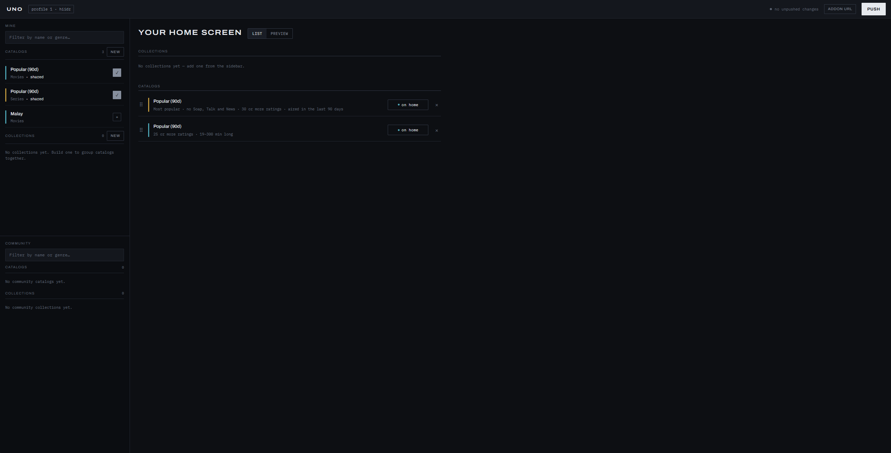

# Uno

Uno builds personal Stremio-protocol catalog addons for [Nuvio](https://api.nuvio.tv) profiles.
You log in with your Nuvio account, pick or build TMDB-powered catalogs (movies and shows
filtered by genre, rating, watch provider, and more), arrange them into a home screen, and push
the result straight into your Nuvio profile — so it shows up as rows on your Nuvio home screen.



## What it does

- Sign in with your existing Nuvio account — no separate account to create.
- Build catalogs from TMDB filters (genre, rating, release window, watch provider, studio,
  network, age rating, and more), or take catalogs and collections other profiles on the same
  server share from Community, as copies that follow their owner's updates.
- Group catalogs into collections and folders, and arrange everything into one home screen.
- Preview what a catalog or your whole home screen will look like before committing to it.
- Push your home screen to Nuvio in one action — it installs the addon and syncs your
  collections for you.

## Requirements

- Go 1.26+
- Node 22+
- A Nuvio account, a Nuvio publishable key, and a [TMDB](https://www.themoviedb.org/) API key
  (or, with `TMDB_KEY_MODE=per-account`, one per Nuvio account, entered in the app — see
  [`docs/configuration.md`](docs/configuration.md))

## Running it locally

```
cp .env.example .env   # fill in TMDB_API_KEY and NUVIO_PUBLISHABLE_KEY
cd web && npm ci && npm run build && cd ..
go run ./cmd/uno
```

`web/embed.go` embeds `web/dist` into the binary. The directory is gitignored apart from a
committed `.gitkeep`, so `go build ./...` works on a fresh clone, but the server has no SPA to
serve until `npm run build` has run.

For day-to-day frontend work, run `npm run dev` in `web/` instead. It starts Vite on its own
port and proxies API and addon requests to a Go server running locally on `http://localhost:8123`,
so you can edit the frontend without rebuilding it into the Go binary, and edit the backend
without restarting Vite.

## Deploying

Each release publishes an image to `ghcr.io/hiidz/uno` for amd64 and arm64.

```
cp .env.example .env   # fill in SITE_BASE_URL, NUVIO_PUBLISHABLE_KEY, TMDB_API_KEY
docker compose up -d
```

Uno listens on `127.0.0.1:8123` over plain HTTP. Put an HTTPS reverse proxy in front and set
`SITE_BASE_URL` to its public URL, since Nuvio fetches the addon from there. The publishable key
is on [Nuvio's docs](https://nuvio.tv/docs#publishable-key). Pin `UNO_TAG` in `.env` to choose a
release, and upgrade with `docker compose pull && docker compose up -d`. [`docs/configuration.md`](docs/configuration.md) covers proxies on a Docker network,
building the image yourself, and running without Docker.

## Checks

```
go build ./...
go vet ./...
golangci-lint run ./...
go test ./...
```

and in `web/`:

```
npm run lint     # oxlint
npm run build    # tsc -b && vite build — this is also the type check
npm test         # vitest
```

## Documentation

| Doc | Covers |
| --- | --- |
| [`docs/architecture.md`](docs/architecture.md) | How the three HTTP surfaces, the vault, and the Nuvio integration fit together |
| [`docs/configuration.md`](docs/configuration.md) | Environment variables, the dev auth bypass, and deployment |
| [`docs/data-model.md`](docs/data-model.md) | The SQLite schema, TMDB recipe params, and the Nuvio push wire shape |
| [`docs/frontend.md`](docs/frontend.md) | The builder UI's structure, conventions, and visual direction |
| [`DESIGN.md`](DESIGN.md) | The builder's design system: tokens, components, and the rules behind them |
| [`docs/api/openapi.yaml`](docs/api/openapi.yaml) | OpenAPI 3.1 description of the builder API and the public addon routes |
| [`docs/api/nuvio-v1.3.md`](docs/api/nuvio-v1.3.md) | Nuvio's own public API documentation, vendored verbatim |
