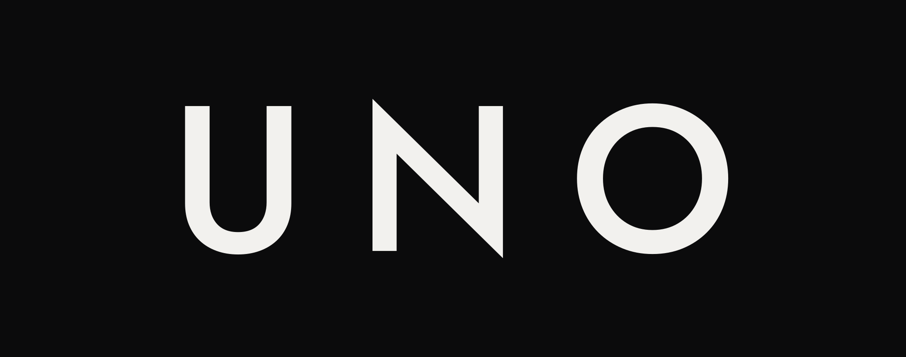

<p align="center">
  
</p>

<p align="center"><b>Your Nuvio home screen, row by row.</b></p>

<p align="center">Build catalogs and collections from TMDB, arrange your home screen, and push it to Nuvio in one click.</p>

- [What is Uno?](#what-is-uno)
- [Why Uno](#why-uno)
- [Features](#features)
- [Getting started](#getting-started)
- [Self-hosting](#self-hosting)
- [API](#api)
- [Development](#development)
- [Docs](#docs)

## What is Uno?

Uno is a website for deciding what your Nuvio home screen shows.

Every row on a Nuvio home screen comes from a catalog. With Uno you choose those rows yourself: build your own, or add ones other people made. Group them into collections, put them in the order you want, and press **Push to Nuvio**. Open Nuvio on your TV, phone or computer, and your home screen is there.

Under the hood, a catalog is a saved TMDB discover query, not a fixed list, so the row stays current. Uno serves those catalogs to Nuvio as a Stremio-protocol addon, one per profile. A push writes the addon, your collections and your home screen order into your Nuvio profile through Nuvio's API, and keeps everything in it that Uno didn't put there.

## Why Uno

I wanted to share my home screen setup with friends and family. But I didn't want to set up their home screens for them, I didn't want them stuck on mine, and I didn't always want to hand out my Nuvio account.

So they needed a way to set up a home screen to their own liking, without building catalogs and collections or installing addons. That's Uno:

1. Create a Nuvio account.
2. Sign in to Uno with it.
3. Pick what you want from Community.
4. Push.

No manifest URL to copy, no addon to install, no new account. Push does the install, and Community holds what others built, with their updates.

Uno is just as much for people who want full control. Build catalogs from the full set of TMDB discover filters, compose collections with your own artwork, arrange the home screen across all six profiles, and publish your work to Community for others to add.

## Features

- **Catalogs from TMDB discover recipes**, for movies or series. Filter by genre, rating, vote count, runtime, language, age rating, streaming service by region, studio, keyword, TV network, or a fixed or rolling release window. Sort them, or shuffle them. A catalog can also be one TMDB collection (a film series).
- **Live preview** of a catalog's titles while you build it.
- **Nuvio collections** composed from your catalogs: folders with a cover image or emoji, tile shape (poster, landscape or square), a backdrop, hero art for Nuvio's Modern Home layout, and an animated GIF on focus. A folder can narrow a catalog to one genre.
- **Your home screen, your order.** Catalogs and collections in one list. Pin a collection to the top, show it as rows or a tabbed grid, or keep a catalog in Discover only.
- **One push** writes it all into your Nuvio profile. Your other addons and collections stay as they are.
- **One account, every profile.** Sign in once with your Nuvio account and manage all six of its profiles, each with its own home screen.
- **Community.** Publish catalogs and collections for everyone on the same server. Others add them as linked copies that take your updates, or duplicate them as their own.
- **Import and export** catalogs and collections as a JSON file, to share them with anyone, on any server.

## Getting started

Uno is self-hosted; there is no public instance. On a server you or someone else runs:

1. Open it and sign in with your Nuvio email and password.
2. Pick a Nuvio profile.
3. Add catalogs and collections from Community, or build your own.
4. Put them in order on the home screen.
5. Press **Push to Nuvio**.

Your Nuvio apps now show the new home screen. Nuvio shows what you last pushed, so later edits appear after the next push.

To install the addon by hand instead, the profile menu has **Copy addon URL**:

```text
{SITE_BASE_URL}/u/{token}/manifest.json
```

## Self-hosting

You need:

- a [TMDB API key](https://www.themoviedb.org/settings/api) (v3), unless each account brings its own (see [Choose a setup](#choose-a-setup) below)
- Nuvio's publishable API key, which is public
- an address your Nuvio apps can reach, served over HTTPS

### Choose a setup

Two settings decide who can use your server and whose TMDB key it spends.

| Setup | Settings |
|---|---|
| Just you, or family and friends | `UNO_ACCESS=allowlist`, `UNO_ALLOWED_EMAILS=you@example.com,friend@example.com` |
| Anyone with a Nuvio account, on your TMDB key | `UNO_ACCESS=open` (default), `TMDB_KEY_MODE=shared` (default), `TMDB_API_KEY=...` |
| Anyone with a Nuvio account, each on their own TMDB key | `UNO_ACCESS=open`, `TMDB_KEY_MODE=per-account`, `UNO_SECRET=...` (no `TMDB_API_KEY`) |

The allowlist works with either key mode. In `per-account` mode, each account saves its TMDB key in the app, encrypted with `UNO_SECRET`; back that secret up with the database.

### Docker

Images for `linux/amd64` and `linux/arm64` are on `ghcr.io/hiidz/uno`.

```sh
curl -fsSLO https://raw.githubusercontent.com/hiidz/uno/main/compose.yaml
curl -fsSL -o .env https://raw.githubusercontent.com/hiidz/uno/main/.env.example
# fill in .env: SITE_BASE_URL, NUVIO_PUBLISHABLE_KEY, and your setup's settings
docker compose up -d
```

The data lives in one SQLite file on the `uno-data` volume. The server speaks plain HTTP, and `compose.yaml` publishes it on `127.0.0.1:8123` only: put an HTTPS reverse proxy in front.

### Manual

Needs Go 1.26 and Node 22.

```sh
git clone https://github.com/hiidz/uno && cd uno
cp .env.example .env              # then fill it in
cd web && npm ci && npm run build && cd ..
go build -o uno ./cmd/uno
./uno
```

The web app is built into the binary, so `uno` and its `.env` are all you need to run it.

### Cloud

Any host that runs a Docker image works, given a persistent disk for the SQLite file and HTTPS in front.

### Environment variables

| Variable | Required | Description |
|---|---|---|
| `SITE_BASE_URL` | Yes | Public URL Nuvio's apps reach this server at, with no trailing slash. |
| `NUVIO_PUBLISHABLE_KEY` | Yes | Nuvio's publishable API key. |
| `TMDB_API_KEY` | In `shared` key mode | The TMDB key every account uses. |
| `TMDB_KEY_MODE` | No | `shared` (default) or `per-account`. |
| `UNO_SECRET` | In `per-account` key mode | 32 random bytes, base64 (`openssl rand -base64 32`). |
| `UNO_ACCESS` | No | `open` (default) or `allowlist`. |
| `UNO_ALLOWED_EMAILS` | With `allowlist` | Comma-separated email addresses. |

The port, database path and the rest are in [configuration](docs/configuration.md). The server refuses to start on a missing or invalid value and names it.

## API

Uno serves two HTTP APIs on one port:

- **Addon** (`/u/{token}/...`): the public Stremio addon protocol that Nuvio's apps read. Manifest and catalog pages only; Uno serves no streams or metadata.
- **Builder API** (`/api/...`): JSON for the web app, behind Nuvio sign-in.

Every route and its shapes are in [`docs/api/openapi.yaml`](docs/api/openapi.yaml).

## Development

With `.env` filled in:

```sh
go run ./cmd/uno                  # API on :8123
cd web && npm ci && npm run dev   # web app, proxies to :8123
```

Tech stack:

- **Backend:** Go, standard-library `net/http`, SQLite (`modernc.org/sqlite`, no cgo)
- **Frontend:** React 19, TypeScript, Vite, TanStack Query, Tailwind CSS, Radix UI
- **Data:** TMDB for titles and artwork; Nuvio for sign-in and the profile Uno writes to

How the parts fit is in [architecture](docs/architecture.md).

## Docs

- [Architecture](docs/architecture.md): the parts, sign-in, push, the addon and sharing
- [Data model](docs/data-model.md): what's stored, recipes and export files
- [Frontend](docs/frontend.md): how the web app is laid out
- [Configuration](docs/configuration.md): every environment variable
- [API](docs/api/openapi.yaml): every HTTP route

## Disclaimer

Uno is not affiliated with Nuvio. It hosts no streams: titles and artwork come from TMDB. This product uses the TMDB API but is not endorsed or certified by TMDB. Report problems at [github.com/hiidz/uno/issues](https://github.com/hiidz/uno/issues).

## License

[MIT](LICENSE)
