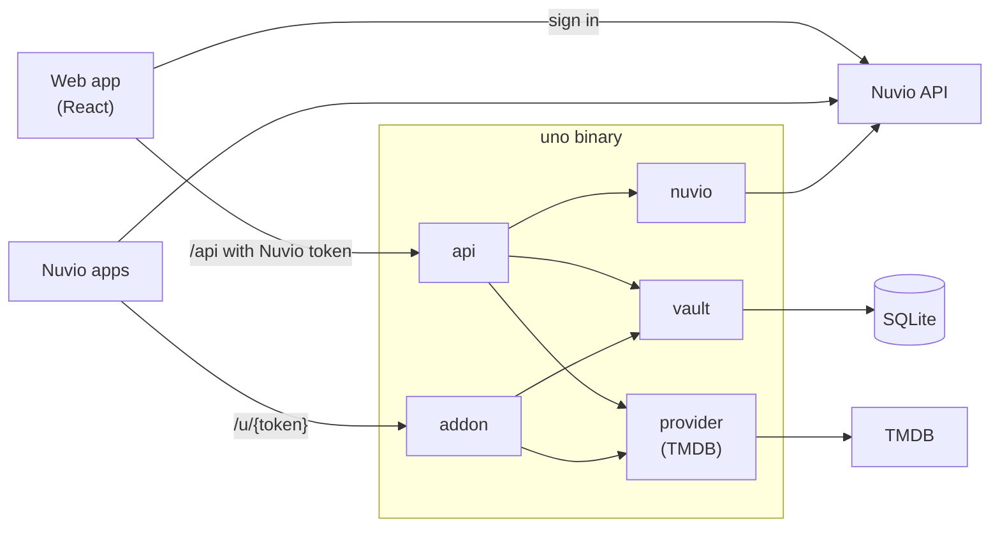

# Architecture

Uno is one Go binary. It serves three things over plain HTTP on one port, and keeps its data in one SQLite file:

- **Builder API** (`/api/...`): JSON for the web app. Needs a Nuvio sign-in.
- **Addon** (`/u/{token}/...`): the Stremio addon protocol, which Nuvio's apps read. Public.
- **Web app** (everything else): the React app, embedded in the binary.

## Packages

| Package | Does |
|---|---|
| `cmd/uno` | Entry point: config, database, server, graceful shutdown. |
| `internal/config` | Reads and checks environment variables. |
| `internal/api` | The builder API, sign-in checks, and push. All routes are in `server.go`. |
| `internal/addon` | The public addon: manifest and catalog pages. |
| `internal/vault` | The SQLite database. Schema in `schema.sql`. |
| `internal/provider` | TMDB: recipe checks, lookups, previews, catalog pages, caching and rate limits. |
| `internal/nuvio` | Nuvio: token verification and the profile, addon, collection and home-order calls. |
| `internal/tmdbkey` | Encrypts per-account TMDB keys. |
| `internal/static` | Serves the web app and `/config.js`. |
| `web` | The React app. `web/embed.go` embeds the build. |

## Sign-in

Uno has no accounts. The web app signs in with Nuvio directly and sends Nuvio's access token on every `/api` call. The server verifies the token against Nuvio's public keys, checks `UNO_ACCESS`, and for `/api/p/{profileIndex}/...` routes looks up the Uno profile for that Nuvio profile slot (1 to 6).

## Push

A push sends the whole home screen to `POST /api/p/{profileIndex}/push`. Uno then writes three lists into the Nuvio profile:

1. Addons: makes sure this profile's Uno addon URL is installed.
2. Collections.
3. Home order.

Nuvio replaces each list whole, so Uno pulls each one first and keeps every entry that isn't its own. If a step fails, Uno puts back what it changed. Only after all three succeed does Uno save the new home screen, and a record of what it pushed.

## Addon

Nuvio's apps load `{SITE_BASE_URL}/u/{token}/manifest.json`. Each profile has its own random token. The addon serves the catalogs from the profile's **last push**, not the current edits, so a change shows up in Nuvio after the next push. Catalog pages come from TMDB, 20 titles at a time.

## Sharing

Profiles on the same server can **publish** catalogs and collections to Community. Others can **add** one (a linked copy that can take updates) or **duplicate** it (an independent copy).

## API

[`api/openapi.yaml`](api/openapi.yaml) lists every route. A Go test (`TestOpenAPISpecMatchesRoutes`) fails if the spec and the routes in `server.go` disagree.
