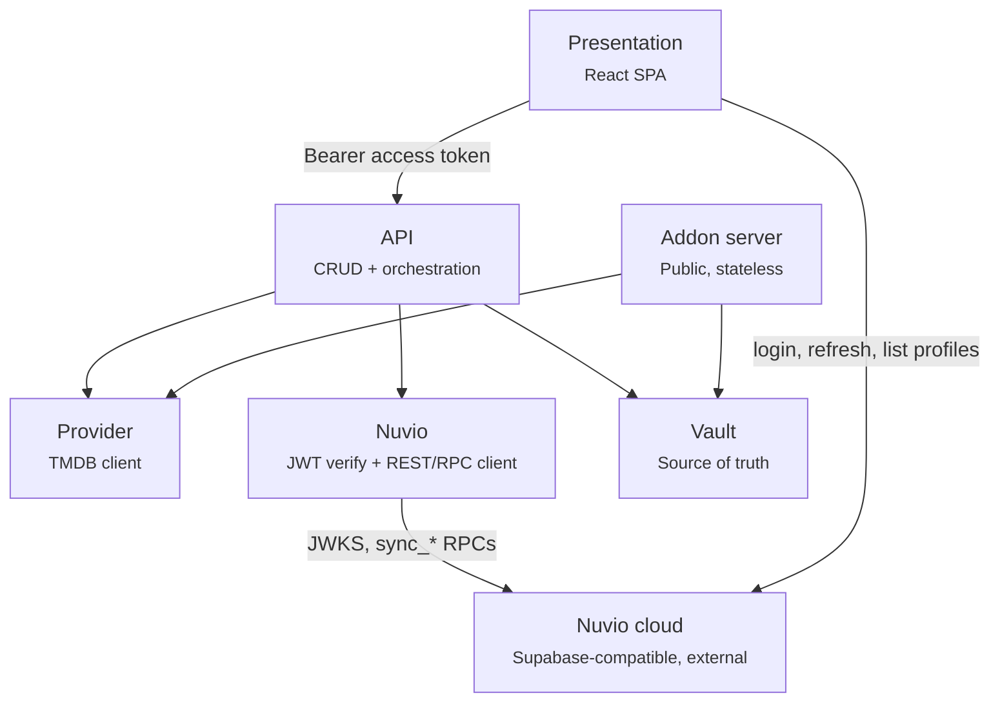

# Architecture

Uno builds personal Stremio-protocol catalog addons for [Nuvio](https://api.nuvio.tv) profiles. A
user logs in with their Nuvio account, authors or borrows *catalogs* (standing TMDB discover
queries) and *collections* (folders of catalogs), arranges them into a home screen, and pushes the
result into their Nuvio profile — which then reads the catalogs back out of Uno's public addon
server.

One Go binary (`github.com/hiidz/uno`) serves all three HTTP surfaces on one port, plus the
embedded frontend build.

| Package | Owns |
| --- | --- |
| `internal/vault` | All persisted state. SQLite via `modernc.org/sqlite` (pure Go, `CGO_ENABLED=0`). Also the push payload (`pushpayload.go`: the wire types push sends, the addon id and manifest id they carry, and the hash push stores), since what push sends decides whether a collection needs a push. Imports only `jsonwire` and its own `vault/migrations` (the frozen schema migrations, standard library only) |
| `internal/addon` | Stremio-protocol manifest + catalog responses, `/u/{token}/...` |
| `internal/api` | Bearer-token auth, CRUD orchestration, push, the route table |
| `internal/provider` | TMDB queries, recipe param types, IMDB-id resolution |
| `internal/nuvio` | JWT verification against JWKS; authenticated REST/RPC calls |
| `internal/config` | Env loading with defaults (`godotenv`) |
| `internal/static` | SPA-fallback file serving + CSP/security headers + gzip middleware |
| `web` | `//go:embed all:dist` — the built frontend |

**`internal/addon` never depends on Nuvio anything**, and this is enforced at the package level: it
imports only `vault` and `provider`. That keeps the one public-facing surface simple, stateless,
and independently scalable. The split exists because these are three surfaces with three different
trust boundaries — authenticated SPA API, push orchestrator, public unauthenticated addon server.

`addon.ID` (`"hiidz.uno.catalog"`, defined as `vault.AddonID`) is constant across every profile.
Identity in the addon protocol comes from the URL path (`/u/{token}/...`), never from the addon
id.

**`vault.ManifestID(c)` is `c.Provider + "-" + c.ID.String()`** — the same literal string that
round-trips as Nuvio's `catalogSources[].catalogId`. Whatever string Uno's manifest uses for a
catalog id must be the same string in a pushed source entry: the manifest goes through
`addon.ManifestID`, which delegates to it, and the push payload calls it directly, and it has to
stay that way. Both live in the vault because the vault builds the push payload and `addon`
imports the vault, not the other way round.

## Server construction

`api.Server` is built from a `Deps` struct — `New(d Deps) (*Server, error)`, with `Deps{Vault, Provider,
Verifier, Nuvio, SiteBaseURL, NuvioBaseURL, Access, Keys}` (`internal/api/deps.go`); a zero `Access` admits every
account, and a nil `Keys` is a server with one shared TMDB key (*TMDB keys*). `cmd/server`'s
`apiDeps` builds them from the config. `Verifier` (`TokenVerifier`, one method)
and `Nuvio` (`NuvioClient`, five methods) are narrow *consumer-side* interfaces over
`*nuvio.Client`'s method set, not the concrete type — the seam that makes `requireNuvioAuth` and
`listProfiles` testable against a fake. Compile-time assertions in `deps.go` turn a signature
drift in `internal/nuvio` into a build error in `internal/api` rather than a surprise at the call
site. `cmd/server/main.go` passes the same `*nuvio.Client` value for both fields; a second,
independently constructed `Verifier` would mean a second, out-of-sync JWKS key cache. Because a
struct literal can silently omit a field, `New` checks each required field and returns an error
rather than nil-panicking on the first request that reaches it. It returns rather than exiting so
the decision to abort startup lives in `cmd/server/main.go`, the only place that calls
`log.Fatal` — the same reason `addon.New` and `static.Gzip` return their errors.

## Auth model

| Question | Answer |
| --- | --- |
| Can a profile exist without Nuvio? | No. Every profile is born from a resolve-or-create against a live Nuvio account. |
| Proxy or direct? | Direct. Frontend → Nuvio for auth; Uno verifies the resulting JWT locally. |
| Password handling | Uno never sees one. The frontend posts credentials straight to Nuvio's auth endpoint. |
| Token persistence | None. Refresh tokens never touch Uno. Access tokens live only for the duration of a request. |
| Background/automatic push | No. Push is an explicit user action, while a live token is in hand. |
| What's public | Addon protocol only (`/u/{token}/...`). Everything else requires a bearer token, community reads included. |

**Uno is stateless with respect to auth.** No session store, no session cookie, no cookie secret.
Every authenticated request carries its own bearer token; identity is the verified `sub` claim,
nothing else.

Direct auth is viable because Nuvio's JWKS endpoint (`/auth/v1/.well-known/jwks.json`) serves a
live **ES256 (P-256)** asymmetric key, so verification is local, cached, and costs zero network
round trips per request. On symmetric HS256 signing the JWKS response would be empty and the only
options would be a `GET /auth/v1/user` round trip per request, or a proxy design where Uno holds
credentials.

`profiles.token` is a capability URL for a public, read-only surface. Acceptable in browser
memory; never log it or place it in a URL the user might share.

## HTTP surface

**Public means the addon protocol. Authenticated means everything else** — community/public reads
included, because login gates the entire builder experience, browsing included. The split is
visible at the URL level (`/u/...` vs `/api/...`), not merely enforced by middleware.

Route registration is in `internal/api/server.go`. Everything not matching a registered route
falls through to the embedded SPA (`static.Gzip(static.Handler(distFS))`); Go's `ServeMux`
matches the most specific registered pattern first.

`requireNuvioAuth` (`internal/api/auth.go`) runs `authenticate` (`internal/api/access.go`): it
reads `Authorization: Bearer`, calls `s.verifier.Verify`, maps `ErrInvalidToken` → `401` and
`ErrJWKSUnavailable` → `502` (`verifyRefusal`), then checks the verified claims against the access
policy (below). It then stashes both the `sub` and the raw token in the request context under an
unexported `contextKey` type. Handlers read them via `nuvioUserIDFrom(ctx)` /
`nuvioTokenFrom(ctx)`. On a server in per-account key mode it also attaches the account's own
TMDB key source (*TMDB keys*), read only if the request reaches TMDB. The raw token is stashed so exactly one place in the codebase understands
the `Authorization` header format.

### Access

Any Nuvio account can sign in by default. `UNO_ACCESS=allowlist` admits only the accounts whose
token carries an email address listed in `UNO_ALLOWED_EMAILS` (`docs/configuration.md`).
`Deps.Access` carries it, and `authenticate` checks it after verification on every authenticated
route: the token's `email` claim (`nuvio.Claims.Email`), lower-cased, must be in the list, which
startup stores lower-cased. A token without an `email` claim matches no entry. Every token Uno sees
has one: Uno signs in only with an email and a password, and Supabase writes the address into every
token it signs. After an email change the old address still matches until the token refreshes,
within the hour.

A verified account the policy doesn't admit gets **403** "this Nuvio account can't use this Uno
server", never a 401: the SPA answers a 401 by refreshing its token and retrying, which a refused
account would do forever. When the dev auth bypass is configured, `cmd/server` admits its fake
account too, by its id, since it has no email (`Access.WithDevBypass`, `DevBypassSub`).

The policy is read from the environment, so it holds across instances.

`requireProfile` chains *after* it on every profile-scoped route — the route table applies the
pair as `requireProfileAuth` — and reads `sub` from context, reads
`{profileIndex}` from the path, validates it's an integer 1–6 (`400` otherwise, before touching
the DB), calls `vault.GetProfileBySlot`, maps `ErrProfileNotFound` → `404`, then stashes the
resolved profile ID. It is a **lookup-only** resolver — no create, no drift-overwrite. A client
hitting a CRUD route before ever calling `POST /api/profiles/select` gets a clean `404`, not a
silent auto-provision.

Seven route-semantics facts the client has to honour:

- **Selection is read via `GET .../selection` but never written there.** The whole pending
  selection travels in `POST .../push`'s body and is written by that handler, in one transaction,
  only after Nuvio has accepted the push. There are no `PUT .../selection` routes; the
  transactional write bodies are `saveCatalogSelectionTx`/`saveCollectionSelectionTx` inside
  `internal/vault`.
- **Community is other profiles' publications, by publication id.** Every route is
  profile-scoped, and the rules behind them are in `docs/data-model.md` → *Publications and
  subscriptions*. The handlers are in `internal/api/community.go`, and every one but the list
  runs through `serveSharingCall`: the id comes from the path, and a vault error goes through
  `writeVaultError`, whose 404 for these routes is `vault.ErrPublicationNotFound`.
  - `GET /api/p/{i}/community` (`ListCommunity`) answers every live publication not the
    caller's own, newest first, in one array: the SPA searches, filters and sorts it. A row
    carries its counts, dates, `subscribed` and `update_available` for the caller, the names of
    its catalogs, and for a catalog its recipe, but never its owner.
  - `GET .../community/{id}` (`GetPublication`) is the row with its `snapshot` and `withdrawn`:
    a live publication, or a withdrawn one the caller subscribes to. It is also how the SPA
    previews an update: the page shows the new version before Update applies it.
  - `POST .../community/{id}/subscribe` (`Subscribe`, 201) and `.../fork` (`ForkPublication`,
    201) copy a live publication of someone else's into the caller's own rows, as
    `{kind, catalog | collection}`. A second subscribe is a 409. `.../update`
    (`UpdateSubscription`, 200) brings the caller's subscribed copy up to the current snapshot.
    None of the three reaches TMDB: they run the form validators over a snapshot whose recipes
    were checked at publish, so a snapshot today's rules refuse is a 400.
  - Updating a subscribed *listed* catalog changes its addon rows at once: a folder source in
    the pushed blob names a catalog only by id and type, and the addon server reads the name and
    params live. An Update that changes what push sends for a collection copy on Home leaves it
    `needs_push`, so it shows on Home as an unpushed change until the next push carries its
    folders to Nuvio.
- **Sharing an owned row, and detaching a copy, are calls on the row.**
  - `POST /api/p/{i}/catalogs/{id}/publish` and `.../collections/{id}/publish`
    (`PublishCatalog`/`PublishCollection`, 200 with the row and its `publication`) publish or
    republish it. They run every recipe the snapshot shares through `validateCatalogParams`, so
    a recipe TMDB refuses is a 400 and TMDB being unreachable a 502. A catalog inside a
    collection, a subscribed copy, and a collection that references a catalog the caller
    subscribes to are 400s, and a source edited while it was being checked a 409. Two
    publications of the same content are both listed in Community.
  - `.../withdraw` (`WithdrawCatalog`/`WithdrawCollection`) withdraws its live publication, if
    any.
  - `.../detach` (`DetachCatalog`/`DetachCollection`) drops a subscribed copy's subscription and
    keeps the row; a row that isn't a subscribed copy is a 400.
  - A content write to a subscribed copy — `PUT` of the catalog or the collection, a catalog
    created in or demoted into it — detaches the copy in the same transaction: its subscription
    goes and every id stays. `POST .../community/{id}/update` never detaches. Placement is not
    content: Home order, Home or Discover and Show first (`pin_to_top`) all travel in push's
    selection (*Push* below), for a copy as for any row.
  - Another profile's row answers 404 on all of them, like one that doesn't exist.
- **Duplicating a collection you own is one atomic server call, not a client-built copy.**
  `POST /api/p/{i}/collections/{id}/duplicate` (`DuplicateCollection`) extracts the source into
  its bundle form and writes it back through the same `createCollectionTx` a collection create
  runs: folders and their refs are copied in order, a listed source catalog stays a reference
  (same id), and each distinct catalog scoped to the source collection becomes a fresh scoped
  copy in the new one, so a catalog referenced by two folders collapses into one new scoped copy
  referenced twice. The copy is unpublished and subscribed to nothing, even when its source is a
  subscribed copy. 404s via `ErrCollectionNotFound` if the source isn't owned by the caller.
- **A catalog inside a collection is written only through that collection's save.**
  `PUT` and `DELETE /api/p/{i}/catalogs/{id}` answer `400` for a catalog whose `collection_id` is
  set. Its edits travel in the collection's own `PUT` body as `catalog_edits`
  (`vault.ScopedCatalogEdit`), whose recipes `validateInlineCatalogs` checks alongside the
  folders' inline `new` specs, so a bad recipe is a `400` (or a `502` when TMDB can't judge it)
  on the collection save. It goes away by dropping its last folder ref and saving the collection.
  `PUT` still accepts a *listed* catalog with `collection_id` set, which moves it into that
  collection.
- **Deletes refuse what Nuvio may still hold** (`internal/vault/delete_guard.go`). Each check runs
  inside the delete's own transaction and reads Home as the server holds it, which is what the
  last push sent, never the SPA's pending edits. A refusal is `vault.ErrConflict`, answered `409`
  with its reason alone as the body (`conflictReason`), the sentence the SPA shows.
  - `DELETE /api/p/{i}/catalogs/{id}`, with the first that holds: the catalog has its own Home
    row, Discover-only included ("Take it off Home and push first."); a collection on Home uses it,
    the first in Home order named ("Remove it from “X” and push first."); or any of the profile's
    collections on Home has `needs_push` ("Push first: Nuvio may still show it in a collection.").
    The last is profile-wide: the pushed hash can't say which catalogs that collection's last
    pushed version used.
  - `DELETE /api/p/{i}/collections/{id}` for a collection on Home ("Take it off Home and push
    first.").
- **Import never trusts its own check step.** Three routes in `internal/api/bundle.go` move
  catalogs and collections in and out as a bundle (format in `docs/data-model.md`, "Bundle
  format"):
  - `POST /api/p/{i}/export`, body `{catalog_ids, collection_ids}`, answers 200 with the bundle
    (`ExportBundle`). Every id must be one of the caller's own listed catalogs or own collections,
    and the selection can't be empty; otherwise 400 naming the id.
  - `POST /api/p/{i}/import/check`, body `{bundle}`, answers 200 with
    `{catalogs, collections, folders, matches}`. The first three are counts: `catalogs` covers
    top-level and collection catalogs together. Each match is
    `{key, name, type, scope, collection, existing: [{id, name}]}`, one for every bundle catalog
    whose recipe (`recipe_hash`) equals one of the caller's listed catalogs. `scope` is `"listed"`
    (top-level, `collection` empty) or `"scoped"` (a collection's own, `collection` its title).
    `existing` is sorted by name, then id, and `matches` is `[]` when nothing matches.
  - `POST /api/p/{i}/import`, body `{bundle, reuse}`, answers 201 with `{catalogs, collections}`
    (`ImportBundle`): the new listed catalogs and the new collections, in bundle order. `reuse`
    maps a bundle catalog key to one of the caller's listed catalogs, which that key's refs then
    point at; a reused catalog gets no new row and is not in `catalogs`.

  Both import routes run `prepareBundle` first: `Bundle.Validate`, then `checkRecipe` on every
  catalog, which replaces its params with the canonical form its row stores. So a bad file or
  recipe is a 400 (a recipe error names the catalog's key), and a TMDB outage a 502. Import runs
  all of that again rather than relying on an earlier check, then every form check before its
  transaction opens; the reuse targets are checked inside it, and any failure writes nothing. The
  two import routes take a body up to `maxBundleBodyBytes` (4 MiB, `decodeJSONLimit`); every
  other route keeps the 1 MiB `maxRequestBodyBytes`, and either limit exceeded is a 413.
- **Selection lives on the rows themselves, not a join table.** `catalogs.home_sort_order`/
  `show_in_home` and `collections.home_sort_order` are columns on the owning row; the selection
  endpoints are `owner_id = ? AND home_sort_order IS NOT
  NULL`, ordered by it. The closed graph means a selection can only ever contain rows the caller
  owns — there is no visibility filter to reason about, and no "selected but since made private"
  case to render around.

### Addon server — public, unauthenticated, CORS-open, cacheable

Two routes: `GET /u/{token}/manifest.json` and `GET /u/{token}/catalog/{type}/{rest...}`, where
`rest` is `{id}.json` or `{id}/{extra}.json`, where `{extra}` is a query string of `skip`
(pagination) and `genre` (a pick from the catalog's genre extra).

The catalog route makes **one lookup**, `vault.ServedCatalog`: the profile by token, joined
to the catalog by id and owner (and to the owner's sealed TMDB key, for per-account mode), with the route's type and the provider from its manifest id
(`parseManifestID` accepts only the exact form `ManifestID` writes). It serves only a catalog **on
the TV**, the manifest's set checked for this one catalog: one with its own home row
(`home_sort_order` set, Discover-only rows included), or one a folder of the profile's on-home
collections references, found by an `EXISTS` over that catalog's own refs. The lookup is also the
access check: an unknown token, another profile's catalog, a catalog off the TV and a type or
provider the catalog doesn't have all return **404**, so a leaked or guessed catalog UUID can't
pull data through a profile it doesn't belong to, nor a catalog the profile hasn't pushed. A
`skip` landing past TMDB's own pagination ceiling (`maxCatalogPage`, page 500) answers **200 with
an empty `metas`** and makes no TMDB call: an empty page past the end is the honest answer, and
TMDB would refuse the request anyway.

**A catalog that leaves the TV answers 404 at once**: taken off Home and pushed, or deleted. A TV
keeps showing what it was last pushed until it syncs again, and until then a row or folder tile
for that catalog comes back empty. NuvioTV (source read at `1a132cb`, 2026-09-30) syncs rarely:
- **Collections and the addon list** are pulled only by a full sync, when the app starts or a
  profile is picked (`StartupSyncService.requestSyncNow`), or from the addon manager's manual
  refresh, which pulls the addon list alone.
- **Not on resume**, and not on the 15-minute timer: both pull only watch state and library
  (`scheduleActivityPull`). A realtime collections pull exists (`requestRealtimeSurfacePull`),
  but nothing calls it.
- **Manifests** refresh at launch, then at most every 6 hours while the app runs
  (`MANIFEST_CACHE_TTL_MS`).

So a TV left running would keep a deleted catalog's row or tile until it restarts or someone picks
a profile, which can be hours or days. That is why **nothing Nuvio may still hold can be deleted**
(*Deletes refuse what Nuvio may still hold*, under *HTTP surface*): a catalog or collection is
deleted only once a push has taken it off. Two gaps
remain, accepted:
- a collection's own catalogs dropped by a save of it or by a Community Update, which go at once;
- a delete made soon after the push that took the row off, before the TV has pulled that push.

The tile flow is `CatalogHandler` → `TMDBClient.FetchCatalogPage` → TMDB `/discover/{movie|tv}` →
per-item `/external_ids` → `Meta`. A discover page is served from the **page cache**
(`internal/provider/pagecache.go`): the finished metas, keyed by the discover request — its path
and sorted query, genre pick and page included, `api_key` not — for 30 minutes
(`catalogPageTTL`), well under the three-hour `cacheMaxAge`. So profiles showing the same recipe
cost TMDB one fetch per half hour, not one each. It holds at most `maxCatalogPageEntries` (1,000,
near 20 MB), evicting the least recently used. Requests for a key whose fetch is in flight wait
for that fetch; it runs detached from the request that started it (bounded by
`catalogPageFetchTimeout`), so one client hanging up fails no other. A failed fetch is not
cached. A randomized recipe picks its page before the lookup, so each random page is its own
entry. A page whose genre list failed to load is served without `genres` but not cached, so it
isn't shared. A panic in a fetch, which runs outside any handler's recover, becomes that fetch's
error (`recoverFetch`). A collection recipe's page isn't cached: its films are memoized already (below).
The TMDB-id→IMDB-id cache on `TMDBClient`
(a pairing never changes once resolved, so an entry never expires; the map is capped at
`maxIMDBCacheEntries` and emptied whole once it fills, because the public addon route can add one
entry per title TMDB has) and the lookup-list memos beside it
(`internal/provider/cache.go`: genres, languages, countries, watch regions and certifications for
the process's lifetime, watch providers and the network export for 24h since services move between
markets and TMDB republishes the export daily). Every memo
clones on read, so a caller that sorts what it got back cannot reach the cached copy. The memos
keyed by an id a caller supplies — the per-id companies, keywords, collections and networks, a
collection's parts, and company and network title counts — are built with `newBoundedMemo`, because their key space is
TMDB's whole catalogue: `maxEntityCacheEntries` (10,000; an entry is an id and a name or a count)
for all but the parts, `maxCollectionPartsEntries` (1,000; an entry is a whole film list) for
those. Inserting a new key at the bound drops the expired entries and, if the memo is still full,
empties it whole — the `maxIMDBCacheEntries` policy, since an entry costs one TMDB call to
re-derive. The whole-list memos stay unbounded; their key spaces are a handful of types and
regions.
`resolveMetas` bounds the per-page `/external_ids` fan-out at 8 concurrent lookups. A title TMDB
has no IMDB id for is dropped from the page; a lookup that *fails* fails the whole page, so the
502 goes to Stremio instead of a short row under a three-hour cache header. `releaseInfo`
is year-only (`YYYY`), Stremio's own convention, matching the Cinemeta sample in
`docs/api/samples/catalog-response.json`. `meta.id` is the IMDB id (`tt...`), which is why
per-item `external_ids` resolution exists at all.

Every other `Meta` field comes from the discover response itself, with no further per-item call:
`poster` (w500), `background` (w1280, from `backdrop_path`), `description`, `releaseInfo`,
`released` (the full date as a midnight-UTC ISO 8601 timestamp, the form Stremio-protocol clients
parse), and `genres` (`genre_ids` named through the cached `Genres` list). Nuvio's own TMDB
enrichment is off by default, so these tile fields are what its home hero and landscape tiles show.
A failed genre-list fetch serves the page without `genres` instead of failing it. `imdbRating` is
deliberately absent: TMDB only has its own `vote_average`, and Nuvio labels the field IMDb.
`logo` and `runtime` are absent because discover doesn't carry them.

The manifest reads `vault.GetPublishedCatalogs`, not `GetCurrentCatalogSelection` — the derived
union of listed catalogs on the home screen and every catalog referenced by a folder of a
collection on the home screen, deduped by id with the home row's
`ShowInHome` winning over a folder-derived one. `GetCurrentCatalogSelection` stays the narrower
pre-push validation/selection-editor view; the manifest needs the wider set so a catalog used
only inside an on-TV collection's folder is still listed, not a dangling reference. The catalog
route checks the same set, for one catalog at a time (above).

Every catalog declares `extra: [{name: "skip"}]` and an explicit `showInHome` (its *published*
`ShowInHome`), plus one `genre` extra (`genreExtra`). Its options aren't chosen by the user.
They are TMDB's genre list for the catalog's type, narrowed to the genres a pick can actually
narrow the recipe by (`provider.GenreExtraOptions` → `genreChoices`):

- With an "any of" (pipe) `with_genres`, only that list's genres. A pick replaces the list,
  because TMDB can't express "(A or B) and C".
- Otherwise every genre except those the recipe already requires or excludes.

The genre filter and the off-home flag share that single entry, because `genre` is the only
required extra the Nuvio mobile/desktop clients tolerate: their Discover and collection-source
pickers drop a catalog with any other required extra (`skip` and `search` aside), so a separate
required marker would take the catalog out of Discover too.

- **Off home** (`ShowInHome` false: off the home screen entirely, or on the TV only through a
  folder): `isRequired: true`, options `["All", …genre names]`, `optionsLimit: 1`.
- **On home**: optional, options are the genre names. There's no genre extra if none apply.

The manifest reads TMDB's genre list through `TMDBClient.Genres`, which memoizes each type's list
in memory for the process's lifetime after the first successful fetch. A cold fetch that fails
is not cached, and degrades that catalog to no genre names (just `["All"]` when off home) rather than failing the
manifest.

Two separate mechanisms keep an off-home catalog off home, because the clients disagree. Nuvio
mobile, Nuvio desktop (the same codebase as mobile) and Stremio leave a catalog with any required
extra out of home's automatic rows, and mobile/desktop never read `showInHome`. Nuvio TV reads
only the per-catalog `showInHome` field, treating an absent one as "show" — which is why
`showInHome` is always on the wire; the only required extra it checks for home is `search`.

The `"All"` first option is required, not cosmetic. Nuvio mobile/desktop and Stremio open a
required genre on its first option, and both drop a catalog whose required genre has no options
at all. Nuvio TV's Discover ignores `isRequired`: it starts on its own "Default" entry, which
sends no genre, so an off-home catalog there lists "Default" and then `"All"`, two entries that
both mean unfiltered.

A home row arrives unfiltered: no client sends a genre for an automatic home row. A collection
folder's row arrives filtered when its source carries a `genre`, which Uno pushes for every folder
reference that has one (`folder_catalogs.genre`, `docs/data-model.md`); Nuvio sends it back as this
same extra. Confirmed on Nuvio desktop and mobile with a hand-edited collection (the folder's rows
came back filtered), and in Nuvio TV's source, whose folder view sends a source's genre unless it
is blank or `"None"`. Otherwise the pick is made in Discover.

These client behaviours were read from the clients' source at NuvioTV `62e1d8b`, NuvioMobile
`cbc921d`, NuvioDesktop `b5c5481` and stremio-core `43427b9` (2026-09-18); installed builds can
lag them.

`CatalogHandler` reads the extra props with `parseCatalogPath`, from the still-escaped path.
`PathValue` is already percent-decoded, so a genre like `Sci-Fi %26 Fantasy`, which Nuvio sends
encoded, would otherwise split at its `&`. It passes the `genre` value to `FetchCatalogPage`,
whose `applyGenrePick` (shared with `PreviewCatalog`) resolves the name through the same
`GenreExtraOptions` list and narrows the discover query with `applyGenreExtra`
(`internal/provider/query.go`): ANDed onto an AND `with_genres`, or replacing an OR one. `All`, an empty value, or a name not in that list leaves the recipe
unfiltered. A collection recipe (`with_collection`, `docs/data-model.md`) has no `with_genres`, so it
offers every genre, and its pick filters the collection's films by `genre_ids` instead of
narrowing a discover query.

Cache headers: `cacheMaxAge` 10800s / `staleRevalidate` 3600s — the same values the Cinemeta
sample carries. They keep Stremio from asking again on every reopen; the page cache only shares a
page between the clients that do ask.

**Rate limit.** Every TMDB API call the process makes goes through `TMDBClient.get`, and so
through one token bucket (`internal/provider/ratelimit.go`): Uno's own ceiling of 40 requests a
second with a burst of 40 (`tmdbRequestsPerSecond`, `tmdbRequestBurst`), shared by the builder's
lookups and previews and every catalog page. A request waits for a token, or gives up when its
context ends. A **429** pauses the whole bucket for the answer's `Retry-After` (seconds or an HTTP
date, 1 s when missing, capped at 10 s so a waiting page fetch can still finish inside its
30 s timeout), then the request goes once more and that answer
stands. The network export download (`files.tmdb.org`, not the API) doesn't go through it. A
call made with an account's own key (*TMDB keys*) first waits on that key's own bucket (a token
taken under the map's lock, so the once-a-minute sweep of refilled buckets can't split a key
across two), 20 a
second with a burst of 40 (`perKeyRequestsPerSecond`, `keyLimiters`), so one account can't take
the whole budget; the shared key waits on the process-wide bucket alone.

**One process.** The page cache, the memos and the limiter live in memory, so they assume one
server process. A second instance would need shared ones.

### TMDB keys

`TMDB_KEY_MODE` (`docs/configuration.md`) picks how the server reaches TMDB. In `shared` mode
every call uses `TMDB_API_KEY`, the `TMDBClient`'s own key. In `per-account` mode the client has
no key, and each call's comes from its context (`provider.WithKeySource`):

- **Which key.** The builder routes use the signed-in account's (`requireNuvioAuth` attaches
  `tmdbkey.Keys.ForAccount`), so a preview, a save's recipe check, a lookup and a publish's check
  use the caller's key. The catalog route uses the key of the account that owns the token's
  profile, read in its one lookup (`Keys.Sealed`); the manifest route looks it up by token for a
  cold genre list (`Keys.ForToken`). Take makes no TMDB call. A source runs at most once per
  request, and only when a call goes out, so a request answered from a cache reads no key.
- **One client, shared caches.** There is one `TMDBClient`; `request` picks the call's key
  (`keyFor`) and sets `api_key`. The page cache, the memos and the IMDB-id cache stay shared,
  since TMDB's data doesn't depend on the key. A shared page fetch runs with the key of the caller
  that started it, so a caller that waited on it and got that caller's key problem tries again,
  until it gets another answer or starts the fetch itself with its own key (`pageCache.load`):
  another keyless caller may have started the next one.
- **Errors.** No key is `provider.ErrNoKey`, raised before any request. A TMDB `401` on an
  account's key is `provider.ErrKeyRejected`; on the shared key it stays an ordinary upstream
  failure (`502`), the operator's to fix. A stored key that no longer opens (`UNO_SECRET`
  changed) is treated as rejected, since its owner fixes it the same way. The builder answers
  both key problems `422` with fixed words (`keyFailures`): a status nothing else in the API
  answers, so the SPA can tell it apart — not `401` (the SPA refreshes and retries), `403` (the
  access refusal) or `409` (Already taken). The addon routes answer `502`, as for any
  upstream failure, but log a key problem as the profile owner's key, apart from TMDB failing
  (`logTMDBFailure`): a keyless owner's TV asks for every row on every load.
- **Storage.** `internal/tmdbkey` seals a key with AES-256-GCM under `UNO_SECRET`, bound to the
  account id as additional data (`Box`), for `accounts` (`docs/data-model.md`). A key is never
  returned, never logged, and only ever sent to TMDB: a failed request's error drops its URL,
  which holds `api_key`, before anything wraps or logs it (`withoutURL`).
- **Routes.** `GET /api/config` (no sign-in) says the mode. `GET`, `PUT` and `DELETE
  /api/account/tmdb-key` read, save and remove the signed-in account's key, and answer `404` in
  shared mode (`perAccountKeys`). `GET` answers `{set, last4}`. `PUT {key}` trims the key and
  refuses one that isn't 32 hexadecimal characters with a `400`, naming TMDB's Read Access Token
  when it is one (`tmdbkey.Clean`); then it checks the key with one call to TMDB's
  `/authentication` (`TMDBClient.CheckKey`). A key TMDB refuses is a `400`, TMDB unreachable a
  `502`, and neither saves anything.

### `POST /api/profiles/select`

Body is `{"profile_index": N}` only. The handler calls `s.nuvio.ListProfiles` with the caller's
own bearer token, matches the requested index against that **live** response (a client-supplied
index absent from the account's real profile list is rejected with `400` before `vault` is ever
touched — the client's index is never trusted directly), then calls
`vault.ResolveOrCreateProfile`. That match-then-resolve sequence is
`Server.resolveSelectedProfile` (`internal/api/profiles.go`); it stays in `api` rather than
`nuvio` because it composes both `nuvio` and `vault`, and `api` is the only package depending on
both — moving it would force `nuvio` to import `vault` and break its leaf status.

The response is the whole `vault.Profile` plus `manifest_url`
(`SITE_BASE_URL + addon.ManifestPath(token)`), built server-side so it is correct in dev and prod
alike and never depends on `window.location.origin`. Handing it over at selection time rather than
waiting on a first push means the builder can show the addon URL immediately. This puts
`profiles.token` in browser memory on `/configure` — see the capability-URL note above.

### `POST /api/catalogs/preview`

The authenticated "run this recipe, show me tiles, save nothing" endpoint
(`internal/api/preview.go` + `provider.PreviewCatalog`).

| | |
| --- | --- |
| Auth | `requireNuvioAuth` only — **not profile-scoped**. No vault read, so nothing to scope. |
| Request | `{type, params, genre?}` — no `endpoint`, no `provider`, no `page`. `genre` narrows the recipe exactly as a client's genre pick does on the addon path (`applyGenrePick`), which is how a collection folder's per-reference genre is previewed |
| Response | `{randomized, items: [{tmdb_id, title, year, poster}], total_results}` — `total_results` is TMDB's count across every page these filters match, not the page `items` carries, so the builder can say "20 of N" rather than implying the page in hand is the whole answer |
| Cost | **1 TMDB call** per recipe; **2** for a `randomized` recipe whose random page isn't page 1; a collection recipe reads its memoized `/collection/{id}` instead of discover and reports its film count as `total_results`. A `genre` adds one `/genre/{kind}/list` fetch the first time a process needs that type's list (`TMDBClient.Genres` caches it for the process's lifetime) |
| Errors | `400` invalid recipe, `502` TMDB unreachable |

Four properties, each load-bearing:

- **It skips `resolveMetas` entirely.** That function's ~20 per-page `/external_ids` calls exist
  solely to mint IMDB ids for Stremio, and a preview has no use for them — poster, title, and
  year are all already on the discover response. Reusing `FetchCatalogPage` would make preview
  **21** TMDB calls per catalog instead of **1**. It does share `catalogEndpoint` +
  `DecodeParams`/`DiscoverQuery` + `discover` (and `collectionItems` for a collection recipe), which
  is the point: the underscore-to-dot param translation must live in exactly one place.
- **It takes a raw recipe, not a saved catalog id.** A saved id would serve only the home preview
  and force a second endpoint for the catalog builder's unsaved edits.
- **It derives the discover path from `type`; it never accepts one.** `TMDBClient.get` builds
  requests as `baseURL + path + "?" + query`, so a caller-supplied path is a request-forgery
  surface: it would let whoever wrote the row point the server's own outbound request, API key
  included, wherever they want. `FetchCatalogPage` and `PreviewCatalog` both derive the path from
  `catalogType` via `catalogEndpoint` (`internal/provider/catalog.go`), the single lookup from
  catalog type to discover path. **Never accept a caller-supplied path or endpoint that gets
  concatenated onto an upstream base URL.** This is a security property, not a style choice —
  and it is the same reason the TMDB key stays server-side while preview is a backend endpoint
  rather than a browser-to-TMDB call.
- **A `randomized` recipe shuffles in preview too**, with the flag returned in the response. Page
  1 is fetched first for TMDB's `total_pages`; the random pick is bounded by
  `min(total_pages, maxRandomPage)`, and a pick other than page 1 costs a second call. Bounding by
  `total_pages` keeps a small recipe from landing on an empty page past its last one. The builder's
  "Run again" re-fetches an unchanged recipe when the flag is set, so each press is a new page.

**It is not routed through the addon route**, which is what makes it usable at all:
`CatalogHandler` serves only a stored catalog on the TV, by id, so it can't preview a
recipe the editor hasn't saved. That is a disqualification for reusing it from the browser, not
a tradeoff. Preview doesn't read the addon's page cache either: it reports TMDB's
`total_results`, which a cached page doesn't carry.

### `POST /api/catalogs/genre-options`

`{type, params}` → `[{id, name}]`: the genres a pick can narrow this recipe by
(`provider.GenreExtraOptions`), the same list the manifest advertises in the catalog's `genre`
extra and the addon path resolves a pick against. The collection editor's per-reference genre
picker reads it, so every genre it offers actually narrows the row. Not `GET /api/genres/{type}`,
which is TMDB's whole list. Same auth and recipe validation as preview, and it takes a recipe
rather than a catalog id for the same reason: a draft catalog has no id yet. `502` when TMDB's
genre list can't be fetched.

### TMDB lookup routes

The builder's pickers read TMDB's vocabulary through thin `requireNuvioAuth` routes in
`internal/api/provider.go`, all answered by one helper, `lookupList`: `GET /api/genres/{type}`,
`/api/certifications/{type}`, `/api/languages`, `/api/countries`,
`/api/watch-providers/{type}?region=`, `/api/watch-regions`, and, for the four vocabularies TMDB's
API serves no whole list of, `GET /api/keywords/search?q=` and `/api/collections/search?q=`
(`[{id, name}]`, TMDB's first result page, `[]` when nothing matches),
`GET /api/companies/search?q=&type=movie|series` and `GET /api/networks/search?q=` (below), plus
`GET /api/companies/{id}`, `/api/keywords/{id}`, `/api/collections/{id}` (`{id, name}`) and
`/api/networks/{id}` (`{id, name, origin_country}`): a saved id resolved back to its name. `lookupList` classifies a failure once for every route: `ErrInvalidCatalogType` or
`ErrInvalidParams` → `400` without contacting TMDB (a blank `q`, a missing or unknown company
search `type`, an id below 1; a non-numeric `{id}` is rejected before the provider is called),
`provider.ErrNotFound` → `404`, a key problem → `422` (*TMDB keys*), anything else → `502`
(`lookupErrors`, a `clientFailure` table). The literal `search` segment outranks
`{id}` in `ServeMux`, so the two patterns coexist.

Company search is ranked, because TMDB's raw order is not usable: its first page for "a24" put
the real A24 third, behind same-named duplicates crediting no titles at all.
`TMDBClient.SearchCompanies` (`internal/provider/companies.go`) keeps the first 10 results of
TMDB's first page (`maxCountedMatches`), counts each one's titles for the catalog's `type` with
one `/discover/movie` or `/discover/tv` call (`with_companies=<id>`, reading `total_results`),
drops those under 5 titles (`minMatchTitles`: in a 15-studio probe every junk duplicate had at
most 1 and the smallest real studios 8–9), and sorts the rest by count, descending, ties in
TMDB's order. It answers `[{id, name, origin_country, title_count}]` — `origin_country` may be
`""`, and `[]` when nothing survives. The counts (`titleCount` and `forEachMatch` in
`internal/provider/titlecounts.go`) run with `resolveMetas`' concurrency bound
(`externalIDsConcurrency`) and are memoized for 24h per filter, type and id (`titleCounts`,
bounded like the per-id memos), so a repeated search costs one TMDB call. A failed count fails the whole search with a
`502` rather than silently dropping the result it was for; a TMDB 404 on that discover call is
reported without `ErrNotFound`, so it is a `502` too, not a `404` for a search. `type` is required
and is Uno's `movie`/`series`, never TMDB's `tv`.

Network search has no TMDB search to rank: TMDB's API has `/network/{id}` but no
`/search/network`. `TMDBClient.SearchNetworks` (`internal/provider/networks.go`) searches TMDB's
daily network export instead: `tv_network_ids_MM_DD_YYYY.json.gz` on `files.tmdb.org`, a
gzipped file of one `{"id","name"}` per line (about 5,600 networks, 52 KB). It is the one TMDB
request that goes to a host other than `api.themoviedb.org`, and it carries no API key. Today's
(UTC) file is tried first, and on any non-200 answer yesterday's (the host answers 403 for a date
it has not published yet). The list is memoized under one key for 24h (`networkIDs`), and a
failed fetch is not cached. Names match case-insensitively, ranked whole name, then name start,
then the start of a later word ("hbo" never matches "Beachbody"), the lower id first within each
rank. The first 10 are looked up through `TMDBClient.Network` for their `origin_country` and
counted on `/discover/tv` (`with_networks=<id>`) through the same helpers as company search. A
name whose `/network/{id}` now answers 404 is dropped, and the rest are filtered and sorted
exactly as companies are. The answer has the company search's shape, with `title_count` counting
series. There is no `type` param: networks filter series only.

### Error responses

`400`s from the CRUD handlers are **plain text**, via `http.Error(w, err.Error(), ...)` — no
field name in a machine-readable position. Per-field form errors are therefore generated
client-side by mirroring `provider`'s `Validate()`; a server 400 firing in normal use means the
mirror has drifted, and that is its only job in the UI (an unexpected-case banner, not the
primary error channel).

Classification is unified: `writeVaultError` (`internal/api/respond.go`) is the single classifier
for create/update/delete on both resources *and* for the two preview routes, so a recipe fails the
same way wherever it is judged. `validateCatalogParams` wraps a rejected recipe in
`vault.ErrInvalidInput` (one path to a 400 rather than two) and a recipe it could not check in
`errUpstreamValidation` (a 502 carrying a fixed "failed to reach TMDB", not the caller's own
`defaultMsg`, which would blame Uno for a TMDB outage). `clientErrors`, a `clientFailure` table
read by `clientFailureOf`, maps the errors the caller can act on: a key problem → `422` in fixed
words (`keyFailures`, *TMDB keys*), then the vault errors, each answered with its own message:
`ErrInvalidInput` → `400`, `ErrConflict` → `409` (a delete's refusal among them, whose message
carries no `conflict:` prefix). Preview and genre-options classify what TMDB
answers after validation the same way (`previewErrors`). The `403` of the access policy comes from
the middleware, before any handler (*Access*). `writeNuvioError`
delegates to `nuvioErrorStatus` so push's JSON responses and the plain-text ones classify Nuvio
failures identically — `nuvio.ErrNuvioRequestFailed` → `502`, anything else → `500`.

### Static serving

`internal/static` serves the embedded build as a single-page app: any path that doesn't resolve
to a real file is rewritten to `/` so React Router handles it. Cache-Control splits on Vite's
hashed output: everything under `/assets/` is `public, max-age=31536000, immutable`; everything
else (`index.html`, icons) is `no-cache`, because caching the shell would strand clients on a
page referencing asset hashes a new build no longer has.

Every SPA response also carries `X-Content-Type-Options: nosniff` and a
`Content-Security-Policy`, built in `contentSecurityPolicy` (`internal/static/static.go`). The
refresh token lives in `localStorage`, so an injected script could steal the Nuvio account. The
policy limits the page to its own origin, which stops such a script from loading more code or
sending the token anywhere except Uno and Nuvio. Each exception has a concrete cause:

- `style-src 'unsafe-inline'`: Radix injects `<style>` elements at runtime.
- `img-src https: data:`: collection and folder art are arbitrary user-supplied URLs.
- `font-src data:`: Vite inlines the smallest `@fontsource` subsets.
- `connect-src` allows the origin of `NUVIO_BASE_URL`, because login and refresh go from the
  browser straight to Nuvio.

`frame-ancestors 'none'`, `base-uri` and `form-action` are set explicitly, since they don't fall
back to `default-src`, and `object-src` is `'none'`. The policy is a response header, not a `<meta>` tag, for two reasons: a
meta tag can't express `frame-ancestors`, and it would also apply under `vite dev`, whose inline
React Refresh preamble `script-src 'self'` would block. The API and addon routes don't get these
headers.

Gzip is `gzhttp` (`internal/static/gzip.go`) with an explicit content-type allow-list rather than
gzhttp's default filter, because the default still compresses fonts — and woff2/woff are already
compressed, so gzipping them buys nothing on ~38% of the bytes served. The decision to compress
depends on the `Content-Type` the file server only sets as it starts writing, which is why this
is gzhttp rather than a hand-rolled up-front wrapper. Range requests bypass gzip entirely — the
file server's byte-range math is over the uncompressed file — and the bypass path adds
`Vary: Accept-Encoding` itself, since gzhttp can't.

## Nuvio integration

`docs/api/nuvio-v1.3.md` is Nuvio's own public API documentation, kept verbatim as the authority
when anything here disagrees with it. The facts Uno's integration leans on:

- **Base URL** `https://api.nuvio.tv`. Auth at `/auth/v1/`, REST/RPC at `/rest/v1/`.
- **Supabase-compatible.** GoTrue for auth, PostgREST for data. PostgREST error bodies carry
  `code`/`message`/`details`/`hint`. Uno parses none of these fields — it classifies on status
  code alone.
- **The publishable key** goes in an `apikey` header on essentially every call. Public by design —
  it is printed in Nuvio's own docs and intended for embedding in client apps. The TMDB key is
  not public, which is why every TMDB call is server-side.
- **Access tokens are JWTs with `expires_in: 3600`.** `internal/nuvio/verify.go` accepts **ES256**
  signatures only, over **P-256** JWKS keys, and requires `iss` to equal the configured base URL
  plus `/auth/v1` and `sub` to be non-empty. It does not inspect any other claim.
- **Refresh tokens rotate.** `grant_type=refresh_token` returns a *new* refresh token as well as
  a new access token; the old one is burned. The frontend owns this loop entirely.
- **Profiles are numbered slots, 1–6**, unique per user. `p_profile_id` on every scoped call is
  the integer slot, never a UUID.
- **Sync strategies differ per resource**, and getting this wrong destroys data. Addons,
  profiles, and collections — everything Uno pushes — are **full replace**: anything omitted from
  the payload is **deleted**. (Nuvio's other resources use incremental mutations, atomic blob
  upserts, or non-destructive merges; Uno touches none of them.)

### Endpoints Uno uses

| Endpoint | Method | Purpose | Wrapped by |
| --- | --- | --- | --- |
| `/auth/v1/.well-known/jwks.json` | GET | Public signing keys for local verification | `Verifier` |
| `/rest/v1/rpc/sync_pull_profiles` | POST | List the account's profiles (no body) | `Client.ListProfiles` |
| `/rest/v1/addons?profile_id=eq.{n}` | GET | Read current addons before a merge | `Client.ListAddons` |
| `/rest/v1/rpc/sync_push_addons` | POST | Full-replace the profile's addon list | `Client.PushAddons` |
| `/rest/v1/rpc/sync_pull_collections` | POST | Read current collections blob | `Client.PullCollections` |
| `/rest/v1/rpc/sync_push_collections` | POST | Full-replace the collections blob | `Client.PushCollections` |
| `/auth/v1/token?grant_type=password` | POST | Login — **frontend only**, never Uno | — |
| `/auth/v1/token?grant_type=refresh_token` | POST | Refresh — **frontend only**, never Uno | — |

### `internal/nuvio` shape

- **`Verifier`** — `baseURL`, HTTP client, `sync.RWMutex`-guarded `map[string]*ecdsa.PublicKey`,
  `fetched time.Time`. Holds no credential; JWKS is public.
- **`Client`** — embeds `*Verifier` (so `Verify` promotes through unchanged), plus
  `publishableKey` and its own separate HTTP client for REST calls, deliberately not sharing
  `Verifier`'s.
- **Sentinels**: `ErrInvalidToken`, `ErrJWKSUnavailable`, `ErrNuvioRequestFailed`. Error wrapping
  uses `%w: %w` (multi-wrap) so the inner error survives `errors.Is`/`errors.As`.
- **Key caching is reactive, not polled.** `Verify` extracts `kid` from the token header (via
  `ParseUnverified` — reading the header only, trusting nothing), looks it up, and on a miss
  refetches the whole JWKS once, subject to a `minRefetchInterval` debounce so a burst of tokens
  with a bogus `kid` cannot trigger a fetch per request. `fetchKeys` **replaces** the cache
  wholesale rather than merging, so retired keys actually disappear.

> **`ListProfiles` checks for exactly `200`, not a 2xx range.** That is correct for a pull, which
> always returns data. **Do not copy that check into a push RPC** — `PushAddons` and
> `PushCollections` legitimately succeed with `204 No Content`, and both check for exactly that.

### Push

`POST /api/p/{profileIndex}/push` (`internal/api/push.go`). Body is the full pending selection,
`{catalogs: CatalogSelectionForm, collections: CollectionSelectionForm}`: catalogs as
`{catalogs: [{catalog_id, show_in_home}]}` and collections as
`{collections: [{collection_id, pin_to_top}]}`, each in Home order. The body is decoded strictly
(`decodeStrictJSON`): a field it doesn't have is a 400 before anything reaches Nuvio. A lenient
read would take a body in an older shape, from a tab loaded before a deploy, as an empty
selection, and a full-replace push of that clears every Uno collection. Show first (`pin_to_top`)
is part of the selection, not of a collection save: push builds each collection it sends with
its entry's pin and stores that pin in its local write, which is the only place `pin_to_top` is
written. A collection push leaves off Home keeps its last pin. Response, past auth and
profile resolution, is always JSON and deliberately flat:
`{success, manifest_url, error?, undo_failed?}` — no partial-progress flags, because the ordering
below guarantees an ordinary failure means nothing changed at all.

**Ordering is Nuvio-first, local-write-last**, and this is load-bearing in two independent ways:

1. Validate access to every id in the body. *Load-bearing, not a fail-fast nicety* — with the
   write moved to the end, this is the only check standing between the request body and a
   third-party API call.
2. `pushAddons` — read the profile's current addons, upsert Uno's manifest URL into that list by
   **URL match** (Nuvio's own dedup key is `md5(url)` per user+profile), push the **complete**
   merged list back. Omitting any existing addon would delete it.
3. `pushCollections` — pull, merge, push (detail below).
4. One local transaction writing both selections, committing at the very end.

Reversing this reopens two problems at once. A write-first design has to hold a SQLite write
transaction open across up to four sequential Nuvio HTTP calls, each capped at a 10s client
timeout — a concurrent vault write in that window waits out the 5s `busy_timeout` and then fails.
It also means a failed push can still leave the catalog manifest live, which is the atomicity gap
this ordering *deletes* rather than documents.

**Addons before collections:** a pushed collection's `catalogSources` reference this addon's
manifest id, so installing the addon first means a client reading collections right after a push
already has something to resolve those references against. If the addons push fails, collections
is never attempted.

**The collections merge.** Nuvio's blob is full-replace and holds collections Uno knows nothing
about (its own native UI, or another client), so the merge must touch only what Uno manages:

1. Pull the current blob as **raw `json.RawMessage` per element** — never decoded into a generic
   map. Round-tripping through `map[string]any` converts JSON numbers to `float64` and would
   silently corrupt any collection Uno doesn't own.
2. Drop every pulled entry that is either **owned by this profile**, or **Uno-managed by the
   addon-id heuristic** (`isUnoManaged`, `internal/api/push.go`): every source in every folder
   carries this addon's id. With the closed graph, everything selected is owned, so the owned set
   alone covers a deselected collection — there's no "old selection" case left to union in, since
   a non-owned collection can never have been selected in the first place. The heuristic instead
   covers a collection Uno *once* pushed but no longer knows the id of (hard-deleted locally, or a
   recreated database): nothing else ever writes a source pointing at this addon's id, so that's
   the only place such a collection could have come from. A pulled collection with no sources at
   all doesn't match the heuristic — there's nothing to compare against `addon.ID`, and treating
   it as a match would risk deleting a Nuvio-native collection whose folders are simply empty.
3. Append freshly built entries for the pending selection: each collection's
   `vault.CollectionWithFolders.PushJSON`, the vault's push payload, with the selection's pin.

**Push stores the hash of what it sent.** `pushCollections` returns `map[uuid.UUID]string`
alongside the pulled blob — for each selected collection, `vault.PushHash` over the exact bytes it
appended at step 3, before Nuvio was called. The local write (step 4, `SaveSelectionsForPush` →
`saveCollectionSelectionTx`) stamps `collections.pushed_hash` from that map, never from the row as
it stands at write time. A collection's reads carry `needs_push` when it is on Home and the hash of
what push would send for it now differs from that stamp (`markNeedsPush` in
`internal/vault/pushpayload.go`), so Home flags exactly the edits that change what Nuvio holds:
a folder's catalogs, genre or images, a title, a setting. A rename and back, or a recipe-only
edit, changes nothing Nuvio holds and flags nothing. A Save landing between push's read and the
local write leaves the row hashing to something else, so it still reads as needing a push. A row
with no entry in the map (vanished between the read and the write) is left untouched rather than
guessed at.

**The one gap the ordering can't close, and its mitigation.** If the local commit fails *after*
both Nuvio calls succeeded, Nuvio has the new collections but Uno's vault doesn't record them. On
that failure the handler re-pushes the collections blob it pulled at the very start (still held
in memory), restoring Nuvio to its prior state. If that compensating push *also* fails — two
independent failures back to back — the response sets `undo_failed` and the user gets distinct
copy. Retry is always safe: every local write is diff-replace and every Nuvio push is
upsert/full-replace.

**Lost update, accepted.** A reorder on the user's TV between pull and push gets clobbered. The
window is seconds and push is a manual click, so this is accepted — but **the pull must sit
immediately adjacent to the push, never cached from page load.**

The wire shape push sends is camelCase and is not Uno's own — see the push wire shape section in
`docs/data-model.md`.
