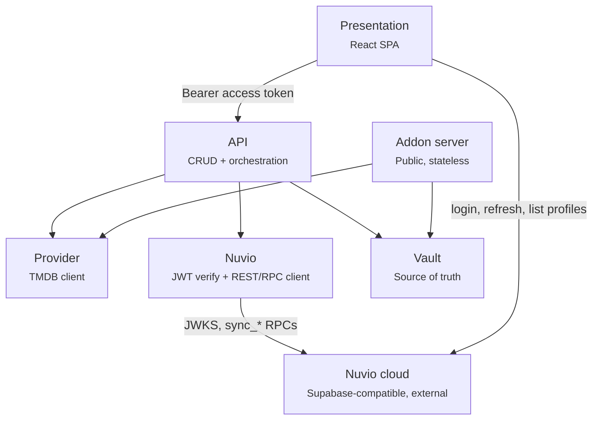

# Architecture

Uno builds personal Stremio-protocol catalog addons for [Nuvio](https://api.nuvio.tv) profiles. A
user logs in with their Nuvio account, authors or borrows *catalogs* (standing TMDB discover
queries) and *collections* (folders of catalogs), arranges them into a home screen, and pushes the
result into their Nuvio profile — which then reads the catalogs back out of Uno's public addon
server.

One Go binary (`github.com/hiidz/uno`) serves all three HTTP surfaces on one port, plus the
embedded frontend build.

| Package | Owns |
| --- | --- |
| `internal/vault` | All persisted state. SQLite via `modernc.org/sqlite` (pure Go, `CGO_ENABLED=0`). The only leaf — imports no other Uno package |
| `internal/addon` | Stremio-protocol manifest + catalog responses, `/u/{token}/...` |
| `internal/api` | Bearer-token auth, CRUD orchestration, push, the route table |
| `internal/provider` | TMDB queries, recipe param types, IMDB-id resolution |
| `internal/nuvio` | JWT verification against JWKS; authenticated REST/RPC calls |
| `internal/config` | Env loading with defaults (`godotenv`) |
| `internal/static` | SPA-fallback file serving + CSP/security headers + gzip middleware |
| `web` | `//go:embed all:dist` — the built frontend |

**`internal/addon` never depends on Nuvio anything**, and this is enforced at the package level: it
imports only `vault` and `provider`. That keeps the one public-facing surface simple, stateless,
and independently scalable. The split exists because these are three surfaces with three different
trust boundaries — authenticated SPA API, push orchestrator, public unauthenticated addon server.

`addon.ID` (`"hiidz.uno.catalog"`) is constant across every profile. Identity in the addon
protocol comes from the URL path (`/u/{token}/...`), never from the addon id.

**`addon.ManifestID(c)` is `c.Provider + "-" + c.ID.String()`** — the same literal string that
round-trips as Nuvio's `catalogSources[].catalogId`. Whatever string Uno's manifest uses for a
catalog id must be the same string in a pushed source entry; both go through `addon.ManifestID`,
and it has to stay that way.

## Server construction

`api.Server` is built from a `Deps` struct — `New(d Deps) (*Server, error)`, with `Deps{Vault, Provider,
Verifier, Nuvio, SiteBaseURL}` (`internal/api/deps.go`). `Verifier` (`TokenVerifier`, one method)
and `Nuvio` (`NuvioClient`, five methods) are narrow *consumer-side* interfaces over
`*nuvio.Client`'s method set, not the concrete type — the seam that makes `requireNuvioAuth` and
`listProfiles` testable against a fake. Compile-time assertions in `deps.go` turn a signature
drift in `internal/nuvio` into a build error in `internal/api` rather than a surprise at the call
site. `cmd/server/main.go` passes the same `*nuvio.Client` value for both fields; a second,
independently constructed `Verifier` would mean a second, out-of-sync JWKS key cache. Because a
struct literal can silently omit a field, `New` checks each required field and returns an error
rather than nil-panicking on the first request that reaches it. It returns rather than exiting so
the decision to abort startup lives in `cmd/server/main.go`, the only place that calls
`log.Fatal` — the same reason `addon.New` and `static.Gzip` return their errors.

## Auth model

| Question | Answer |
| --- | --- |
| Can a profile exist without Nuvio? | No. Every profile is born from a resolve-or-create against a live Nuvio account. |
| Proxy or direct? | Direct. Frontend → Nuvio for auth; Uno verifies the resulting JWT locally. |
| Password handling | Uno never sees one. The frontend posts credentials straight to Nuvio's auth endpoint. |
| Token persistence | None. Refresh tokens never touch Uno. Access tokens live only for the duration of a request. |
| Background/automatic push | No. Push is an explicit user action, while a live token is in hand. |
| What's public | Addon protocol only (`/u/{token}/...`). Everything else requires a bearer token, community reads included. |

**Uno is stateless with respect to auth.** No session store, no session cookie, no cookie secret.
Every authenticated request carries its own bearer token; identity is the verified `sub` claim,
nothing else.

Direct auth is viable because Nuvio's JWKS endpoint (`/auth/v1/.well-known/jwks.json`) serves a
live **ES256 (P-256)** asymmetric key, so verification is local, cached, and costs zero network
round trips per request. On symmetric HS256 signing the JWKS response would be empty and the only
options would be a `GET /auth/v1/user` round trip per request, or a proxy design where Uno holds
credentials.

`profiles.token` is a capability URL for a public, read-only surface. Acceptable in browser
memory; never log it or place it in a URL the user might share.

## HTTP surface

**Public means the addon protocol. Authenticated means everything else** — community/public reads
included, because login gates the entire builder experience, browsing included. The split is
visible at the URL level (`/u/...` vs `/api/...`), not merely enforced by middleware.

Route registration is in `internal/api/server.go`. Everything not matching a registered route
falls through to the embedded SPA (`static.Gzip(static.Handler(distFS))`); Go's `ServeMux`
matches the most specific registered pattern first.

`requireNuvioAuth` (`internal/api/auth.go`) reads `Authorization: Bearer`, calls
`s.verifier.Verify`, maps `ErrInvalidToken` → `401` and `ErrJWKSUnavailable` → `502`, then stashes
both the verified `sub` and the raw token in the request context under an unexported `contextKey`
type. Handlers read them via `nuvioUserIDFrom(ctx)` / `nuvioTokenFrom(ctx)`. The raw token is
stashed so exactly one place in the codebase understands the `Authorization` header format.

`requireProfile` chains *after* it on every profile-scoped route — the route table applies the
pair as `requireProfileAuth` — and reads `sub` from context, reads
`{profileIndex}` from the path, validates it's an integer 1–6 (`400` otherwise, before touching
the DB), calls `vault.GetProfileBySlot`, maps `ErrProfileNotFound` → `404`, then stashes the
resolved profile ID. It is a **lookup-only** resolver — no create, no drift-overwrite. A client
hitting a CRUD route before ever calling `POST /api/profiles/select` gets a clean `404`, not a
silent auto-provision.

Five route-semantics facts the client has to honour:

- **Selection is read via `GET .../selection` but never written there.** The whole pending
  selection travels in `POST .../push`'s body and is written by that handler, in one transaction,
  only after Nuvio has accepted the push. There are no `PUT .../selection` routes; the
  transactional write bodies are `saveCatalogSelectionTx`/`saveCollectionSelectionTx` inside
  `internal/vault`.
- **Community list endpoints are profile-scoped and exclude your own rows.**
  `GET /api/p/{i}/community/catalogs` and `GET /api/p/{i}/community/collections`
  (`GetCommunityCatalogs`/`GetCommunityCollections`) are `is_public = TRUE AND owner_id != ?`,
  so — unlike the pre-closed-graph community routes — there is no merge or dedup left for the
  frontend to do: a row you own never appears there. Catalogs additionally collapse to one row
  per fingerprint: the survivor is the oldest `created_at`, ties
  broken by the smallest id — a fully deterministic rule, not the query's own row order — and the
  final list is sorted name/title, then `created_at`, then id, so equal names never swap between
  requests. Both responses carry a per-row `taken: bool` — for catalogs, true if the caller has
  taken *any* row in that fingerprint group, not only the surviving one; for collections, an
  `EXISTS` against the caller's own `taken_from` values — computed server-side, never inferred
  client-side.
  `POST /api/p/{i}/community/catalogs/{id}/take` and `.../community/collections/{id}/take`
  (`TakeCatalog`/`TakeCollection`) deep-copy a public, not-own source into a new row the caller
  fully owns; both 404 via `ErrCatalogNotFound`/`ErrCollectionNotFound` if the source isn't
  public or is already the caller's own. Both re-validate the recipes they copy against TMDB
  before writing anything, so either take can also 400 on a source recipe that no longer
  validates or 502 when TMDB can't be reached to judge it — see "Take re-validates what it
  copies" in `docs/data-model.md`. `GET /api/catalogs` and `GET /api/collections` (the old
  unscoped, unauthenticated-by-profile community routes) are removed.
- **Duplicating a collection you own is one atomic server call, not a client-built copy.**
  `POST /api/p/{i}/collections/{id}/duplicate` (`DuplicateCollection`) reuses `TakeCollection`'s
  copy path (`copyCollection`, which writes through the same `createCollectionTx` a collection
  create runs): folders and their refs are copied in order, a listed
  source catalog stays a reference (same id), and each distinct catalog scoped to the source
  collection becomes a fresh scoped copy in the new one — the same one-copy-per-distinct-catalog
  rule Take uses, so a catalog referenced by two folders collapses into one new scoped copy
  referenced twice. `taken_from` stays `NULL` throughout: this is a copy of the caller's own data,
  not a take. 404s via `ErrCollectionNotFound` if the source isn't owned by the caller.
- **A catalog inside a collection is written only through that collection's save.**
  `PUT` and `DELETE /api/p/{i}/catalogs/{id}` answer `400` for a catalog whose `collection_id` is
  set. Its edits travel in the collection's own `PUT` body as `catalog_edits`
  (`vault.ScopedCatalogEdit`), whose recipes `validateInlineCatalogs` checks alongside the
  folders' inline `new` specs, so a bad recipe is a `400` (or a `502` when TMDB can't judge it)
  on the collection save. It goes away by dropping its last folder ref and saving the collection.
  `PUT` still accepts a *listed* catalog with `collection_id` set, which moves it into that
  collection.
- **Selection lives on the rows themselves, not a join table.** `catalogs.home_sort_order`/
  `show_in_home` and `collections.home_sort_order` are columns on the owning row; the selection
  endpoints are `owner_id = ? AND home_sort_order IS NOT
  NULL`, ordered by it. The closed graph means a selection can only ever contain rows the caller
  owns — there is no visibility filter to reason about, and no "selected but since made private"
  case to render around.

### Addon server — public, unauthenticated, CORS-open, cacheable

Two routes: `GET /u/{token}/manifest.json` and `GET /u/{token}/catalog/{type}/{rest...}`, where
`rest` is `{id}.json` or `{id}/{extra}.json`, where `{extra}` is a query string of `skip`
(pagination) and `genre` (a pick from the catalog's genre extra). An unknown/invalid token, or a
catalog id that is not in this profile's *published set*, both return **404** rather than an
empty or error response — `findSelectedCatalog` doubles as the access check, so a leaked or
guessed catalog UUID can't pull data through a profile it was never shared with. A `skip` landing
past TMDB's own pagination ceiling (`maxCatalogPage`, page 500) answers **200 with an empty
`metas`** and makes no TMDB call: an empty page past the end is the honest answer, and TMDB would
refuse the request anyway.

The tile flow is `CatalogHandler` → `TMDBClient.FetchCatalogPage` → TMDB `/discover/{movie|tv}` →
per-item `/external_ids` → `Meta`. Direct per-request TMDB call; there is **no response cache**
for discover results (a ranking goes stale), only the TMDB-id→IMDB-id cache on `TMDBClient`
(a pairing never changes once resolved, so an entry never expires; the map is capped at
`maxIMDBCacheEntries` and emptied whole once it fills, because the public addon route can add one
entry per title TMDB has) and the lookup-list memos beside it
(`internal/provider/cache.go`: genres, languages, countries, watch regions and certifications for
the process's lifetime, watch providers and the network export for 24h since services move between
markets and TMDB republishes the export daily). Every memo
clones on read, so a caller that sorts what it got back cannot reach the cached copy. The memos
keyed by an id a caller supplies — the per-id companies, keywords, collections and networks, a
collection's parts, and company and network title counts — are built with `newBoundedMemo`, because their key space is
TMDB's whole catalogue: `maxEntityCacheEntries` (10,000; an entry is an id and a name or a count)
for all but the parts, `maxCollectionPartsEntries` (1,000; an entry is a whole film list) for
those. Inserting a new key at the bound drops the expired entries and, if the memo is still full,
empties it whole — the `maxIMDBCacheEntries` policy, since an entry costs one TMDB call to
re-derive. The whole-list memos stay unbounded; their key spaces are a handful of types and
regions.
`resolveMetas` bounds the per-page `/external_ids` fan-out at 8 concurrent lookups. A title TMDB
has no IMDB id for is dropped from the page; a lookup that *fails* fails the whole page, so the
502 goes to Stremio instead of a short row under a three-hour cache header. `releaseInfo`
is year-only (`YYYY`), Stremio's own convention, matching the Cinemeta sample in
`docs/api/samples/catalog-response.json`. `meta.id` is the IMDB id (`tt...`), which is why
per-item `external_ids` resolution exists at all.

Every other `Meta` field comes from the discover response itself, with no further per-item call:
`poster` (w500), `background` (w1280, from `backdrop_path`), `description`, `releaseInfo`,
`released` (the full date as a midnight-UTC ISO 8601 timestamp, the form Stremio-protocol clients
parse), and `genres` (`genre_ids` named through the cached `Genres` list). Nuvio's own TMDB
enrichment is off by default, so these tile fields are what its home hero and landscape tiles show.
A failed genre-list fetch serves the page without `genres` instead of failing it. `imdbRating` is
deliberately absent: TMDB only has its own `vote_average`, and Nuvio labels the field IMDb.
`logo` and `runtime` are absent because discover doesn't carry them.

Both routes read `vault.GetPublishedCatalogs`, not `GetCurrentCatalogSelection` — the derived
union of listed catalogs on the home screen and every catalog referenced by a folder of a
collection on the home screen, deduped by id with the home row's
`ShowInHome` winning over a folder-derived one. `GetCurrentCatalogSelection` stays the narrower
pre-push validation/selection-editor view; the addon server needs the wider set so a catalog used
only inside an on-TV collection's folder is still published, not a dangling reference.

Every catalog declares `extra: [{name: "skip"}]` and an explicit `showInHome` (its *published*
`ShowInHome`), plus one `genre` extra (`genreExtra`). Its options aren't chosen by the user.
They are TMDB's genre list for the catalog's type, narrowed to the genres a pick can actually
narrow the recipe by (`provider.GenreExtraOptions` → `genreChoices`):

- With an "any of" (pipe) `with_genres`, only that list's genres. A pick replaces the list,
  because TMDB can't express "(A or B) and C".
- Otherwise every genre except those the recipe already requires or excludes.

The genre filter and the off-home flag share that single entry, because `genre` is the only
required extra the Nuvio mobile/desktop clients tolerate: their Discover and collection-source
pickers drop a catalog with any other required extra (`skip` and `search` aside), so a separate
required marker would take the catalog out of Discover too.

- **Off home** (`ShowInHome` false: off the home screen entirely, or on the TV only through a
  folder): `isRequired: true`, options `["All", …genre names]`, `optionsLimit: 1`.
- **On home**: optional, options are the genre names. There's no genre extra if none apply.

The manifest reads TMDB's genre list through `TMDBClient.Genres`, which memoizes each type's list
in memory for the process's lifetime after the first successful fetch. A cold fetch that fails
is not cached, and degrades that catalog to no genre names (just `["All"]` when off home) rather than failing the
manifest.

Two separate mechanisms keep an off-home catalog off home, because the clients disagree. Nuvio
mobile, Nuvio desktop (the same codebase as mobile) and Stremio leave a catalog with any required
extra out of home's automatic rows, and mobile/desktop never read `showInHome`. Nuvio TV reads
only the per-catalog `showInHome` field, treating an absent one as "show" — which is why
`showInHome` is always on the wire; the only required extra it checks for home is `search`.

The `"All"` first option is required, not cosmetic. Nuvio mobile/desktop and Stremio open a
required genre on its first option, and both drop a catalog whose required genre has no options
at all. Nuvio TV's Discover ignores `isRequired`: it starts on its own "Default" entry, which
sends no genre, so an off-home catalog there lists "Default" and then `"All"`, two entries that
both mean unfiltered.

A home row arrives unfiltered: no client sends a genre for an automatic home row. A collection
folder's row arrives filtered when its source carries a `genre`, which Uno pushes for every folder
reference that has one (`folder_catalogs.genre`, `docs/data-model.md`); Nuvio sends it back as this
same extra. Confirmed on Nuvio desktop and mobile with a hand-edited collection (the folder's rows
came back filtered), and in Nuvio TV's source, whose folder view sends a source's genre unless it
is blank or `"None"`. Otherwise the pick is made in Discover.

These client behaviours were read from the clients' source at NuvioTV `62e1d8b`, NuvioMobile
`cbc921d`, NuvioDesktop `b5c5481` and stremio-core `43427b9` (2026-09-18); installed builds can
lag them.

`CatalogHandler` reads the extra props with `parseCatalogPath`, from the still-escaped path.
`PathValue` is already percent-decoded, so a genre like `Sci-Fi %26 Fantasy`, which Nuvio sends
encoded, would otherwise split at its `&`. It passes the `genre` value to `FetchCatalogPage`,
whose `applyGenrePick` (shared with `PreviewCatalog`) resolves the name through the same
`GenreExtraOptions` list and narrows the discover query with `applyGenreExtra`
(`internal/provider/query.go`): ANDed onto an AND `with_genres`, or replacing an OR one. `All`, an empty value, or a name not in that list leaves the recipe
unfiltered. A collection recipe (`with_collection`, `docs/data-model.md`) has no `with_genres`, so it
offers every genre, and its pick filters the collection's films by `genre_ids` instead of
narrowing a discover query.

Cache headers: `cacheMaxAge` 10800s / `staleRevalidate` 3600s — the same values the Cinemeta
sample carries. With no server-side response cache, these are the only thing keeping Stremio from
re-hitting TMDB on every reopen.

**No server-side cache, deliberately.** At this project's scale (~10 people, ≤30 devices) the
addon path is roughly 30 devices × 5 opens/day × 15 rows ≈ 2,250 discover calls/day, ~0.03 req/s —
orders of magnitude under TMDB's limits. `discover()` (`internal/provider/tmdb.go`) remains the
one place a server cache drops in if that stops being true.

### `POST /api/profiles/select`

Body is `{"profile_index": N}` only. The handler calls `s.nuvio.ListProfiles` with the caller's
own bearer token, matches the requested index against that **live** response (a client-supplied
index absent from the account's real profile list is rejected with `400` before `vault` is ever
touched — the client's index is never trusted directly), then calls
`vault.ResolveOrCreateProfile`. That match-then-resolve sequence is
`Server.resolveSelectedProfile` (`internal/api/profiles.go`); it stays in `api` rather than
`nuvio` because it composes both `nuvio` and `vault`, and `api` is the only package depending on
both — moving it would force `nuvio` to import `vault` and break its leaf status.

The response is the whole `vault.Profile` plus `manifest_url`
(`SITE_BASE_URL + addon.ManifestPath(token)`), built server-side so it is correct in dev and prod
alike and never depends on `window.location.origin`. Handing it over at selection time rather than
waiting on a first push means the builder can show the addon URL immediately. This puts
`profiles.token` in browser memory on `/configure` — see the capability-URL note above.

### `POST /api/catalogs/preview`

The authenticated "run this recipe, show me tiles, save nothing" endpoint
(`internal/api/preview.go` + `provider.PreviewCatalog`).

| | |
| --- | --- |
| Auth | `requireNuvioAuth` only — **not profile-scoped**. No vault read, so nothing to scope. |
| Request | `{type, params, genre?}` — no `endpoint`, no `provider`, no `page`. `genre` narrows the recipe exactly as a client's genre pick does on the addon path (`applyGenrePick`), which is how a collection folder's per-reference genre is previewed |
| Response | `{randomized, items: [{tmdb_id, title, year, poster}], total_results}` — `total_results` is TMDB's count across every page these filters match, not the page `items` carries, so the builder can say "20 of N" rather than implying the page in hand is the whole answer |
| Cost | **1 TMDB call** per recipe; **2** for a `randomized` recipe whose random page isn't page 1; a collection recipe reads its memoized `/collection/{id}` instead of discover and reports its film count as `total_results`. A `genre` adds one `/genre/{kind}/list` fetch the first time a process needs that type's list (`TMDBClient.Genres` caches it for the process's lifetime) |
| Errors | `400` invalid recipe, `502` TMDB unreachable |

Four properties, each load-bearing:

- **It skips `resolveMetas` entirely.** That function's ~20 per-page `/external_ids` calls exist
  solely to mint IMDB ids for Stremio, and a preview has no use for them — poster, title, and
  year are all already on the discover response. Reusing `FetchCatalogPage` would make preview
  **21** TMDB calls per catalog instead of **1**. It does share `catalogEndpoint` +
  `DecodeParams`/`DiscoverQuery` + `discover` (and `collectionItems` for a collection recipe), which
  is the point: the underscore-to-dot param translation must live in exactly one place.
- **It takes a raw recipe, not a saved catalog id.** A saved id would serve only the home preview
  and force a second endpoint for the catalog builder's unsaved edits.
- **It derives the discover path from `type`; it never accepts one.** `TMDBClient.get` builds
  requests as `baseURL + path + "?" + query`, so a caller-supplied path is a request-forgery
  surface: it would let whoever wrote the row point the server's own outbound request, API key
  included, wherever they want. `FetchCatalogPage` and `PreviewCatalog` both derive the path from
  `catalogType` via `catalogEndpoint` (`internal/provider/catalog.go`), the single lookup from
  catalog type to discover path. **Never accept a caller-supplied path or endpoint that gets
  concatenated onto an upstream base URL.** This is a security property, not a style choice —
  and it is the same reason the TMDB key stays server-side while preview is a backend endpoint
  rather than a browser-to-TMDB call.
- **A `randomized` recipe shuffles in preview too**, with the flag returned in the response. Page
  1 is fetched first for TMDB's `total_pages`; the random pick is bounded by
  `min(total_pages, maxRandomPage)`, and a pick other than page 1 costs a second call. Bounding by
  `total_pages` keeps a small recipe from landing on an empty page past its last one. The builder's
  "Run again" re-fetches an unchanged recipe when the flag is set, so each press is a new page.

**It is not routed through the selection**, which is what makes it usable at all:
`CatalogHandler` resolves via `findSelectedCatalog` over `GetPublishedCatalogs`, so the
public addon route can only ever serve the *persisted, published* set — useless for previewing
pending, unpushed edits. That is a disqualification for reusing it from the browser, not a
tradeoff.

### `POST /api/catalogs/genre-options`

`{type, params}` → `[{id, name}]`: the genres a pick can narrow this recipe by
(`provider.GenreExtraOptions`), the same list the manifest advertises in the catalog's `genre`
extra and the addon path resolves a pick against. The collection editor's per-reference genre
picker reads it, so every genre it offers actually narrows the row. Not `GET /api/genres/{type}`,
which is TMDB's whole list. Same auth and recipe validation as preview, and it takes a recipe
rather than a catalog id for the same reason: a draft catalog has no id yet. `502` when TMDB's
genre list can't be fetched.

### TMDB lookup routes

The builder's pickers read TMDB's vocabulary through thin `requireNuvioAuth` routes in
`internal/api/provider.go`, all answered by one helper, `lookupList`: `GET /api/genres/{type}`,
`/api/certifications/{type}`, `/api/languages`, `/api/countries`,
`/api/watch-providers/{type}?region=`, `/api/watch-regions`, and, for the four vocabularies TMDB's
API serves no whole list of, `GET /api/keywords/search?q=` and `/api/collections/search?q=`
(`[{id, name}]`, TMDB's first result page, `[]` when nothing matches),
`GET /api/companies/search?q=&type=movie|series` and `GET /api/networks/search?q=` (below), plus
`GET /api/companies/{id}`, `/api/keywords/{id}`, `/api/collections/{id}` (`{id, name}`) and
`/api/networks/{id}` (`{id, name, origin_country}`): a saved id resolved back to its name. `lookupList` classifies a failure once for every route: `ErrInvalidCatalogType` or
`ErrInvalidParams` → `400` without contacting TMDB (a blank `q`, a missing or unknown company
search `type`, an id below 1; a non-numeric `{id}` is rejected before the provider is called),
`provider.ErrNotFound` → `404`, anything else → `502`. The literal `search` segment outranks
`{id}` in `ServeMux`, so the two patterns coexist.

Company search is ranked, because TMDB's raw order is not usable: its first page for "a24" put
the real A24 third, behind same-named duplicates crediting no titles at all.
`TMDBClient.SearchCompanies` (`internal/provider/companies.go`) keeps the first 10 results of
TMDB's first page (`maxCountedMatches`), counts each one's titles for the catalog's `type` with
one `/discover/movie` or `/discover/tv` call (`with_companies=<id>`, reading `total_results`),
drops those under 5 titles (`minMatchTitles`: in a 15-studio probe every junk duplicate had at
most 1 and the smallest real studios 8–9), and sorts the rest by count, descending, ties in
TMDB's order. It answers `[{id, name, origin_country, title_count}]` — `origin_country` may be
`""`, and `[]` when nothing survives. The counts (`titleCount` and `forEachMatch` in
`internal/provider/titlecounts.go`) run with `resolveMetas`' concurrency bound
(`externalIDsConcurrency`) and are memoized for 24h per filter, type and id (`titleCounts`,
bounded like the per-id memos), so a repeated search costs one TMDB call. A failed count fails the whole search with a
`502` rather than silently dropping the result it was for; a TMDB 404 on that discover call is
reported without `ErrNotFound`, so it is a `502` too, not a `404` for a search. `type` is required
and is Uno's `movie`/`series`, never TMDB's `tv`.

Network search has no TMDB search to rank: TMDB's API has `/network/{id}` but no
`/search/network`. `TMDBClient.SearchNetworks` (`internal/provider/networks.go`) searches TMDB's
daily network export instead: `tv_network_ids_MM_DD_YYYY.json.gz` on `files.tmdb.org`, a
gzipped file of one `{"id","name"}` per line (about 5,600 networks, 52 KB). It is the one TMDB
request that goes to a host other than `api.themoviedb.org`, and it carries no API key. Today's
(UTC) file is tried first, and on any non-200 answer yesterday's (the host answers 403 for a date
it has not published yet). The list is memoized under one key for 24h (`networkIDs`), and a
failed fetch is not cached. Names match case-insensitively, ranked whole name, then name start,
then the start of a later word ("hbo" never matches "Beachbody"), the lower id first within each
rank. The first 10 are looked up through `TMDBClient.Network` for their `origin_country` and
counted on `/discover/tv` (`with_networks=<id>`) through the same helpers as company search. A
name whose `/network/{id}` now answers 404 is dropped, and the rest are filtered and sorted
exactly as companies are. The answer has the company search's shape, with `title_count` counting
series. There is no `type` param: networks filter series only.

### Error responses

`400`s from the CRUD handlers are **plain text**, via `http.Error(w, err.Error(), ...)` — no
field name in a machine-readable position. Per-field form errors are therefore generated
client-side by mirroring `provider`'s `Validate()`; a server 400 firing in normal use means the
mirror has drifted, and that is its only job in the UI (an unexpected-case banner, not the
primary error channel).

Classification is unified: `writeVaultError` (`internal/api/respond.go`) is the single classifier
for create/update/delete on both resources *and* for the two preview routes, so a recipe fails the
same way wherever it is judged. `validateCatalogParams` wraps a rejected recipe in
`vault.ErrInvalidInput` (one path to a 400 rather than two) and a recipe it could not check in
`errUpstreamValidation` (a 502 carrying a fixed "failed to reach TMDB", not the caller's own
`defaultMsg`, which would blame Uno for a TMDB outage). `writeNuvioError`
delegates to `nuvioErrorStatus` so push's JSON responses and the plain-text ones classify Nuvio
failures identically — `nuvio.ErrNuvioRequestFailed` → `502`, anything else → `500`.

### Static serving

`internal/static` serves the embedded build as a single-page app: any path that doesn't resolve
to a real file is rewritten to `/` so React Router handles it. Cache-Control splits on Vite's
hashed output: everything under `/assets/` is `public, max-age=31536000, immutable`; everything
else (`index.html`, icons) is `no-cache`, because caching the shell would strand clients on a
page referencing asset hashes a new build no longer has.

Every SPA response also carries `X-Content-Type-Options: nosniff` and a
`Content-Security-Policy`, built in `contentSecurityPolicy` (`internal/static/static.go`). The
refresh token lives in `localStorage`, so an injected script could steal the Nuvio account. The
policy limits the page to its own origin, which stops such a script from loading more code or
sending the token anywhere except Uno and Nuvio. Each exception has a concrete cause:

- `style-src 'unsafe-inline'`: Radix injects `<style>` elements at runtime.
- `img-src https: data:`: collection and folder art are arbitrary user-supplied URLs.
- `font-src data:`: Vite inlines the smallest `@fontsource` subsets.
- `connect-src` allows the origin of `NUVIO_BASE_URL`, because login and refresh go from the
  browser straight to Nuvio.

`frame-ancestors 'none'`, `base-uri` and `form-action` are set explicitly, since they don't fall
back to `default-src`, and `object-src` is `'none'`. The policy is a response header, not a `<meta>` tag, for two reasons: a
meta tag can't express `frame-ancestors`, and it would also apply under `vite dev`, whose inline
React Refresh preamble `script-src 'self'` would block. The API and addon routes don't get these
headers.

Gzip is `gzhttp` (`internal/static/gzip.go`) with an explicit content-type allow-list rather than
gzhttp's default filter, because the default still compresses fonts — and woff2/woff are already
compressed, so gzipping them buys nothing on ~38% of the bytes served. The decision to compress
depends on the `Content-Type` the file server only sets as it starts writing, which is why this
is gzhttp rather than a hand-rolled up-front wrapper. Range requests bypass gzip entirely — the
file server's byte-range math is over the uncompressed file — and the bypass path adds
`Vary: Accept-Encoding` itself, since gzhttp can't.

## Nuvio integration

`docs/api/nuvio-v1.3.md` is Nuvio's own public API documentation, kept verbatim as the authority
when anything here disagrees with it. The facts Uno's integration leans on:

- **Base URL** `https://api.nuvio.tv`. Auth at `/auth/v1/`, REST/RPC at `/rest/v1/`.
- **Supabase-compatible.** GoTrue for auth, PostgREST for data. PostgREST error bodies carry
  `code`/`message`/`details`/`hint`. Uno parses none of these fields — it classifies on status
  code alone.
- **The publishable key** goes in an `apikey` header on essentially every call. Public by design —
  it is printed in Nuvio's own docs and intended for embedding in client apps. The TMDB key is
  not public, which is why every TMDB call is server-side.
- **Access tokens are JWTs with `expires_in: 3600`.** `internal/nuvio/verify.go` accepts **ES256**
  signatures only, over **P-256** JWKS keys, and requires `iss` to equal the configured base URL
  plus `/auth/v1` and `sub` to be non-empty. It does not inspect any other claim.
- **Refresh tokens rotate.** `grant_type=refresh_token` returns a *new* refresh token as well as
  a new access token; the old one is burned. The frontend owns this loop entirely.
- **Profiles are numbered slots, 1–6**, unique per user. `p_profile_id` on every scoped call is
  the integer slot, never a UUID.
- **Sync strategies differ per resource**, and getting this wrong destroys data. Addons,
  profiles, and collections — everything Uno pushes — are **full replace**: anything omitted from
  the payload is **deleted**. (Nuvio's other resources use incremental mutations, atomic blob
  upserts, or non-destructive merges; Uno touches none of them.)

### Endpoints Uno uses

| Endpoint | Method | Purpose | Wrapped by |
| --- | --- | --- | --- |
| `/auth/v1/.well-known/jwks.json` | GET | Public signing keys for local verification | `Verifier` |
| `/rest/v1/rpc/sync_pull_profiles` | POST | List the account's profiles (no body) | `Client.ListProfiles` |
| `/rest/v1/addons?profile_id=eq.{n}` | GET | Read current addons before a merge | `Client.ListAddons` |
| `/rest/v1/rpc/sync_push_addons` | POST | Full-replace the profile's addon list | `Client.PushAddons` |
| `/rest/v1/rpc/sync_pull_collections` | POST | Read current collections blob | `Client.PullCollections` |
| `/rest/v1/rpc/sync_push_collections` | POST | Full-replace the collections blob | `Client.PushCollections` |
| `/auth/v1/token?grant_type=password` | POST | Login — **frontend only**, never Uno | — |
| `/auth/v1/token?grant_type=refresh_token` | POST | Refresh — **frontend only**, never Uno | — |

### `internal/nuvio` shape

- **`Verifier`** — `baseURL`, HTTP client, `sync.RWMutex`-guarded `map[string]*ecdsa.PublicKey`,
  `fetched time.Time`. Holds no credential; JWKS is public.
- **`Client`** — embeds `*Verifier` (so `Verify` promotes through unchanged), plus
  `publishableKey` and its own separate HTTP client for REST calls, deliberately not sharing
  `Verifier`'s.
- **Sentinels**: `ErrInvalidToken`, `ErrJWKSUnavailable`, `ErrNuvioRequestFailed`. Error wrapping
  uses `%w: %w` (multi-wrap) so the inner error survives `errors.Is`/`errors.As`.
- **Key caching is reactive, not polled.** `Verify` extracts `kid` from the token header (via
  `ParseUnverified` — reading the header only, trusting nothing), looks it up, and on a miss
  refetches the whole JWKS once, subject to a `minRefetchInterval` debounce so a burst of tokens
  with a bogus `kid` cannot trigger a fetch per request. `fetchKeys` **replaces** the cache
  wholesale rather than merging, so retired keys actually disappear.

> **`ListProfiles` checks for exactly `200`, not a 2xx range.** That is correct for a pull, which
> always returns data. **Do not copy that check into a push RPC** — `PushAddons` and
> `PushCollections` legitimately succeed with `204 No Content`, and both check for exactly that.

### Push

`POST /api/p/{profileIndex}/push` (`internal/api/push.go`). Body is the full pending selection,
`{catalogs: CatalogSelectionForm, collections: CollectionSelectionForm}`. Response, past auth and
profile resolution, is always JSON and deliberately flat:
`{success, manifest_url, error?, undo_failed?}` — no partial-progress flags, because the ordering
below guarantees an ordinary failure means nothing changed at all.

**Ordering is Nuvio-first, local-write-last**, and this is load-bearing in two independent ways:

1. Validate access to every id in the body. *Load-bearing, not a fail-fast nicety* — with the
   write moved to the end, this is the only check standing between the request body and a
   third-party API call.
2. `pushAddons` — read the profile's current addons, upsert Uno's manifest URL into that list by
   **URL match** (Nuvio's own dedup key is `md5(url)` per user+profile), push the **complete**
   merged list back. Omitting any existing addon would delete it.
3. `pushCollections` — pull, merge, push (detail below).
4. One local transaction writing both selections, committing at the very end.

Reversing this reopens two problems at once. A write-first design has to hold a SQLite write
transaction open across up to four sequential Nuvio HTTP calls, each capped at a 10s client
timeout — a concurrent vault write in that window waits out the 5s `busy_timeout` and then fails.
It also means a failed push can still leave the catalog manifest live, which is the atomicity gap
this ordering *deletes* rather than documents.

**Addons before collections:** a pushed collection's `catalogSources` reference this addon's
manifest id, so installing the addon first means a client reading collections right after a push
already has something to resolve those references against. If the addons push fails, collections
is never attempted.

**The collections merge.** Nuvio's blob is full-replace and holds collections Uno knows nothing
about (its own native UI, or another client), so the merge must touch only what Uno manages:

1. Pull the current blob as **raw `json.RawMessage` per element** — never decoded into a generic
   map. Round-tripping through `map[string]any` converts JSON numbers to `float64` and would
   silently corrupt any collection Uno doesn't own.
2. Drop every pulled entry that is either **owned by this profile**, or **Uno-managed by the
   addon-id heuristic** (`isUnoManaged`, `internal/api/push.go`): every source in every folder
   carries this addon's id. With the closed graph, everything selected is owned, so the owned set
   alone covers a deselected collection — there's no "old selection" case left to union in, since
   a non-owned collection can never have been selected in the first place. The heuristic instead
   covers a collection Uno *once* pushed but no longer knows the id of (hard-deleted locally, or a
   recreated database): nothing else ever writes a source pointing at this addon's id, so that's
   the only place such a collection could have come from. A pulled collection with no sources at
   all doesn't match the heuristic — there's nothing to compare against `addon.ID`, and treating
   it as a match would risk deleting a Nuvio-native collection whose folders are simply empty.
3. Append freshly built entries for the pending selection.

**Push stamps the version it read, not a clock.** `pushCollections` returns
`map[uuid.UUID]int` alongside the pulled blob — each selected collection's `Version` as read at
step 3, before Nuvio was called. The local write (step 4, `SaveSelectionsForPush` →
`saveCollectionSelectionTx`) stamps `collections.pushed_version` from that map, never from the
row's current `Version` at write time. A Save landing between the read and the local write —
even inside the same second — leaves `Version` ahead of the stamped `PushedVersion`, so the
frontend's pending-change signal (`Version !== PushedVersion`) still fires correctly for it. A
row with no entry in the map (vanished between the read and the write) is left untouched rather
than guessed at.

**The one gap the ordering can't close, and its mitigation.** If the local commit fails *after*
both Nuvio calls succeeded, Nuvio has the new collections but Uno's vault doesn't record them. On
that failure the handler re-pushes the collections blob it pulled at the very start (still held
in memory), restoring Nuvio to its prior state. If that compensating push *also* fails — two
independent failures back to back — the response sets `undo_failed` and the user gets distinct
copy. Retry is always safe: every local write is diff-replace and every Nuvio push is
upsert/full-replace.

**Lost update, accepted.** A reorder on the user's TV between pull and push gets clobbered. The
window is seconds and push is a manual click, so this is accepted — but **the pull must sit
immediately adjacent to the push, never cached from page load.**

The wire shape push sends is camelCase and is not Uno's own — see the push wire shape section in
`docs/data-model.md`.
