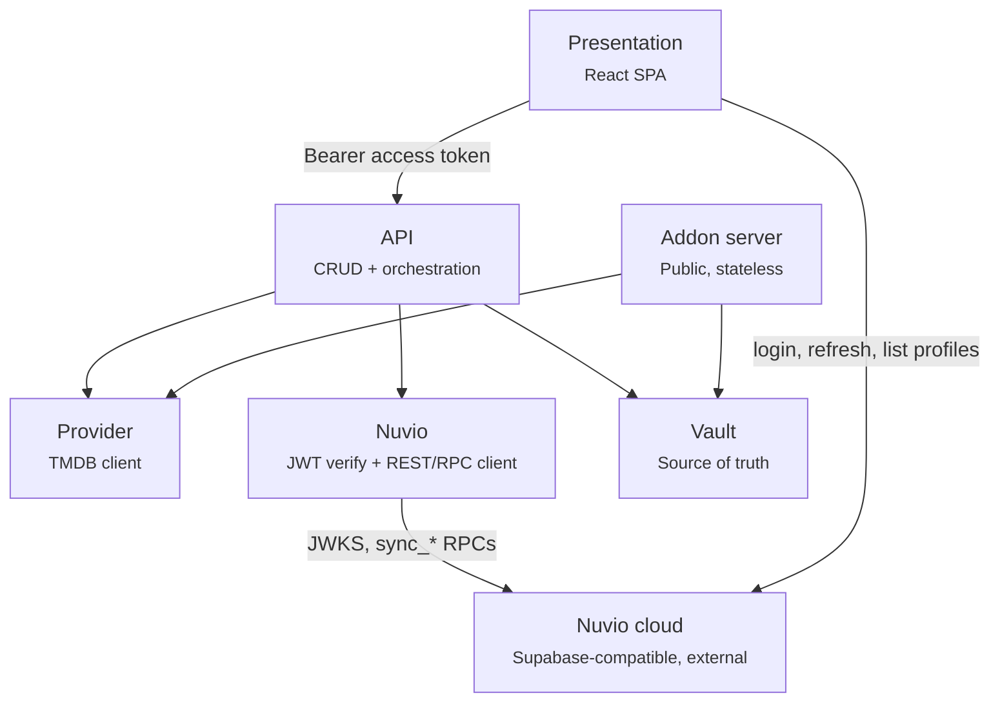

# Architecture

Uno builds personal Stremio-protocol catalog addons for [Nuvio](https://api.nuvio.tv) profiles. A
user logs in with their Nuvio account, authors or borrows *catalogs* (standing TMDB discover
queries) and *collections* (folders of catalogs), arranges them into a home screen, and pushes the
result into their Nuvio profile — which then reads the catalogs back out of Uno's public addon
server.

One Go binary (`github.com/hiidz/uno`) serves all three HTTP surfaces on one port, plus the
embedded frontend build.

| Package | Owns |
| --- | --- |
| `internal/vault` | All persisted state. SQLite via `modernc.org/sqlite` (pure Go, `CGO_ENABLED=0`). Also the push payload (`pushpayload.go`: the wire types push sends, and the addon id and manifest id they carry) and the push record (`pushrecord.go`: what a profile's last push sent), since what push sends decides whether a collection needs a push, and the reads built on it: what the addon serves (`published.go`) and what waits for a push (`pushpending.go`). Imports only `jsonwire`. The schema is `schema.sql`, embedded |
| `internal/addon` | Stremio-protocol manifest + catalog responses, `/u/{token}/...` |
| `internal/api` | Bearer-token auth, CRUD orchestration, push, the route table |
| `internal/provider` | TMDB queries, recipe param types, IMDB-id resolution |
| `internal/nuvio` | JWT verification against JWKS; authenticated REST/RPC calls |
| `internal/tmdbkey` | Per-account TMDB keys: sealing under `UNO_SECRET`, and each request's key source (*TMDB keys*) |
| `internal/httpx` | Request and response plumbing `api` and `addon` share: JSON writes, path UUIDs |
| `internal/jsonwire` | Conversions on the way out to JSON, such as `OrEmpty` (a nil slice as `[]`) |
| `internal/config` | Env loading with defaults (`godotenv`) |
| `internal/static` | SPA-fallback file serving + CSP/security headers + gzip middleware |
| `web` | `//go:embed all:dist` — the built frontend |

**`internal/addon` never depends on Nuvio anything**, and this is enforced at the package level: it
imports only `vault`, `provider`, `tmdbkey` and `httpx`, never `nuvio` or `api`. That keeps the one public-facing surface simple, stateless,
and independently scalable. The split exists because these are three surfaces with three different
trust boundaries — authenticated SPA API, push orchestrator, public unauthenticated addon server.

`addon.ID` (`"hiidz.uno.catalog"`, defined as `vault.AddonID`) is constant across every profile.
Identity in the addon protocol comes from the URL path (`/u/{token}/...`), never from the addon
id.

**`vault.ManifestID(c)` is `c.Provider + "-" + c.ID.String()`** — the same literal string that
round-trips as Nuvio's `catalogSources[].catalogId`. Whatever string Uno's manifest uses for a
catalog id must be the same string in a pushed source entry: the manifest and the push payload
both call `vault.ManifestID` directly, and it has to stay that way. Both live in the vault because the vault builds the push payload and `addon`
imports the vault, not the other way round.

## Server construction

`api.Server` is built from a `Deps` struct — `New(d Deps) (*Server, error)`, with `Deps{Vault, Provider,
Verifier, Nuvio, SiteBaseURL, NuvioBaseURL, Access, Keys}` (`internal/api/deps.go`); a zero `Access` admits every
account, and a nil `Keys` is a server with one shared TMDB key (*TMDB keys*). `cmd/uno`'s
`apiDeps` builds them from the config. `Verifier` (`TokenVerifier`, one method)
and `Nuvio` (`NuvioClient`, eight methods) are narrow *consumer-side* interfaces over
`*nuvio.Client`'s method set, not the concrete type — the seam that makes `requireNuvioAuth` and
`listProfiles` testable against a fake. Compile-time assertions in `deps.go` turn a signature
drift in `internal/nuvio` into a build error in `internal/api` rather than a surprise at the call
site. `cmd/uno/main.go` passes the same `*nuvio.Client` value for both fields; a second,
independently constructed `Verifier` would mean a second, out-of-sync JWKS key cache. Because a
struct literal can silently omit a field, `New` checks each required field and returns an error
rather than nil-panicking on the first request that reaches it. It returns rather than exiting so
the decision to abort startup lives in `cmd/uno/main.go`, the only place that calls
`log.Fatal` — the same reason `addon.New` and `static.Gzip` return their errors.

## Auth model

| Question | Answer |
| --- | --- |
| Can a profile exist without Nuvio? | No. Every profile is born from a resolve-or-create against a live Nuvio account. |
| Proxy or direct? | Direct. Frontend → Nuvio for auth; Uno verifies the resulting JWT locally. |
| Password handling | Uno never sees one. The frontend posts credentials straight to Nuvio's auth endpoint. |
| Token persistence | None. Refresh tokens never touch Uno. Access tokens live only for the duration of a request. |
| Background/automatic push | No. Push is an explicit user action, while a live token is in hand. |
| What's public | The addon protocol (`/u/{token}/...`), plus `GET /api/health` and `GET /api/config`, which carry no user data. Everything else requires a bearer token, community reads included. |

**Uno is stateless with respect to auth.** No session store, no session cookie, no cookie secret.
Every authenticated request carries its own bearer token; identity is the verified `sub` claim,
nothing else.

**A server's operator is trusted with its users' Nuvio accounts.** The bearer token each builder
request carries is the user's own Nuvio access token, and Uno forwards it to Nuvio for profiles
and push (`internal/nuvio/client.go`, `do`). Nuvio has no narrower kind of token, so that one
token can make any Nuvio call the account can, deleting profiles or reading watch history
included, until it expires within the hour. The server also serves the page that takes the
Nuvio password. Uno keeps no token past its request, but whoever runs the server, or changes its
code, could. A user should sign in only to a server whose operator they would trust with their
Nuvio account.

Direct auth is viable because Nuvio's JWKS endpoint (`/auth/v1/.well-known/jwks.json`) serves a
live **ES256 (P-256)** asymmetric key, so verification is local, cached, and costs zero network
round trips per request. On symmetric HS256 signing the JWKS response would be empty and the only
options would be a `GET /auth/v1/user` round trip per request, or a proxy design where Uno holds
credentials.

`profiles.token` is a capability URL for a public, read-only surface. Acceptable in browser
memory; never log it or place it in a URL the user might share. Nothing changes a profile's
token once it is made, so one that leaks, from a manifest URL pasted somewhere or a reverse
proxy's access log, stays usable: its holder reads the profile's served catalogs and makes public
requests paced as that token (*Rate limit*), on its owner's TMDB key in per-account mode. The
remedy is a hand edit of `profiles.token` followed by a push, which replaces the old addon entry
in Nuvio (`mergeAddon`).

## Sharing vocabulary

Code, API, database and docs say publish / subscribe / unpublish / duplicate / publisher. The UI
says Publish / **Add** / Unpublish / Duplicate / publisher. Add = subscribe is the one place the
two layers differ.

| Concept | Code, API, database, docs | UI |
|---|---|---|
| The feature as a whole | sharing (`features/sharing`, `serveSharingCall`): a name, never a verb or status | never says "share" |
| Browse tab | Community | Community |
| Put it out | publish, publication, publisher | Publish…, Publish update…, "Published" |
| Take it back, for good | unpublish; a subscriber's row is then released, silently becoming their own | Unpublish; the subscriber is not told, and the row loses its From Community sticker |
| Read-only copy that gets updates | subscribe, subscription, subscriber, subscribed copy | **Add**, ✓ Added, "Added by N", the **From Community** sticker |
| Copy that's yours to edit | duplicate (`DuplicatePublication`, `DuplicateCollection`) | Duplicate |
| Get the update | update | Update |
| Who published it | publisher (`publisher_id`) | its publisher |
| The profile a row belongs to | owner (`owner_id` on catalogs, collections) | — |
| What subscribe or duplicate produces | copy | copy, for what Duplicate makes only |

- Text a user reads uses the UI words, Go error messages the SPA shows verbatim included.
- In the UI, "copy" means only what Duplicate makes. A row added from Community is labelled
  **From Community** everywhere (its sticker, its view, the Publish dialog) and is never called a
  copy.
- An own row's editor setting holding Publish and Unpublish is labelled **Community**.
- An update reaches a subscribed copy only when its subscriber takes it with Update. Nothing
  applies one automatically: a publisher never changes what a subscriber's Nuvio shows without
  that subscriber accepting the change, however often the publisher updates.
- **Media travel by address, not by content.** A collection's and its folders' image, GIF and
  video fields are web addresses the publisher typed (any `http` or `https` host,
  `mediaURLProblem`), and Uno stores and pushes the address alone. So the guarantee above covers
  the address, not the picture: whoever runs that host can change what it serves at any time. The
  host also sees every device that fetches it: a browser scrolling Community fetches each folder's
  cover as it renders (`RowPreview.tsx`), before anyone presses Add, and an added collection's
  media are fetched by every Nuvio device that shows it. A publisher who controls the host learns
  the viewers' IP addresses and browsers, though Community never names a publisher to its viewers.
  Which hosts Community should show covers from is not decided yet.
- Where pushed content shows up is always **Nuvio**, never "TV".

## HTTP surface

**Public means the addon protocol. Authenticated means everything else** — community/public reads
included, because login gates the entire builder experience, browsing included. The split is
visible at the URL level (`/u/...` vs `/api/...`), not merely enforced by middleware. Two
`/api` routes are the exceptions, and neither says anything about an account: `GET /api/health`
answers `ok`, and `GET /api/config` says the server's TMDB key mode (*TMDB keys*).

Route registration is in `internal/api/server.go`. A path under `/api/` that no registered route
serves, whatever its method, is a 404 (`apiNotFound`). Everything else not matching a registered
route falls through to the embedded SPA (`static.Gzip(static.Handler(distFS))`); Go's `ServeMux`
matches the most specific registered pattern first.

`docs/api/openapi.yaml` (OpenAPI 3.1) describes every registered route: request and response
bodies, status codes, and the auth each takes. `TestOpenAPISpecMatchesRoutes`
(`internal/api/openapi_test.go`) fails when a route is registered that the spec doesn't describe,
or the spec describes one no route serves. It checks paths and methods only, so a change to a
body or a status code updates the spec by hand.

`requireNuvioAuth` (`internal/api/auth.go`) runs `authenticate` (`internal/api/access.go`): it
reads `Authorization: Bearer`, calls `s.verifier.Verify`, maps `ErrInvalidToken` → `401` and
`ErrJWKSUnavailable` → `502` (`verifyRefusal`), then checks the verified claims against the access
policy (below). It then stashes both the `sub` and the raw token in the request context under an
unexported `contextKey` type. Handlers read them via `nuvioUserIDFrom(ctx)` /
`nuvioTokenFrom(ctx)`. On a server in per-account key mode it also attaches the account's own
TMDB key source (*TMDB keys*), read only if the request reaches TMDB. The raw token is stashed so exactly one place in the codebase understands
the `Authorization` header format.

### Access

Any Nuvio account can sign in by default. `UNO_ACCESS=allowlist` admits only the accounts whose
token carries an email address listed in `UNO_ALLOWED_EMAILS` (`docs/configuration.md`).
`Deps.Access` carries it, and `authenticate` checks it after verification on every authenticated
route: the token's `email` claim (`nuvio.Claims.Email`), lower-cased, must be in the list, which
startup stores lower-cased. A token without an `email` claim matches no entry. Every token Uno sees
has one: Uno signs in only with an email and a password, and Supabase writes the address into every
token it signs. After an email change the old address still matches until the token refreshes,
within the hour.

A verified account the policy doesn't admit gets **403** "this Nuvio account can't use this Uno
server", never a 401: the SPA answers a 401 by refreshing its token and retrying, which a refused
account would do forever. When the dev auth bypass is configured, `cmd/uno` admits its fake
account too, by its id, since it has no email (`Access.WithDevBypass`, `DevBypassSub`).

The policy is read from the environment, so it holds across instances.

`requireProfile` chains *after* it on every profile-scoped route — the route table applies the
pair as `requireProfileAuth` — and reads `sub` from context, reads
`{profileIndex}` from the path, validates it's an integer 1–6 (`400` otherwise, before touching
the DB), calls `vault.GetProfileBySlot`, maps `ErrProfileNotFound` → `404`, then stashes the
resolved profile (`withProfile`; handlers read its id through `profileIDFrom`, and push the whole
row through `profileFrom`). It is a **lookup-only** resolver — no create, no drift-overwrite. A client
hitting a CRUD route before ever calling `POST /api/profiles/select` gets a clean `404`, not a
silent auto-provision.

Route-semantics facts the client has to honour:

- **The library is one read: `GET /api/p/{i}/library`** (`getLibrary`,
  `internal/api/library.go`) answers `{catalogs, collections, pending, home_revision}`: the listed
  catalogs (`GetUserCatalogs`), the collections with their folders and catalogs
  (`GetUserCollections`), what a push would change in Nuvio (`PendingPush`, below), and the
  `home_revision` the next push is built from (*Push*). The builder's lists have no
  other GET: the catalog and collection routes keep their writes, and `push/pending` is gone.
  It is unpaged, so a profile is capped at 200 listed catalogs and 50 collections
  (`internal/vault/limits.go`). Every path that adds a row checks it inside its own transaction:
  a catalog create or Duplicate, a collection create or Duplicate, a subscribe, a Community
  Duplicate and an import, which is refused whole. The refusal is a 400 (`ErrInvalidInput`). A
  collection's scoped catalogs don't count, and a profile already past a cap still reads, pushes,
  saves and deletes.
  `GetLibrary` reads all four in one snapshot, so the pending list describes the very rows the
  lists hold, and the `home_revision` the Home positions they carry.
- **A save carries the revision it was built from.** Every catalog and collection row carries
  `revision`, which each content write raises by one in its own transaction (`docs/data-model.md`
  → *Revisions*). `PUT /api/p/{i}/catalogs/{id}` and `.../collections/{id}` take the form plus
  the `revision` the editor opened at (`catalogSave`, `collectionSave`); a save at any other is
  refused with `409 {"error": "Error saving."}`, writing nothing (`vault.ErrStale`, checked
  inside the write's transaction by `writeCatalogAt` and `updateCollectionTxAt`). An absent
  `revision` decodes as 0, which no row is at, so a tab loaded before revisions existed is refused
  rather than overwriting. A collection's revision guards the catalogs scoped to it too: only its
  save and an Update of a collection copy write them, and `catalog_edits` carry none. Update
  writes a copy with no revision to check. A `DELETE` takes none: a delete from a stale tab still
  deletes.
- **The Home selection is read from the library and written only by push.** Each owned row
  carries its place on Home as `home_position`, with a catalog's `show_in_home` and a
  collection's `pin_to_top`; a row whose `home_position` is `null` is off Home. The whole pending
  selection travels in `POST .../push`'s body and is written by that handler, in one transaction,
  only after Nuvio has accepted the push. There are no selection routes; the transactional write
  bodies are `saveCatalogSelectionTx`/`saveCollectionSelectionTx` inside `internal/vault`.
- **Community is other profiles' publications, by publication id.** Every route is
  profile-scoped, and the rules behind them are in `docs/data-model.md` → *Publications and
  subscriptions*. The handlers are in `internal/api/community.go`, and every one but the list
  runs through `serveSharingCall`: the id comes from the path, and a vault error goes through
  `writeVaultError`, whose 404 for these routes is `vault.ErrPublicationNotFound`.
  - `GET /api/p/{i}/community?kind=&sort=&q=&cursor=` (`ListCommunity`) answers one page of the
    publications not the caller's own, `{items, next_cursor}`: 50 rows of one `kind` (`catalog`,
    `collection`) by `sort` (`name`, `newest`), where every word of `q` is in the title or a
    catalog's name, after `cursor`, the last page's `next_cursor` (`null` on the last page). The
    server searches, filters and sorts, so the list's size grows with the server without the
    response doing so. A bad kind, sort or cursor, or a `q` over 200 characters or 8 words, is a
    400. A row carries its counts, dates, `subscribed` and `update_available` for the caller, the
    names of its catalogs, and for a catalog its recipe, but never its publisher.
  - `GET .../community/{id}` (`GetPublication`) is the row with its `snapshot`; 404 once it is
    unpublished. It is also how the SPA previews an update: the page shows the new version
    before Update applies it.
  - `GET .../community/{id}/changes` (`UpdateChanges`) is what Update would change in the caller's
    added row: its copy against the publication's current snapshot, as a list of `SnapshotChange`
    items in the order removals, additions, changes. `[]` for a row in step; 404 unless the caller
    subscribes to the publication.
  - `POST .../community/{id}/subscribe` (`Subscribe`, 201) and `.../duplicate` (`DuplicatePublication`,
    201) copy a publication of someone else's into the caller's own rows, as
    `{kind, catalog | collection}`. A second subscribe is a 409. `.../update`
    (`UpdateSubscription`, 200) brings the caller's subscribed copy up to the current snapshot.
    None of the three reaches TMDB: they run the form validators over a snapshot whose recipes
    were checked when their rows were saved, so a snapshot today's rules refuse is a 400.
  - Updating a subscribed *listed* catalog changes what Nuvio shows only at the next push: the
    addon serves a catalog's name and params from the push record (*Addon server* below), so an
    Update, like an editor Save, waits for Push. It shows on Home as a change to push
    (`pending` in `GET .../library`, *Push*), as does an Update that changes what push sends for a
    collection copy on Home.
- **Publishing an owned row is a call on the row.**
  - `POST /api/p/{i}/catalogs/{id}/publish` and `.../collections/{id}/publish`
    (`PublishCatalog`/`PublishCollection`, 200 with the row and its `publication`) publish it or
    publish its update, in one transaction that reads the vault only: every recipe the snapshot
    publishes was checked against TMDB when its row was saved, so a publish makes no TMDB call.
    A snapshot the form validators refuse, a catalog inside a collection and a subscribed copy are
    400s. A collection that references a catalog the caller subscribes to publishes, with that
    catalog frozen as it stands. Two publications of the same content are both listed in
    Community.
  - `.../unpublish` (`UnpublishCatalog`/`UnpublishCollection`, 200 with the row, its
    `publication` now `null`) deletes its publication, if any. It is one-way: every subscriber's
    copy becomes that subscriber's own row, untold, and publishing the row again is a new
    publication with no subscribers.
  - `GET .../catalogs/{id}/changes-since-publish` and `.../collections/{id}/changes-since-publish`
    (`CatalogChangesSincePublish`/`CollectionChangesSincePublish`) answer what publishing an
    update would change: the row as saved against what it last published, in the same item list.
    `[]` for a row not published; a subscribed copy and a catalog inside a collection are 400s,
    as for a publish. They read the vault only: nothing here compares with the push record.
  - A content write to a subscribed copy — `PUT` of the catalog or the collection — is a 400
    (`refuseSubscribedCopy`, run in the write's transaction ahead of the write, over the
    caller's own subscriptions, so another profile's copy still answers 404). `POST .../community/{id}/update` is the only writer of a copy. A subscription ends when
    the copy is deleted, or when its publisher unpublishes, which leaves the copy the caller's own.
    Placement is not content: Home order, Home
    or Discover and the pin (`pin_to_top`) all travel in push's selection (*Push* below), for
    a copy as for any row.
  - Another profile's row answers 404 on all of them, like one that doesn't exist.
- **Duplicating a catalog you own is one server call, and makes no TMDB call.**
  `POST /api/p/{i}/catalogs/{id}/duplicate` (`DuplicateCatalog`, 201) writes a listed copy of the
  stored type, provider and params through `CreateUserCatalog`, so only the form validators run:
  a recipe TMDB has since outgrown doesn't block a copy of your own catalog. The name is
  `copyName` of the source's, and the copy is unpublished and subscribed to nothing, even when its
  source is a subscribed copy. 404s via `ErrCatalogNotFound` for another profile's catalog and
  for one scoped to a collection.
- **Every Duplicate names its copy the same way.** `copyName` appends `" (copy)"`, cutting the
  name short, in characters, when the two would pass `maxNameLen`: the library's catalog and
  collection and Community's, never refusing for length.
- **Duplicating a collection you own is one atomic server call, not a client-built copy.**
  `POST /api/p/{i}/collections/{id}/duplicate` (`DuplicateCollection`) extracts the source into
  its bundle form and writes it back through the same `createCollectionTx` a collection create
  runs: folders and their refs are copied in order, a listed source catalog stays a reference
  (same id), and each distinct catalog scoped to the source collection becomes a fresh scoped
  copy in the new one, so a catalog referenced by two folders collapses into one new scoped copy
  referenced twice. The copy is unpublished and subscribed to nothing, even when its source is a
  subscribed copy. 404s via `ErrCollectionNotFound` if the source isn't owned by the caller.
- **A catalog inside a collection is written only through that collection's save.** It is
  created there, as a folder's inline `new` entry; `POST /api/p/{i}/catalogs` always creates a
  listed catalog. `PUT` and `DELETE /api/p/{i}/catalogs/{id}` answer `400` for a catalog whose `collection_id` is
  set. Its edits travel in the collection's own `PUT` body as `catalog_edits`
  (`vault.ScopedCatalogEdit`), whose recipes `validateInlineCatalogs` checks alongside the
  folders' inline `new` specs, so a bad recipe is a `400` (or a `502` when TMDB can't judge it)
  on the collection save. It goes away by dropping its last folder ref and saving the collection.
  `PUT` of a *listed* catalog leaves its scope alone, so the catalog stays listed.
- **Deletes are allowed any time.** `DELETE /api/p/{i}/catalogs/{id}` and
  `.../collections/{id}` remove the row from Uno and Community at once (a published row is
  unpublished, and its subscribers keep their copies as their own) whether or not it is on Home; Nuvio keeps what the last push put there, served
  from the push record, until the next push drops it (*Addon server*, *Push*). A delete changes
  nothing else about Nuvio: a collection whose folders used the catalog loses it by cascade, so
  that collection shows as changed. The delete confirm says so: "Delete removes it from Uno and
  Community now, and from Nuvio at your next push."
- **What waits for a push is read from the server.** The `pending` list of `GET /api/p/{i}/library`
  (`PendingPush`, `internal/vault/pushpending.go`) answers the rows a push of the Home as Uno
  stores it would change in Nuvio, as `[{kind, id, name, change}]` with `change` one of `changed`
  (Nuvio holds the row differently: a catalog's name or recipe, a collection's pushed bytes, or
  a catalog its folders use), `added` (on Home, and Nuvio holds nothing for it) and `removed`
  (deleted since the last push). It is the difference between the push record and the record
  `StoredPushRecord` builds from the Home columns now, read in one snapshot. The Home edits a tab
  has made and not pushed are not in it: the SPA lists those itself and adds this list
  (`docs/frontend.md`).
- **Import never trusts its own check step.** Three routes in `internal/api/bundle.go` move
  catalogs and collections in and out as a bundle (format in `docs/data-model.md`, "Bundle
  format"):
  - `POST /api/p/{i}/export`, body `{catalog_ids, collection_ids}`, answers 200 with the bundle
    (`ExportBundle`). Every id must be one of the caller's own listed catalogs or own collections,
    and the selection can't be empty; otherwise 400 naming the id.
  - `POST /api/p/{i}/import/check`, body `{bundle}`, answers 200 with `{catalogs, collections}`
    (`importCheckOf`): what the bundle holds, in bundle order, for the import dialog to list, so
    the SPA never reads the bundle's format. `catalogs` are the top-level ones, each
    `{key, name, type, params, existing: [{id, name}]}` with params canonical; `existing` is every
    one of the caller's listed catalogs whose recipe hash (`Catalog.RecipeHash`) equals it, sorted by name,
    then id, and `[]` when none does. `collections` are each
    `{title, folders, matched, catalogs}`: its folders' titles, whether its title, trimmed and in
    any case, is one of the caller's collections', and its own catalogs in the same shape. A
    collection's position in the list is the one `skip_collections` names.
  - `POST /api/p/{i}/import`, body `{bundle, reuse, skip_collections}`, answers 201 with
    `{catalogs, collections}` (`ImportBundle`): the new listed catalogs and the new collections, in
    bundle order. `reuse` maps a bundle catalog key to one of the caller's listed catalogs, which
    that key's refs then point at; a reused catalog gets no new row and is not in `catalogs`.
    `skip_collections` lists bundle positions to leave out, each with its own catalogs
    (`withoutCollections`, before `prepareBundle`), so a `reuse` key inside a skipped collection is
    refused like any key the bundle lacks; a position the bundle doesn't have is a 400.

  Both import routes run `prepareBundle` first: `Bundle.Validate`, then `checkRecipe` on every
  catalog, which replaces its params with the canonical form its row stores. So a bad file or
  recipe is a 400 (a recipe error names the catalog's key), and a TMDB outage a 502. Import runs
  all of that again rather than relying on an earlier check, then every form check before its
  transaction opens; the reuse targets are checked inside it (each must be a listed catalog of the
  caller's holding the recipe of the bundle catalog it stands in for, `checkReuseRecipes`), and any
  failure writes nothing. The
  two import routes take a body up to `maxBundleBodyBytes` (4 MiB, `decodeJSONLimit`); every
  other route keeps the 1 MiB `maxRequestBodyBytes`, and either limit exceeded is a 413. Every
  route with a body decodes strictly (`decodeJSONLimit`, *Error responses* below): a key the bundle
  has no field for, a mistyped `"tile_shap"`, is a 400 that names it
  (`invalid request body: unknown field "tile_shap"`) rather than being dropped with the field left
  at its default. `BundleCatalog.UnmarshalJSON` decodes strictly itself, since a custom unmarshaler
  does not inherit the outer decoder's setting.
- **Selection lives on the rows themselves, not a join table.** `catalogs.home_sort_order`/
  `show_in_home` and `collections.home_sort_order` are columns on the owning row, the two
  `home_sort_order`s one numbering of a profile's Home, so catalogs and collections mix. The
  selection endpoints are `owner_id = ? AND home_sort_order IS NOT NULL`, ordered by it, and each
  row carries it as `home_position`, which the builder merges the two reads by. The closed graph
  means a selection can only ever contain rows the caller owns — there is no visibility filter to
  reason about, and no "selected but since made private"
  case to render around.

### Addon server — public, unauthenticated, CORS-open, cacheable

Two routes: `GET /u/{token}/manifest.json` and `GET /u/{token}/catalog/{type}/{rest...}`, where
`rest` is `{id}.json` or `{id}/{extra}.json`, where `{extra}` is a query string of `skip`
(pagination) and `genre` (a pick from the catalog's genre extra). A third, `GET
/u/{token}/configure`, is where Nuvio's addon managers send the addon's Configure action (the
manifest declares `behaviorHints.configurable`); it redirects to the builder's `/profiles`, which
asks for sign-in, without looking the token up. The manifest's `logo` is the SPA build's
`logo.png` on `SITE_BASE_URL` (`addon.LogoPath`, `web/public/logo.png`), which the addon managers
show beside the addon's name.

**Both routes serve the profile's push record, never its live rows.** What the addon tells Nuvio
is what the profile's last push put there (`PushRecord`, *Push* below): a Save, an Update or a
delete changes the rows in Uno and reaches Nuvio only once a push has carried it. The record is
current only while its stamp is the profile's Nuvio profile id now (`currentRecords`); a profile
that never pushed, or whose Nuvio profile slot was reused since (`ResolveOrCreateProfile` updates
the id), has none, and Nuvio is taken to hold nothing: its manifest is a 200 with an empty
`catalogs` list and every catalog route is a 404, until its next push stores a fresh record.

The manifest (`vault.GetPublishedCatalogs`) lists the record's catalogs in its order: those with a
home row of their own, with the Home or Discover the push carried, then those only a folder of a
pushed collection uses, off Home. Names, types and params are the record's own, so they are what
the last push left.

The catalog route makes **one lookup**, `vault.ServedCatalog`: the profile by token, joined to its
current push record and to the owner's sealed TMDB key (for per-account mode, read live: a key
isn't content), then the catalog by id with the route's type and the provider from its manifest id
(`parseManifestID` accepts only the exact form `ManifestID` writes) among the record's catalogs.
It serves only a catalog **Nuvio can reach**, the manifest's set checked for this one catalog: one
with its own home row (Discover-only rows included), or one a folder of a pushed collection
references, with the params the push left. The lookup is also the access check: an unknown token,
another profile's catalog, a catalog the last push didn't put in Nuvio and a type or provider the
catalog doesn't have all return **404**, so a leaked or guessed catalog UUID can't pull data
through a profile it doesn't belong to, nor a catalog the profile hasn't pushed.

**A catalog row ends at 500 titles** (`maxServedTitles`): a `skip` of 500 or more answers **200
with an empty `metas`** and makes no TMDB call, the end of the catalog as a client reads it. The
route is public and walks a recipe's pages from page 1 (below), so without the bound one request
for a deep `skip` would cost TMDB up to 500 discover calls and their IMDB id lookups, around
10,000 calls, and push every other profile's pages out of the page cache. At 500 titles a cold
request walks at most 50 pages. No one scrolls a Nuvio row that far, and TMDB's own ceiling, page
500, lies well past it.

**`skip` is a count of titles, and a page is the next twenty** (`catalogWindow`). Nuvio's apps
and Stremio send `skip` as the number of titles they already hold, and a TMDB page holds fewer
than twenty of them whenever a title without an IMDB id was dropped (below), which happens on a
page or two in every few of a sparse recipe: 12–19 of 20 measured on Korean, documentary and
Tamil recipes on 2026-10-03. Serving TMDB page `skip/20+1` would hand a client that holds 18 the
same page again, a scroll that loads nothing new, and a row whose pages ran down to six or fewer
would end, since the clients give up after three pages with nothing new. So the route walks the
recipe's pages from page 1 (`walkWindow`), each from the page cache once a client has scrolled
past it, and serves the twenty titles after the first `skip`, fewer only where the catalog ends
or the 500th title comes first.
The catalog ends where TMDB's `total_pages` says it does (`provider.CatalogPage.More`), not at a
page left with no titles: every title on a page can lack an IMDB id while the pages after it have
some. The walk stops at twice as many pages as full ones would take, which bounds a cold request deep
into a sparse recipe. A randomized recipe has no order to walk, so it keeps serving the one random
page it picks.

**A catalog leaves Nuvio's addon when a push takes it off**, whether it was taken off Home or
deleted: until then it is served as pushed, so a deleted catalog never leaves a Nuvio client with
an empty row or tile before it has synced. A client keeps showing what it was last pushed until it
syncs again. NuvioTV (source read at `1a132cb`, 2026-09-30) syncs rarely:
- **Collections and the addon list** are pulled only by a full sync, when the app starts or a
  profile is picked (`StartupSyncService.requestSyncNow`), or from the addon manager's manual
  refresh, which pulls the addon list alone.
- **Not on resume**, and not on the 15-minute timer: both pull only watch state and library
  (`scheduleActivityPull`). A realtime collections pull exists (`requestRealtimeSurfacePull`),
  but nothing calls it.
- **Manifests** refresh at launch, then at most every 6 hours while the app runs
  (`MANIFEST_CACHE_TTL_MS`).

So a client left running keeps a row until it restarts or someone picks a profile, which can be
hours or days, and a push that takes a row off answers 404 for it at once to a client that
hasn't synced: its row or folder tile comes back empty until then. That is accepted. A second
gap, also accepted: push stores the record only after Nuvio accepted the push, so a client that
reads the manifest in those few milliseconds sees the list as it was before the push.

The tile flow is `CatalogHandler` → `TMDBClient.FetchCatalogPage` → TMDB `/discover/{movie|tv}` →
per-item `/external_ids` → `Meta`. A discover page is served from the **page cache**
(`internal/provider/pagecache.go`): the finished metas, keyed by the discover request — its path
and sorted query, genre pick and page included, `api_key` not — for 30 minutes
(`catalogPageTTL`). So profiles showing the same recipe
cost TMDB one fetch per half hour, not one each. It holds at most `maxCatalogPageEntries` (1,000,
near 20 MB), evicting the least recently used. Requests for a key whose fetch is in flight wait
for that fetch; it runs detached from the request that started it (bounded by
`catalogPageFetchTimeout`), so one client hanging up fails no other. A failed fetch is not
cached. A randomized recipe picks its page before the lookup, so each random page is its own
entry. A page whose genre list failed to load is served without `genres` but not cached, so it
isn't shared. A panic in a fetch, which runs outside any handler's recover, becomes that fetch's
error (`recoverFetch`). A collection recipe's page isn't cached: its films are memoized already (below).
The TMDB-id→IMDB-id cache on `TMDBClient`
(a pairing never changes once resolved, so a found id never expires, while TMDB having no id
for a title is served for `missingIMDBIDTTL`, 24h, since TMDB adds ids to new titles later; the map is capped at
`maxIMDBCacheEntries` and emptied whole once it fills, because the public addon route can add one
entry per title TMDB has) and the lookup-list memos beside it
(`internal/provider/cache.go`: genres, languages, countries, watch regions and certifications for
the process's lifetime, watch providers and the network export for 24h since services move between
markets and TMDB republishes the export daily). Every memo
clones on read, so a caller that sorts what it got back cannot reach the cached copy. The memos
keyed by an id a caller supplies — the per-id companies, keywords, collections and networks, a
collection's parts, and company and network title counts — are built with `newBoundedMemo`, because their key space is
TMDB's whole catalogue: `maxEntityCacheEntries` (10,000; an entry is an id and a name or a count)
for all but the parts, `maxCollectionPartsEntries` (1,000; an entry is a whole film list) for
those. Inserting a new key at the bound drops the expired entries and, if the memo is still full,
empties it whole — the `maxIMDBCacheEntries` policy, since an entry costs one TMDB call to
re-derive. The whole-list memos stay unbounded; their key spaces are a handful of types and
regions.
`resolveMetas` bounds the per-page `/external_ids` fan-out at 8 concurrent lookups. A title TMDB
has no IMDB id for is dropped from the page; a lookup that *fails* fails the whole page, so the
502 goes to the client instead of a short row the page cache would keep. `releaseInfo`
is year-only (`YYYY`), Stremio's own convention, matching the Cinemeta sample in
`docs/api/samples/catalog-response.json`. `meta.id` is the IMDB id (`tt...`), which is why
per-item `external_ids` resolution exists at all.

Every other `Meta` field comes from the discover response itself, with no further per-item call:
`poster` (w500), `background` (w1280, from `backdrop_path`), `description`, `releaseInfo`,
`released` (the full date as a midnight-UTC ISO 8601 timestamp, the form Stremio-protocol clients
parse), and `genres` (`genre_ids` named through the cached `Genres` list). Nuvio's own TMDB
enrichment is off by default, so these tile fields are what its home hero and landscape tiles show.
A failed genre-list fetch serves the page without `genres` instead of failing it. `imdbRating` is
deliberately absent: TMDB only has its own `vote_average`, and Nuvio labels the field IMDb.
`logo` and `runtime` are absent because discover doesn't carry them.

The manifest reads `vault.GetPublishedCatalogs`, not the catalogs on Home — the derived
union of listed catalogs on the home screen and every catalog referenced by a folder of a
collection on the home screen, deduped by id with the home row's
`ShowInHome` winning over a folder-derived one. The manifest needs the wider set so a catalog
used only inside an on-TV collection's folder is still listed, not a dangling reference. The catalog
route checks the same set, for one catalog at a time (above).

Every catalog declares `extra: [{name: "skip"}]` and an explicit `showInHome` (its *published*
`ShowInHome`), plus one `genre` extra (`genreExtra`). Its options aren't chosen by the user.
They are TMDB's genre list for the catalog's type, narrowed to the genres a pick can actually
narrow the recipe by (`provider.GenreExtraOptions` → `genreChoices`):

- With an "any of" (pipe) `with_genres`, only that list's genres. A pick replaces the list,
  because TMDB can't express "(A or B) and C".
- Otherwise every genre except those the recipe already requires or excludes.

The genre filter and the off-home flag share that single entry, because `genre` is the only
required extra the Nuvio mobile/desktop clients tolerate: their Discover and collection-source
pickers drop a catalog with any other required extra (`skip` and `search` aside), so a separate
required marker would take the catalog out of Discover too.

- **Off home** (`ShowInHome` false: off the home screen entirely, or on the TV only through a
  folder): `isRequired: true`, options `["All", …genre names]`, `optionsLimit: 1`.
- **On home**: optional, options are the genre names. There's no genre extra if none apply.

The manifest reads TMDB's genre list through `TMDBClient.Genres`, which memoizes each type's list
in memory for the process's lifetime after the first successful fetch. A cold fetch that fails
is not cached, and degrades that catalog to no genre names (just `["All"]` when off home) rather than failing the
manifest.

Two separate mechanisms keep an off-home catalog off home, because the clients disagree. Nuvio
mobile, Nuvio desktop (the same codebase as mobile) and Stremio leave a catalog with any required
extra out of home's automatic rows, and mobile/desktop never read `showInHome`. Nuvio TV reads
only the per-catalog `showInHome` field, treating an absent one as "show" — which is why
`showInHome` is always on the wire; the only required extra it checks for home is `search`.

The `"All"` first option is required, not cosmetic. Nuvio mobile/desktop and Stremio open a
required genre on its first option, and both drop a catalog whose required genre has no options
at all. Nuvio TV's Discover ignores `isRequired`: it starts on its own "Default" entry, which
sends no genre, so an off-home catalog there lists "Default" and then `"All"`, two entries that
both mean unfiltered.

A home row arrives unfiltered: no client sends a genre for an automatic home row. A collection
folder's row arrives filtered when its source carries a `genre`, which Uno pushes for every folder
reference that has one (`folder_catalogs.genre`, `docs/data-model.md`); Nuvio sends it back as this
same extra. Confirmed on Nuvio desktop and mobile with a hand-edited collection (the folder's rows
came back filtered), and in Nuvio TV's source, whose folder view sends a source's genre unless it
is blank or `"None"`. Otherwise the pick is made in Discover.

These client behaviours were read from the clients' source at NuvioTV `1a132cb`, NuvioMobile
`90b58e2`, NuvioDesktop `c5826cb` and stremio-core `43427b9` (checked 2026-10-01), and read again
at NuvioTV `e374881`, NuvioMobile `7be1b56` and NuvioDesktop `ed77003` (2026-10-03), all but
Nuvio TV Discover's "Default" entry; installed builds can lag them.

`CatalogHandler` reads the extra props with `parseCatalogPath`, from the still-escaped path.
`PathValue` is already percent-decoded, so a genre like `Sci-Fi %26 Fantasy`, which Nuvio sends
encoded, would otherwise split at its `&`. It passes the `genre` value to `FetchCatalogPage`,
whose `applyGenrePick` (shared with `PreviewCatalog`) resolves the name through the same
`GenreExtraOptions` list and narrows the discover query with `applyGenreExtra`
(`internal/provider/query.go`): ANDed onto an AND `with_genres`, or replacing an OR one. `All`, an empty value, or a name not in that list leaves the recipe
unfiltered. A collection recipe (`with_collection`, `docs/data-model.md`) has no `with_genres`, so it
offers every genre, and its pick filters the collection's films by `genre_ids` instead of
narrowing a discover query.

A catalog page carries `cacheMaxAge` 10800s / `staleRevalidate` 3600s, the same values the
Cinemeta sample carries. They are hints the Stremio addon SDK turns into a `Cache-Control` header
(stremio-core `response.rs`); no Nuvio app reads them from the body, and Uno sends no such header
on `/u/` routes, so Nuvio's apps fetch every catalog page afresh on every view. The page cache is
what keeps that from reaching TMDB. A long header would keep a pre-push row on the TV for as long
as it said, and the manifest must never get one.

**Rate limit.** Every TMDB API call the process makes goes through `TMDBClient.get`, and so
through one token bucket (`internal/provider/ratelimit.go`): Uno's own ceiling of 40 requests a
second with a burst of 40 (`tmdbRequestsPerSecond`, `tmdbRequestBurst`), shared by the builder's
lookups and previews and every catalog page. A request waits for a token, or gives up when its
context ends. A **429** pauses the whole bucket for the answer's `Retry-After` (seconds or an HTTP
date, 1 s when missing, capped at 10 s so a waiting page fetch can still finish inside its
30 s timeout), then the request goes once more and that answer
stands. The network export download (`files.tmdb.org`, not the API) doesn't go through it.

Ahead of the process-wide bucket, each call waits on its **caller's** own bucket, 20 a second with
a burst of 40 (`perCallerRequestsPerSecond`, `callerLimiters`), in either key mode, so no one
caller can take the whole budget and leave every other profile's rows waiting. The caller is the
signed-in account on the builder routes (`requireNuvioAuth`, `provider.WithCaller`) and the addon
token on the `/u/` routes (`tokenCaller`). A shared page fetch is paced as the caller that started
it. A call made with an account's own key (*TMDB keys*) also waits on that key's own bucket, at
the same rate (`perKeyRequestsPerSecond`, `keyLimiters`), so an account's tokens together can't
spend its key faster than that. Both kinds of bucket live in one `keyLimiters` each, filed by the
SHA-256 of the key or caller so the map holds neither, a token taken under the map's lock so the
once-a-minute sweep of refilled buckets can't split one across two.

**One process.** The page cache, the memos and the limiter live in memory, so they assume one
server process. A second instance would need shared ones.

### TMDB keys

`TMDB_KEY_MODE` (`docs/configuration.md`) picks how the server reaches TMDB. In `shared` mode
every call uses `TMDB_API_KEY`, the `TMDBClient`'s own key. In `per-account` mode the client has
no key, and each call's comes from its context (`provider.WithKeySource`):

- **Which key.** The builder routes use the signed-in account's (`requireNuvioAuth` attaches
  `tmdbkey.Keys.ForAccount`), so a preview, a save's recipe check and a lookup use the caller's
  key. The catalog route uses the key of the account that owns the token's
  profile, read in its one lookup (`Keys.Sealed`); the manifest route looks it up by token for a
  cold genre list (`Keys.ForToken`). A subscribe (Add) makes no TMDB call. A source runs at most once per
  request, and only when a call goes out, so a request answered from a cache reads no key.
- **One client, shared caches.** There is one `TMDBClient`; `request` picks the call's key
  (`keyFor`) and sets `api_key`. The page cache, the memos and the IMDB-id cache stay shared,
  since TMDB's data doesn't depend on the key. A shared page fetch runs with the key of the caller
  that started it, so a caller that waited on it and got that caller's key problem tries again,
  until it gets another answer or starts the fetch itself with its own key (`pageCache.load`):
  another keyless caller may have started the next one.
- **Errors.** No key is `provider.ErrNoKey`, raised before any request. A TMDB `401` on an
  account's key is `provider.ErrKeyRejected`; on the shared key it stays an ordinary upstream
  failure (`502`), the operator's to fix. A stored key that no longer opens (`UNO_SECRET`
  changed) is treated as rejected, since its owner fixes it the same way. The builder answers
  both key problems `422` with fixed words (`keyFailures`): a status nothing else in the API
  answers, so the SPA can tell it apart — not `401` (the SPA refreshes and retries), `403` (the
  access refusal) or `409` (Already added, or a stale save). The addon routes answer `502`, as for any
  upstream failure, but log a key problem as the profile owner's key, apart from TMDB failing
  (`logTMDBFailure`): a keyless owner's TV asks for every row on every load.
- **Storage.** `internal/tmdbkey` seals a key with AES-256-GCM under `UNO_SECRET`, bound to its
  provider and account by `uno-account-key/1\0{provider}\0{account}` as additional data
  (`Box`), so a sealed key copied to another provider's or another account's row doesn't open. It
  is stored in `account_keys`, one row per account and provider (`docs/data-model.md`), and every
  read names its provider (`tmdbkey.Provider` for the TMDB keys). A key is never
  returned, never logged, and only ever sent to TMDB: a failed request's error drops its URL,
  which holds `api_key`, before anything wraps or logs it (`withoutURL`).
- **Routes.** `GET /api/config` (no sign-in) says the mode. `GET`, `PUT` and `DELETE
  /api/account/tmdb-key` read, save and remove the signed-in account's key, and answer `404` in
  shared mode (`perAccountKeys`). `GET` answers `{set, last4}`. `PUT {key}` trims the key and
  refuses one that isn't 32 hexadecimal characters with a `400` ("A TMDB API Key is 32
  characters, 0–9 and a–f."), naming TMDB's Read Access Token
  when it is one (`tmdbkey.Clean`); then it checks the key with one call to TMDB's
  `/authentication` (`TMDBClient.CheckKey`). A key TMDB refuses is a `400`, TMDB unreachable a
  `502`, and neither saves anything.

### `POST /api/profiles/select`

Body is `{"profile_index": N}` only. The handler calls `s.nuvio.ListProfiles` with the caller's
own bearer token, matches the requested index against that **live** response (a client-supplied
index absent from the account's real profile list is rejected with `400` before `vault` is ever
touched — the client's index is never trusted directly), then calls
`vault.ResolveOrCreateProfile`. That match-then-resolve sequence is
`Server.resolveSelectedProfile` (`internal/api/profiles.go`); it stays in `api` rather than
`nuvio` because it composes both `nuvio` and `vault`, and `api` is the only package depending on
both — moving it would force `nuvio` to import `vault` and break its leaf status.

The response is `{manifest_url}` alone
(`SITE_BASE_URL + addon.ManifestPath(token)`), built server-side so it is correct in dev and prod
alike and never depends on `window.location.origin`. Handing it over at selection time rather than
waiting on a first push means the builder can show the addon URL immediately. The URL carries
`profiles.token`, which this puts in browser memory on `/configure` — see the capability-URL note above.

### `POST /api/catalogs/preview`

The authenticated "run this recipe, show me tiles, save nothing" endpoint
(`internal/api/preview.go` + `provider.PreviewCatalog`).

| | |
| --- | --- |
| Auth | `requireNuvioAuth` only — **not profile-scoped**. No vault read, so nothing to scope. |
| Request | `{type, params, genre?}` — no `endpoint`, no `provider`, no `page`. `genre` narrows the recipe exactly as a client's genre pick does on the addon path (`applyGenrePick`), which is how a collection folder's per-reference genre is previewed |
| Response | `{randomized, items: [{tmdb_id, title, year, poster}], total_results}` — `total_results` is TMDB's count across every page these filters match, not the page `items` carries, so the builder can say "20 of N" rather than implying the page in hand is the whole answer |
| Cost | **1 TMDB call** per recipe; **2** for a `randomized` recipe whose random page isn't page 1; a collection recipe reads its memoized `/collection/{id}` instead of discover and reports its film count as `total_results`. A `genre` adds one `/genre/{kind}/list` fetch the first time a process needs that type's list (`TMDBClient.Genres` caches it for the process's lifetime) |
| Errors | `400` invalid recipe, `502` TMDB unreachable |

Four properties, each load-bearing:

- **It skips `resolveMetas` entirely.** That function's ~20 per-page `/external_ids` calls exist
  solely to mint IMDB ids for Stremio, and a preview has no use for them — poster, title, and
  year are all already on the discover response. Reusing `FetchCatalogPage` would make preview
  **21** TMDB calls per catalog instead of **1**. It does share `catalogEndpoint` +
  `DecodeParams`/`DiscoverQuery` + `discover` (and `collectionItems` for a collection recipe), which
  is the point: the underscore-to-dot param translation must live in exactly one place.
- **It takes a raw recipe, not a saved catalog id.** A saved id would serve only the home preview
  and force a second endpoint for the catalog builder's unsaved edits.
- **It derives the discover path from `type`; it never accepts one.** `TMDBClient.get` builds
  requests as `baseURL + path + "?" + query`, so a caller-supplied path is a request-forgery
  surface: it would let whoever wrote the row point the server's own outbound request, API key
  included, wherever they want. `FetchCatalogPage` and `PreviewCatalog` both derive the path from
  `catalogType` via `catalogEndpoint` (`internal/provider/catalog.go`), the single lookup from
  catalog type to discover path. **Never accept a caller-supplied path or endpoint that gets
  concatenated onto an upstream base URL.** This is a security property, not a style choice —
  and it is the same reason the TMDB key stays server-side while preview is a backend endpoint
  rather than a browser-to-TMDB call.
- **A `randomized` recipe shuffles in preview too**, with the flag returned in the response. Page
  1 is fetched first for TMDB's `total_pages`; the random pick is bounded by
  `min(total_pages, maxRandomPage)`, and a pick other than page 1 costs a second call. Bounding by
  `total_pages` keeps a small recipe from landing on an empty page past its last one. The builder's
  "Run again" re-fetches an unchanged recipe when the flag is set, so each press is a new page.

**It is not routed through the addon route**, which is what makes it usable at all:
`CatalogHandler` serves only a stored catalog on the TV, by id, so it can't preview a
recipe the editor hasn't saved. That is a disqualification for reusing it from the browser, not
a tradeoff. Preview doesn't read the addon's page cache either: it reports TMDB's
`total_results`, which a cached page doesn't carry.

### `POST /api/catalogs/genre-options`

`{type, params}` → `[{id, name}]`: the genres a pick can narrow this recipe by
(`provider.GenreExtraOptions`), the same list the manifest advertises in the catalog's `genre`
extra and the addon path resolves a pick against. The collection editor's per-reference genre
picker reads it, so every genre it offers actually narrows the row. Not `GET /api/genres/{type}`,
which is TMDB's whole list. Same auth and recipe validation as preview, and it takes a recipe
rather than a catalog id for the same reason: a draft catalog has no id yet. `502` when TMDB's
genre list can't be fetched.

### TMDB lookup routes

The builder's pickers read TMDB's vocabulary through thin `requireNuvioAuth` routes in
`internal/api/provider.go`, all answered by one helper, `lookupList`: `GET /api/genres/{type}`,
`/api/certifications/{type}`, `/api/languages`, `/api/countries`,
`/api/watch-providers/{type}?watch_region=`, `/api/watch-regions`, and, for the four vocabularies TMDB's
API serves no whole list of, `GET /api/keywords/search?q=` and `/api/collections/search?q=`
(`[{id, name}]`, TMDB's first result page, `[]` when nothing matches),
`GET /api/companies/search?q=&type=movie|series` and `GET /api/networks/search?q=` (below), plus
`GET /api/companies/{id}`, `/api/keywords/{id}`, `/api/collections/{id}` (`{id, name}`) and
`/api/networks/{id}` (`{id, name, origin_country}`): a saved id resolved back to its name. `lookupList` classifies a failure once for every route: `ErrInvalidCatalogType` or
`ErrInvalidParams` → `400` without contacting TMDB (a blank `q`, a missing or unknown company
search `type`, an id below 1; a non-numeric `{id}` is rejected before the provider is called),
`provider.ErrNotFound` → `404`, a key problem → `422` (*TMDB keys*), anything else → `502`
(`lookupErrors`, a `clientFailure` table). The literal `search` segment outranks
`{id}` in `ServeMux`, so the two patterns coexist.

Company search is ranked, because TMDB's raw order is not usable: its first page for "a24" put
the real A24 third, behind same-named duplicates crediting no titles at all.
`TMDBClient.SearchCompanies` (`internal/provider/companies.go`) keeps the first 10 results of
TMDB's first page (`maxCountedMatches`), counts each one's titles for the catalog's `type` with
one `/discover/movie` or `/discover/tv` call (`with_companies=<id>`, reading `total_results`),
drops those under 5 titles (`minMatchTitles`: in a 15-studio probe every junk duplicate had at
most 1 and the smallest real studios 8–9), and sorts the rest by count, descending, ties in
TMDB's order. It answers `[{id, name, origin_country, title_count}]` — `origin_country` may be
`""`, and `[]` when nothing survives. The counts (`titleCount` and `forEachMatch` in
`internal/provider/titlecounts.go`) run with `resolveMetas`' concurrency bound
(`externalIDsConcurrency`) and are memoized for 24h per filter, type and id (`titleCounts`,
bounded like the per-id memos), so a repeated search costs one TMDB call. A failed count fails the whole search with a
`502` rather than silently dropping the result it was for; a TMDB 404 on that discover call is
reported without `ErrNotFound`, so it is a `502` too, not a `404` for a search. `type` is required
and is Uno's `movie`/`series`, never TMDB's `tv`.

Network search has no TMDB search to rank: TMDB's API has `/network/{id}` but no
`/search/network`. `TMDBClient.SearchNetworks` (`internal/provider/networks.go`) searches TMDB's
daily network export instead: `tv_network_ids_MM_DD_YYYY.json.gz` on `files.tmdb.org`, a
gzipped file of one `{"id","name"}` per line (about 5,600 networks, 52 KB). It is the one TMDB
request that goes to a host other than `api.themoviedb.org`, and it carries no API key. Today's
(UTC) file is tried first, and on any non-200 answer yesterday's (the host answers 403 for a date
it has not published yet). The list is memoized under one key for 24h (`networkIDs`), and a
failed fetch is not cached. Names match case-insensitively, ranked whole name, then name start,
then the start of a later word ("hbo" never matches "Beachbody"), the lower id first within each
rank. The first 10 are looked up through `TMDBClient.Network` for their `origin_country` and
counted on `/discover/tv` (`with_networks=<id>`) through the same helpers as company search. A
name whose `/network/{id}` now answers 404 is dropped, and the rest are filtered and sorted
exactly as companies are. The answer has the company search's shape, with `title_count` counting
series. There is no `type` param: networks filter series only.

### Error responses

Every error under `/api` is JSON, `{"error": "<words>"}` with a `code` when the SPA acts on the
error by kind (`httpx.ErrorBody`, written by `httpx.WriteError`/`WriteCodedError`; a 500 goes
through `serverError`, `internal/api/respond.go`, which logs the cause and answers only what
failed). That includes a path no route serves: `apiNotFound` answers a 404, never the SPA. Push is
the one exception, answering `PushResult` whether it succeeds or fails. The public addon under
`/u/` answers plain text, which its clients don't read (*Addon server*).

The `400`s from the CRUD handlers carry the vault's words in `error`, with no field name in a
machine-readable position. Per-field form errors are therefore generated client-side, checking
the rules a form can reach (`provider`'s `Validate()` and the vault's form validators: name and
title lengths, media address scheme, rating, count and date ranges, the folder and ref caps); a
server 400 firing on one of them in normal use means the client copy has drifted, and that is its
only job in the UI (an unexpected-case banner, not the primary error channel).

**One 404 carries a code.** `requireProfile`'s answer for a profile slot the caller never
selected is `{"error": "profile not found", "code": "profile_not_found"}`
(`codeProfileNotFound`, `internal/api/respond.go`), the one error the SPA acts on by kind rather
than by status: it reads the `code`, never the words (`ProfileNotSelectedError`,
`web/src/api/http.ts`), and sends the user back to the profile picker. A route's own 404 (a
catalog or a publication not found) has no code.

**Every body is decoded strictly.** `decodeJSONLimit` (`internal/api/respond.go`, 1 MiB, or 4 MiB
for the import routes) refuses a field the request type doesn't have, at any depth, with a `400`
that names it (`invalid request body: unknown field "focus_glow_enable"`). A lenient decoder
would save a misspelled boolean as `false`, and a push in an older shape as an empty selection.

Classification is unified: `writeVaultError` (`internal/api/respond.go`) is the single classifier
for create/update/delete on both resources *and* for the two preview routes, so a recipe fails the
same way wherever it is judged. `validateCatalogParams` wraps a rejected recipe in
`vault.ErrInvalidInput` (one path to a 400 rather than two) and a recipe it could not check in
`errUpstreamValidation` (a 502 carrying a fixed "failed to reach TMDB", not the caller's own
`defaultMsg`, which would blame Uno for a TMDB outage). `clientErrors`, a `clientFailure` table
read by `clientFailureOf`, maps the errors the caller can act on: a key problem → `422` in fixed
words (`keyFailures`, *TMDB keys*), then the vault errors, each answered with its own message:
`ErrInvalidInput` → `400`, `ErrConflict` → `409` (a second subscribe). `ErrStale` → `409` with the fixed
`"Error saving."` and no `code`: an editor's save built from a row another write has changed since
(*HTTP surface*). Preview and
genre-options classify what TMDB answers after validation the same way (`previewErrors`). The `403` of the access policy comes from
the middleware, before any handler (*Access*). `writeNuvioError`
delegates to `nuvioErrorStatus` so push's answers and the others classify Nuvio
failures identically — `nuvio.ErrNuvioRequestFailed` → `502`, anything else → `500`.

### Static serving

`internal/static` serves the embedded build as a single-page app: any path that doesn't resolve
to a real file is rewritten to `/` so React Router handles it. Cache-Control splits on Vite's
hashed output: everything under `/assets/` is `public, max-age=31536000, immutable`; everything
else (`index.html`, icons) is `no-cache`, because caching the shell would strand clients on a
page referencing asset hashes a new build no longer has.

Every SPA response also carries `X-Content-Type-Options: nosniff` and a
`Content-Security-Policy`, built in `contentSecurityPolicy` (`internal/static/static.go`). The
refresh token lives in `localStorage`, so an injected script could steal the Nuvio account. The
policy limits the page to its own origin, which stops such a script from loading more code or
sending the token anywhere except Uno and Nuvio. Each exception has a concrete cause:

- `style-src 'unsafe-inline'`: Radix injects `<style>` elements at runtime.
- `img-src https: data:`: collection and folder art are arbitrary user-supplied URLs, and the profile picker shows avatars from Nuvio's storage.
- `font-src data:`: Vite inlines the smallest `@fontsource` subsets.
- `connect-src` allows the origin of `NUVIO_BASE_URL`, because login and refresh go from the
  browser straight to Nuvio.

`frame-ancestors 'none'`, `base-uri` and `form-action` are set explicitly, since they don't fall
back to `default-src`, and `object-src` is `'none'`. The policy is a response header, not a `<meta>` tag, for two reasons: a
meta tag can't express `frame-ancestors`, and it would also apply under `vite dev`, whose inline
React Refresh preamble `script-src 'self'` would block. The API and addon routes don't get these
headers.

Gzip is `gzhttp` (`internal/static/gzip.go`) with an explicit content-type allow-list rather than
gzhttp's default filter, because the default still compresses fonts — and woff2/woff are already
compressed, so gzipping them buys nothing on ~38% of the bytes served. The decision to compress
depends on the `Content-Type` the file server only sets as it starts writing, which is why this
is gzhttp rather than a hand-rolled up-front wrapper. Range requests bypass gzip entirely — the
file server's byte-range math is over the uncompressed file — and the bypass path adds
`Vary: Accept-Encoding` itself, since gzhttp can't.

## Nuvio integration

`docs/api/nuvio-v1.3.md` is Nuvio's own public API documentation, kept verbatim as the authority
when anything here disagrees with it. The facts Uno's integration leans on:

- **Base URL** `https://api.nuvio.tv`. Auth at `/auth/v1/`, REST/RPC at `/rest/v1/`.
- **Supabase-compatible.** GoTrue for auth, PostgREST for data. PostgREST error bodies carry
  `code`/`message`/`details`/`hint`. Uno parses none of these fields — it classifies on status
  code alone.
- **The publishable key** goes in an `apikey` header on essentially every call. Public by design —
  it is printed in Nuvio's own docs and intended for embedding in client apps. The TMDB key is
  not public, which is why every TMDB call is server-side.
- **Access tokens are JWTs with `expires_in: 3600`.** `internal/nuvio/verify.go` accepts **ES256**
  signatures only, over **P-256** JWKS keys, and requires `iss` to equal the configured base URL
  plus `/auth/v1`, `sub` to be non-empty, an `exp`, and `aud` to be `authenticated`, the audience
  Nuvio's auth server gives signed-in accounts. It refuses an anonymous sign-in
  (`is_anonymous: true`, `claimsProblem`) as an invalid token: Nuvio lets anyone sign in
  anonymously, with no email or password (api.nuvio.tv's `/auth/v1/settings` has
  `anonymous_users` on, read 2026-10-08), Uno's login never does, and each such token would be a
  fresh account. Beyond these it reads only `email`, for the allowlist (*Access*).
- **Refresh tokens rotate.** `grant_type=refresh_token` returns a *new* refresh token as well as
  a new access token; the old one is burned. The frontend owns this loop entirely.
- **Profiles are numbered slots, 1–6**, unique per user. `p_profile_id` on every scoped call is
  the integer slot, never a UUID.
- **Sync strategies differ per resource**, and getting this wrong destroys data. Addons,
  profiles, collections and the home-order list — everything Uno pushes — are **full replace**: anything omitted from
  the payload is **deleted**. (Nuvio's other resources use incremental mutations, atomic blob
  upserts, or non-destructive merges; Uno touches none of them.)
- **A profile can use profile 1's addons** (`uses_primary_addons` on `sync_pull_profiles`). Every
  Nuvio app then reads and writes profile 1's addon list for it, never its own (NuvioTV
  `AddonSyncService`/`AddonPreferences`, NuvioMobile and NuvioDesktop `AddonRepository`);
  collections stay per profile. Uno's addon pushed to such a profile would show nowhere, so push
  refuses it (*Push*), and the picker and the builder say so before anyone tries.
- **The picker draws a profile as Nuvio's apps do.** `sync_pull_profiles` carries
  `avatar_color_hex`, `avatar_url` (an upload), `avatar_id` (one of Nuvio's built-in avatars) and
  `pin_enabled`. `GET /api/profiles` answers each profile with `avatar_image_url`
  (`pickerProfile`, `internal/api/profiles.go`): its upload, else its built-in avatar's image,
  else `""`. A built-in avatar's image is Nuvio's public storage,
  `{NUVIO_BASE_URL}/storage/v1/object/public/avatars/{storage_path}`, with `storage_path` from
  `get_avatar_catalog`, the URL NuvioMobile builds (`ProfileModels`). The hosted list's paths are
  bare (`animals/bram-v1.png`, read 2026-10-03), unlike the vendor doc's `avatars/…` example.
  The list is read only when a profile uses a built-in avatar, and a failure to read it leaves
  every profile its colour. Uno shows a PIN as a badge and never asks for it: PIN checks are
  app-specific, not public.
- **Sign-out ends Uno's session alone.** GoTrue's `POST /auth/v1/logout` revokes every session the
  account holds unless told `scope=local`, which the vendor doc doesn't mention. The SPA
  (`web/src/auth/client.ts`) sends `?scope=local`, so signing out of Uno leaves the account signed
  in to Nuvio on its other devices.
- **Uno names itself.** Every request Uno's server sends Nuvio carries `User-Agent: Uno/1.0.0`
  (`internal/nuvio`); Nuvio's audit log of addon and collection pushes records the User-Agent.
- **`p_origin_client_id` is not sent.** Nuvio's apps tag their pushes with an id of their
  installation, which selects a three-argument overload of each push RPC. It is meant to let the
  device that made a change skip the live-update notice that change causes for every other device.
  In the self-host build nothing reads the tag or sends those notices, no Nuvio app listens for
  them, and the vendor doc documents the tag on the library RPCs alone. Uno doesn't listen for
  notices either, so the tag would gain it nothing: revisit if Nuvio ships live updates that it
  changes something for.
- **Nuvio TV keeps its own copy when the pulled collections blob is empty**, or fails to parse
  (`CollectionSyncService`, `CollectionsDataStore`). So a push that leaves a profile with no
  collections at all doesn't clear the TV, and the next collection edit made on the TV pushes its
  old copy back, until a push leaves at least one collection. Nothing on the wire changes this.
  NuvioMobile and NuvioDesktop apply an empty blob.
- **A profile's home screen order is its home-order list**, one record all three apps share:
  `sync_pull_home_catalog_settings` / `sync_push_home_catalog_settings` with
  `p_platform: "home_catalog_shared"` (`HomeCatalogSettingsSyncService` in each app). The vendor
  doc shows an older `"tv"` platform and a `{rows, hidden_catalogs}` shape no app reads. The real
  `settings_json` is `{items: [...], show_catalog_type, hide_unreleased_content, ...}`, each item
  `{addon_id, type, catalog_id, enabled, order, custom_title, is_collection, collection_id, key}`;
  prod also carries `hide_catalog_underline`, which none of the apps read here know. Pull answers
  200 with `[]` for a profile whose list was never saved; push answers 204 and replaces it whole.
  - A row names a catalog by the addon's manifest id, the catalog's type and its manifest id;
    mobile and desktop also key it as `addonId:type:catalogId`, or `collection_<id>`. Both apps
    reject the whole list over a missing or `null` `addon_id`, `type` or `catalog_id`.
  - Nuvio TV draws pinned collections first, then listed rows by `order`, then rows the list
    lacks (catalogs in addon and manifest order, then collections). Mobile and desktop draw by
    `order` alone, give a row the list lacks their own next number, and lift pinned collections
    to the top only when their collections change. Ties break differently: TV by arrival,
    mobile catalogs first.
  - A row hidden in a Nuvio app is `enabled: false`; it leaves Home but stays in Discover.
  - The apps read the list only at startup or when a profile is picked, and keep rows for
    addons and collections that are gone (they show nothing for them).
  - On a profile whose list was never saved, Uno's push writes only Uno's rows. TV then shows
    them first; mobile and desktop number the other rows themselves from 0, so those can fall
    between Uno's rows, which still keep their order. It lasts until anyone reorders in a Nuvio
    app, which saves every row.
  - TV's "Follow addons order" (off by default, set on the TV) orders catalogs by manifest and
    moves a collection between two catalogs of one addon to the end of that addon's catalogs. Uno
    takes it as off.

These were read at NuvioTV `e374881`, NuvioMobile `7be1b56`, NuvioDesktop `ed77003` and the
self-host build `39ea2bd` (2026-10-03).

### Endpoints Uno uses

| Endpoint | Method | Purpose | Wrapped by |
| --- | --- | --- | --- |
| `/auth/v1/.well-known/jwks.json` | GET | Public signing keys for local verification | `Verifier` |
| `/rest/v1/rpc/sync_pull_profiles` | POST | List the account's profiles (no body) | `Client.ListProfiles` |
| `/rest/v1/addons?profile_id=eq.{n}` | GET | Read current addons before a merge | `Client.ListAddons` |
| `/rest/v1/rpc/sync_push_addons` | POST | Full-replace the profile's addon list | `Client.PushAddons` |
| `/rest/v1/rpc/sync_pull_collections` | POST | Read current collections blob | `Client.PullCollections` |
| `/rest/v1/rpc/sync_push_collections` | POST | Full-replace the collections blob | `Client.PushCollections` |
| `/rest/v1/rpc/sync_pull_home_catalog_settings` | POST | Read the home-order list | `Client.PullHomeOrder` |
| `/rest/v1/rpc/sync_push_home_catalog_settings` | POST | Full-replace the home-order list | `Client.PushHomeOrder` |
| `/rest/v1/rpc/get_avatar_catalog` | POST | Nuvio's built-in profile avatars (no sign-in needed) | `Client.AvatarImages` |
| `/auth/v1/token?grant_type=password` | POST | Login — **frontend only**, never Uno | — |
| `/auth/v1/token?grant_type=refresh_token` | POST | Refresh — **frontend only**, never Uno | — |
| `/auth/v1/logout?scope=local` | POST | Sign out of this session alone — **frontend only** | — |

### `internal/nuvio` shape

- **`Verifier`** — `baseURL`, HTTP client, `sync.RWMutex`-guarded `map[string]*ecdsa.PublicKey`,
  `fetched time.Time`. Holds no credential; JWKS is public.
- **`Client`** — embeds `*Verifier` (so `Verify` promotes through unchanged), plus
  `publishableKey` and its own separate HTTP client for REST calls, deliberately not sharing
  `Verifier`'s.
- **Sentinels**: `ErrInvalidToken`, `ErrJWKSUnavailable`, `ErrNuvioRequestFailed`. Error wrapping
  uses `%w: %w` (multi-wrap) so the inner error survives `errors.Is`/`errors.As`.
- **Key caching is reactive, not polled.** `Verify` extracts `kid` from the token header (via
  `ParseUnverified` — reading the header only, trusting nothing), looks it up, and on a miss
  refetches the whole JWKS once, subject to a `minRefetchInterval` debounce so a burst of tokens
  with a bogus `kid` cannot trigger a fetch per request. `fetchKeys` **replaces** the cache
  wholesale rather than merging, so retired keys actually disappear.

> **`ListProfiles` checks for exactly `200`, not a 2xx range.** That is correct for a pull, which
> always returns data. **Do not copy that check into a push RPC** — `PushAddons` and
> `PushCollections` legitimately succeed with `204 No Content`, and both check for exactly that.

### Push

`POST /api/p/{profileIndex}/push` (`internal/api/push.go`). Body is the full pending Home as one
ordered list and the `home_revision` it was built from,
`{rows: [{catalog_id, show_in_home} | {collection_id, pin_to_top}], home_revision}`: a row's place
in `rows` is its place on Home, which push stores as its `home_sort_order` (`pushRequest.selection`,
which turns the list into the vault's Home selection, `vault.PushedHome`, each entry with its
`Position`). A row naming neither a catalog nor a collection, or both, is a 400, and so is a row
naming a catalog or collection an earlier row names: a home screen holds each row once
(`pushRequest.check`). The body is
decoded strictly like every body (`decodeJSON`): a field it doesn't have is a 400 before anything reaches Nuvio. A lenient
read would take a body in an older shape, from a tab loaded before a deploy, as an empty
selection, and a full-replace push of that clears every Uno collection. The pin (`pin_to_top`)
is part of the selection, not of a collection save: push builds each collection it sends with
its entry's pin and stores that pin in its local write, which is the only place `pin_to_top` is
written. A collection push leaves off Home keeps its last pin. Response, past auth and
profile resolution and once the body has decoded, is JSON and deliberately flat:
`{success, undo_failed?, refused?, home_revision?}` — no partial-progress flags, because the
ordering below and the undo of what Nuvio already took guarantee an ordinary failure means
nothing changed at all. A success answers the `home_revision` the push raised the profile to,
which the tab's next push carries. `refused` names a refusal of step 2 or 3 the SPA has words for:
`empty_collection`, `shares_addons`, `profile_changed`, `home_order_unreadable` or
`too_many_catalogs`.

**Ordering is Nuvio-first, local-write-last**, and this is load-bearing in two independent ways:

1. Build the push record (`vault.BuildPushRecord`), which refuses (`400`) any id in the body the
   profile may not put on Home: not its own, or a catalog scoped to a collection. *Load-bearing,
   not a fail-fast nicety* — with the write moved to the end, this is the only check standing
   between the request body and a third-party API call.
2. `refusePushFrom` — turn the push away before any write reaches Nuvio when (the first case
   `refuseStaleHome`'s, the rest `refusePush`'s):
   - the Home it was built from is stale: the body's `home_revision` isn't the profile's now
     (`refuseStaleHome`, `409` with a plain `{success: false}` and no `refused` value, so the SPA
     shows its generic failure). It is read from the vault after `lockPush` is taken, never from
     the profile `requireProfile` loaded before it: only push raises it (`SavePush`), one push at
     a time per profile, so two tabs pushing from one Home can't both pass. An absent
     `home_revision` decodes as 0, which no profile is at;
   - a collection it sends has no folders (`400`, `refused: empty_collection`): Nuvio's phone and
     desktop apps leave one off Home, and Nuvio TV has no guard against one;
   - the record gives Nuvio more than 1,000 catalogs, those on Home and those its collections'
     folders use (`400`, `refused: too_many_catalogs`, `maxPushedCatalogs`, `recordRefusal`). Only
     listed catalogs count toward a profile's 200, so its collections can hold thousands of their
     own, and the public addon serves every catalog the record holds: the manifest lists them all,
     uncompressed, and each catalog request decodes the whole record. The bound keeps one push
     from turning a small public request into a large answer;
   - the profile's Nuvio slot, read live with `ListProfiles`, is empty or holds a Nuvio profile
     other than the one the profile was selected as (`409`, `refused: profile_changed`; picking
     the profile again stamps the slot's Nuvio profile afresh). Pushing there would hand Uno's
     addon and collections to whoever takes the slot next: deleting a Nuvio profile deletes its
     rows, nothing stops a push recreating them, and a new profile in that slot keeps them;
   - that Nuvio profile uses profile 1's addons (`409`, `refused: shares_addons`; *Nuvio
     integration*).
3. `prepareHomeOrder` — pull the profile's home-order list and merge the push's rows into it
   (detail below), writing nothing. A list push can't read (`errHomeOrderUnreadable`) stops the
   push here, before any write reaches Nuvio (`502`, `refused: home_order_unreadable`): the list
   is full-replace, so a row the merge couldn't read would be gone once pushed back.
4. `pushAddons` — read the profile's current addons, merge Uno's entry in (`mergeAddon`), push
   the **complete** merged list back. Omitting any existing addon would delete it. Entries match
   the way Nuvio's apps compare addon URLs (`addonKey`: trimmed, no trailing slash or final
   `/manifest.json`, case-folded), because Nuvio TV saves Uno's URL without `/manifest.json` and
   Nuvio's own dedup key is `md5(url)` per user+profile, so an exact match would add Uno a second
   time. The first entry for this profile's manifest URL stays where it is, with the URL and the
   name it has (a name is the user's own, set in a Nuvio app), and is switched on, since pressing
   Push means "show this". A further entry for it is dropped, and so is one for another Uno addon
   URL under the same `SITE_BASE_URL` (another token's): every Uno addon has the one addon id,
   which Nuvio apps resolve collection sources by. With no entry, one named `addon.Name` is
   appended.
5. `pushCollections` — pull, merge, push (detail below).
6. `pushHomeOrder` — push the list step 3 merged. Its rows name the addon's catalogs and the
   collections steps 4 and 5 put there.
7. One local transaction writing both selections and the push record and raising the profile's
   `home_revision` (`SavePush`, `writePushedHome`), committing at the very end. The new revision
   is what a success answers.

`sendPush` runs steps 3–6 as one list of `pushStep`s on a `pushRun`, each returning how to put
back what it wrote.

Reversing this reopens two problems at once. A write-first design has to hold a SQLite write
transaction open across up to seven sequential Nuvio HTTP calls, each capped at a 10s client
timeout — a concurrent vault write in that window waits out the 5s `busy_timeout` and then fails.
It also means a failed push can still leave the catalog manifest live, which is the atomicity gap
this ordering *deletes* rather than documents.

**Addons before collections:** a pushed collection's `catalogSources` reference this addon's
manifest id, so installing the addon first means a client reading collections right after a push
already has something to resolve those references against. If the addons push fails, collections
is never attempted.

**The collections merge.** Nuvio's blob is full-replace and holds collections Uno knows nothing
about (its own native UI, or another client), so the merge must touch only what Uno manages:

1. Pull the current blob as **raw `json.RawMessage` per element** — never decoded into a generic
   map. Round-tripping through `map[string]any` converts JSON numbers to `float64` and would
   silently corrupt any collection Uno doesn't own.
2. Drop every pulled entry that is **owned by this profile** or **sent by this profile's last
   push** (the push record's collections, `vault.PushedCollectionIDs`), by id alone. The set
   (`managedCollectionIDs`) is read once per push, by `prepareHomeOrder`, and the home-order
   merge uses the same one. With the closed graph, everything selected is owned, so the owned
   set alone covers a deselected collection. The record covers a collection deleted since the last push, whatever it held. A
   collection is never dropped for what its folders hold: Nuvio's own collection editors build
   folders from every installed addon's catalogs, Uno's included (*Addon server*), so a
   collection made in a Nuvio app entirely from Uno catalogs is the user's. A collection Uno
   pushed from a database since recreated is the one case this leaves in Nuvio, to be removed
   there by hand.
3. Append the pending selection's collections as the push record holds them: each
   collection's `vault.CollectionWithFolders.PushJSON`, the vault's push payload, with the
   selection's pin.

**The home-order merge** (`mergeHomeOrder`, `internal/api/homeorder.go`). Nuvio's apps order a
profile's home screen by its home-order list (*Nuvio integration*). The manifest's catalog order
and the collections blob's order are only their default, for rows the list doesn't hold. Once
anyone reorders Home in a Nuvio app, every row is in it, and without this step Uno's order
would stop reaching Nuvio. The list is full-replace, so the merge touches only Uno's rows:

1. Decode the list's top level and each row as `map[string]json.RawMessage`, never a generic
   map, for the same reason as the collections blob. Sort the rows by `order`, rows sharing one
   in the order they came.
2. Uno's rows are catalogs whose `addon_id` is `vault.AddonID` and collections in the set the
   collections merge drops (owned, or sent by the last push). Every other row keeps its order.
3. The push's rows come from the record (`vault.PushRecord.HomeRows`): pinned collections, then
   catalogs with a home row of their own and the other collections mixed, each by position. A
   Discover-only catalog, or one only a folder uses, has no row: `showInHome: false` and the
   required genre (*Addon server*) keep it off Home on every app, list or not.
4. Pinned collections lead the list. Nuvio TV draws them first anyway, but Nuvio mobile and
   desktop draw by `order` alone and lift a pinned collection only when their collections
   change, which can land before the list does.
5. Uno's other rows go in as **one block**, in the push's order, at the place of the first Uno
   row in the pulled list that isn't one of the pinned collections (a row Uno no longer has
   counts: it marks where Uno sat), or at the end when the list holds none. Other rows above that
   place stay before the block; every other one follows it, a row that sat between Uno's rows
   included, all in their order. A row Uno no longer has on Home is dropped. The block is a
   choice for predictability: rows mixed in between Uno's are given up, and in exchange no
   number of addons or arrangement can scramble Uno's order or another addon's. To keep another
   addon's rows ahead of Uno's, put them above Uno's first row in a Nuvio app.
6. An Uno row Nuvio already listed keeps every field it has, a rename (`custom_title`) included,
   and is switched on (`enabled: true`), since pressing Push means "show this", as with the addon
   entry. A new one gets all nine fields both apps read (`addon_id`, `type`, `catalog_id`,
   `enabled`, `order`, `custom_title`, `is_collection`, `collection_id`, `key`), with `""` where
   one doesn't apply and never `null`: either app throws the whole list away over a missing
   `addon_id`, `type` or `catalog_id`.
7. `order` is rewritten 0…n down the list, so no two rows tie (Nuvio TV breaks ties by arrival,
   mobile by catalogs-before-collections, so a tie can show differently on each).
8. Top-level fields (`show_catalog_type`, `hide_unreleased_content`, any a newer Nuvio app adds)
   pass through as they came and are never added: a setting the list lacks is one each device
   keeps for itself.

**Push stores what it sent: the push record.** After step 1, push builds the profile's push
record once (`vault.BuildPushRecord`, `internal/vault/pushrecord.go`) from the pending selection:
each selected collection as the exact bytes `PushJSON` gives, the Home selection, and every catalog
Nuvio can reach (its own Home row, or a folder of a collection on Home uses it) with name, type,
provider and params inline, in the manifest's order. Step 5 sends the record's collections, step
3 builds the home-order rows from it, and the local write (step 7, `vault.SavePush`) stores the
record whole in `push_records`, one row per
profile replaced by each push and stamped with the Nuvio profile id the profile has then
(`profiles.nuvio_profile_uuid`). Nothing cascades into it from `catalogs` or `collections`. It is
never rebuilt from the rows at write time, so a Save landing between the build and the write still
waits for a push.

**The record is what Nuvio holds, and everything about Nuvio reads it.** The addon serves from it
(*Addon server*). A record counts only while its stamp is the profile's Nuvio profile id now
(`currentRecords`): when the slot is reused by a new Nuvio profile, the record describes one that
is gone, so Nuvio holds nothing, the Home layout and the library are kept, every row on Home
waits for a push, and the next push stores a fresh record. The list of what waits for a push
(`PendingPush`, *HTTP surface*) holds a collection on Home when what push would send for it now
differs from the bytes its owner's current record holds for it, or the record holds none. That is
the collection's own payload: a folder's catalogs, genre or images, a title, a setting. A rename
and back changes nothing Nuvio holds and lists nothing. A catalog's name and recipe are not in a
pushed collection, which names a catalog only by id and type, but the list compares the record's
catalogs too, so an edited catalog is listed, and a collection using it is listed as changed. Only push writes the Home columns, so a row on
Home was in the last push and the record holds it, until a delete takes the row and leaves the
record holding it: the next push drops it.

**The gaps the ordering can't close, and their mitigation** (`sendPush`, `undoPush`). If a later
Nuvio step fails after an earlier one succeeded, Nuvio holds what the earlier ones wrote; if the
local commit fails *after* every Nuvio push succeeded, Nuvio has all of it but Uno's vault
doesn't record it. On any such failure the handler re-pushes what it pulled before writing
(still held in memory), newest first — the home-order list as it came (`{}` when there was
none, which every Nuvio app reads as no saved order), the collections blob, then the addon list
— restoring Nuvio to its prior state. If a compensating push *also* fails — two independent
failures back to back — the response sets `undo_failed` and the user gets distinct copy. Retry
is always safe: every local write is diff-replace and every Nuvio push is upsert/full-replace.

**A push runs to its end once it reaches Nuvio, and one at a time per profile.** `sendPush` runs
detached from the request's cancellation, so a client that drops mid-push (a closed tab, a
suspended phone browser) doesn't cancel the undo or the local commit and leave Nuvio holding part
of the push. Its steps run within `pushStepsBudget` (25s), and the local commit or the undo within
its own `pushSettleBudget` (15s), so a step that runs out of time still leaves the undo time to
run. With `pushLockWait` (5s) and the 10s live-profile read before them, a push answers inside the
server's 60s `WriteTimeout`, so the SPA hears how it ended rather than reporting it unknown. A
per-profile lock (`lockPush`) runs one push at a time: two interleaved pushes would each
full-replace Nuvio's lists step by step, and one's undo would put back what the other replaced. A
push that waits out `pushLockWait` behind another is a 503, which the SPA reports as an ordinary
failure. A tab holding a Home baseline from before another tab's push is refused at step 2
(`refuseStaleHome`) rather than sending its own full list over it; the user refreshes the page.

**Lost updates, accepted.** A change made in Nuvio between push's pull and its push of the same
resource — a collection edited or Home reordered in a Nuvio app — gets clobbered. The window is
the push's own few seconds and push is a manual click, so this is accepted — but **every pull
happens inside the push, never cached from page load.** The home-order pull runs first, a few
calls ahead of its own push, so that a list push can't read stops it before any write. The other way round is accepted too: a
Nuvio app running since before a push still holds the old home order, since the apps read the
list only at startup (*Nuvio integration*), and a reorder, hide or rename made there before it
restarts uploads that old list over Uno's.

The wire shape push sends is camelCase and is not Uno's own — see the push wire shape section in
`docs/data-model.md`.
