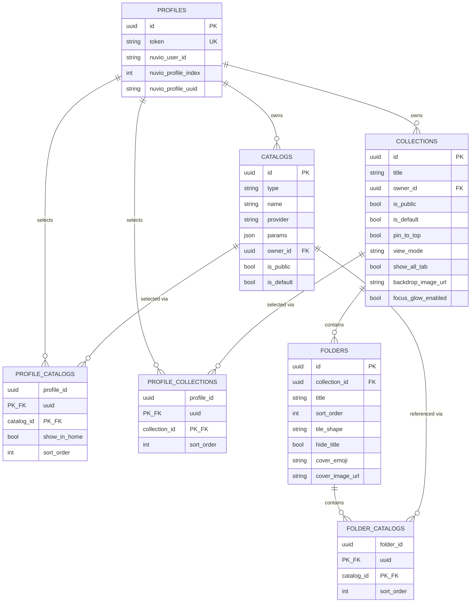

# Data model

SQLite, defined in `internal/vault/schema.go`. Row structs and wire DTOs are in
`internal/vault/models.go`, all with explicit `snake_case` JSON tags. `internal/vault/db.go`
opens the database in WAL mode with a 5s `busy_timeout` and foreign keys on.

There are no migrations: `InitDB` runs `CREATE TABLE IF NOT EXISTS`, which never alters an
existing table. Any schema change means deleting and recreating both the local `vault.db` and the
`uno-data` compose volume (`docker compose down -v`).



## `profiles`

```sql
CREATE TABLE IF NOT EXISTS profiles (
    id                  TEXT    PRIMARY KEY,     -- UUID
    token               TEXT    NOT NULL UNIQUE, -- URL slug, e.g. /u/{token}/...
    nuvio_user_id       TEXT    NOT NULL,        -- Nuvio auth.users.id (the account)
    nuvio_profile_index INTEGER NOT NULL,        -- Nuvio profile slot, 1..6
    nuvio_profile_uuid  TEXT    NOT NULL,        -- Nuvio profile row's own id

    UNIQUE (nuvio_user_id, nuvio_profile_index),
    CHECK  (nuvio_profile_index BETWEEN 1 AND 6)
);
```

**The composite key is `(nuvio_user_id, nuvio_profile_index)`, not `nuvio_profile_uuid`,** and
the reason propagates through the whole API. The *index* is what every downstream Nuvio call is
scoped by (`p_profile_id` is the integer slot, never the UUID), and the index is the only
identifier available at lookup time — the resolve-or-create input is `(sub from the JWT,
profile_index from the picker)`. The UUID isn't known until *after* a `sync_pull_profiles` round
trip, so it cannot be the thing you query by. This is also why the bearer-auth CRUD routes
resolve profiles by `(sub, profileIndex)`, not by UUID.

`nuvio_profile_uuid` is stored as a tripwire rather than a key. `sync_push_profiles` is
full-replace over slots 1..6, so a user can delete slot 2 and create a *different* profile in
that slot. Uno's link is to a slot *number*, and storing Nuvio's own profile UUID alongside it is
the only way to detect that a slot's occupant changed. `ResolveOrCreateProfile` **silently
overwrites** the stored UUID on drift rather than prompting; nothing acts on the tripwire.

`profiles.token` has exactly one job: identifying a profile in the public addon URLs. It is not a
write credential.

## Key rules

- **`catalogs.id` is permanent once created** — never rename or recycle it. It is baked into
  `addon.ManifestID` and therefore into Nuvio's `catalogSources[].catalogId`.
- **`catalogs.params` is opaque `TEXT` at the schema level.** For `provider = 'tmdb'` there is an
  app-level shape in `internal/provider` (`TMDBMovieParams` / `TMDBTVParams` on
  `TMDBCommonParams` + `BaseParams`), with `Validate()` covering cross-field rules, dispatched by
  `validateCatalogParams` from the create/update handlers. It crosses the wire as a JSON-encoded
  **string**, not a nested object.
- **Two distinct removal mechanisms — don't conflate them.**
  - **Hard delete** (`DeleteUserCatalog` / `DeleteUserCollection`): owner-scoped single `DELETE`,
    all downstream cleanup via `ON DELETE CASCADE`. Removes the row for *everyone*, not just the
    caller. The frontend warns the owner; the backend gives no signal to affected profiles.
  - **Unselect**: profile-scoped diff-based save, reachable only through push. IDs absent from
    the payload are deleted, present ones upserted with sort order from array index, every
    incoming ID validated (ownership-or-public).
- **`profile_catalogs.show_in_home` is stored and toggleable, and `buildManifest` does not
  consume it** — every catalog declares only `extra: [{name: "skip"}]`, with no genre entry and
  no `isRequired`. The Stremio mechanism it is meant to drive is marking a catalog's genre filter
  `isRequired`, which keeps it out of home rows while leaving it reachable in Discover. Both the
  Home-pane toggle's tooltip and Preview's dimmed Discover-only group carry a "not active yet"
  caveat that comes out only when the manifest builder consumes the flag.
- **No cascade on `profile_id`** (`profile_catalogs`/`profile_collections`) or `owner_id`
  (`catalogs`/`collections`). Irrelevant until profile deletion exists; revisit then.
- **`folder_catalogs` has no column for a per-reference selector** (e.g. a genre override),
  unlike real Nuvio `sources[]` entries, which can carry one. Not a gap:
  `folder_catalogs.catalog_id` only ever references Uno's own catalogs, and those bake their
  filter into `catalogs.params` at creation time, so there is no runtime-selectable extra to
  override per-reference. It becomes real work only if Uno's own manifest grows a
  runtime-selectable extra.
- **`folder_catalogs` is `PRIMARY KEY (folder_id, catalog_id)`.** The same catalog twice in one
  folder is a constraint violation, which surfaces as a **500**, not a 400 — the plain-text error
  channel cannot explain it. The UI makes it unrepresentable rather than validated. The same
  catalog in two *different* folders is allowed and supported.
- **`folders.tile_shape` defaults to `'LANDSCAPE'` at the schema level, and Preview reads `''`
  as an assumed `POSTER`.** The two point different directions and neither is wrong: the schema
  default only applies to a row inserted without the column, and the collection editor always
  sends a value — including `''`, which it keeps as its own "Default" option rather than
  normalising. Nothing inserts a folder without `tile_shape`, so the schema default is
  unreachable in practice.
- **Dead-by-design columns.** `is_default` on `catalogs`/`collections` is never read and never
  set true by any code path, and is tagged `json:"-"` on both structs so it doesn't reach the
  wire; the column stays because a real "default catalog" feature is buildable later and
  dropping it would force a delete-and-recreate. The cosmetic Nuvio fields
  (`folders.focus_gif_url`, `focus_gif_enabled`, `hero_video_url`, `hero_backdrop_url`,
  `title_logo_url`, and `collections.focus_glow_enabled`) exist as columns with defaults, and no
  SQL anywhere reads, writes, or selects any of them — every `SELECT` in `internal/vault` uses an
  explicit column list. They are absent from `vault.Folder`/`vault.Collection`, and
  `buildPushCollection` does not carry them into the push payload, so an Uno-owned collection
  pushed to Nuvio has these fields dropped. Harmless while Uno never pulls a collection *into*
  its own database — collections Uno doesn't own pass through push as untouched
  `json.RawMessage` and keep their cosmetic fields intact.
- **`collections.backdrop_image_url` is stored, editable in the collection editor, pushed to
  Nuvio, and never rendered by Uno.** It is a collection-level field, and a collection renders on
  home as a row of folder tiles rather than as its own page, so no current surface wants it.

## Vault invariants

- Every CRUD/selection method takes a pre-resolved `profileID uuid.UUID`, never a token — profile
  resolution happens exactly once per request, in the API layer's `requireProfile` middleware.
  `ResolveProfileID` (token → profile ID) exists exclusively for the addon server.
- `ResolveOrCreateProfile` is the **only** path that creates a profile row. It handles the
  SELECT-then-INSERT race by catching `SQLITE_CONSTRAINT_UNIQUE` (`isUniqueConstraintErr`) and
  falling back to a fresh SELECT rather than surfacing a 500.
- **Folders and their catalog refs are not independently addressable.** All access goes through
  the parent collection's whole-tree upsert. There are no standalone
  `listFolders`/`addFolder`/`reorder` operations, and adding them would be a fresh decision
  rather than resumption of a deferred plan. This shape is what forces the collection editor's
  one dirty state and one Save button.
- **Empty lists serialize as `[]`, never `null`.** The row parsers in `internal/vault/scan.go`
  initialize their slices, and `orEmpty[T]` (`internal/vault/utils.go`) covers the map-lookup and
  client-input spots that produce nested `Folders`/`CatalogIDs` slices. The push-internal batch
  loaders still `return nil, nil` on empty input, deliberately — nothing serializes their output.
  The frontend's `?? []` coercion (`getList`, and the `| null` on nested array types in
  `web/src/api/types.ts`) is retained as defensive handling. Any new list endpoint must
  initialize or `orEmpty` its slice: four client-side comments (`web/src/api/http.ts`,
  `web/src/features/library/useLibrary.ts`, `web/src/features/home/preview.ts`,
  `web/src/features/collections/collectionForm.ts`) assert the no-`null` rule unconditionally,
  and one nil slice on the wire makes all four wrong.

## Recipe params (TMDB)

The provider is read-only and sessionless: a live TMDB HTTP client plus typed "recipe" structs
describing what a TMDB-backed catalog may ask for.

- **Type hierarchy.** `BaseParams` (provider-agnostic behavior — `randomized`) →
  `TMDBCommonParams` (every discover filter both types share: genres, language, vote and runtime
  ranges, watch providers, **and certification**) → `TMDBMovieParams` / `TMDBTVParams`
  (type-specific only: the date window). Movie has `primary_release_date_*` and
  `released_within_days`; series has `first_air_date_*` and `aired_within_days` — a different
  axis, since a 2015 show still matches "aired in the last 30 days".
- **Validation split.** `Validate()` on each leaf type checks the `sort_by` enum (per type —
  movie and tv have different sort vocabularies) and fixed-vs-rolling date exclusivity, then
  delegates to `TMDBCommonParams`'s shared check for the two required-together pairs:
  certification needs a country, watch providers need a region.
- **Certification applies to both types.** `certification`, `certification.gte`,
  `certification.lte`, and `certification_country` sit on `TMDBCommonParams` and map in
  `commonQuery` (`internal/provider/query.go`), so `/discover/tv` gets them too. The **value
  vocabulary differs per type** (US movie is `G`/`PG`/`PG-13`/`R`/`NC-17`; US TV is
  `TV-Y`…`TV-MA`), which is why the picker's options come from `GET /api/certifications/{type}`
  rather than a shared hardcoded list.
- **Underscore-to-dot translation lives in one place.** Storage tags are underscore-only
  (`vote_average_gte`) while TMDB's real range params use a dot (`vote_average.gte`);
  `buildDiscoverQuery`/`commonQuery` translate field-by-field, and both `FetchCatalogPage` and
  `PreviewCatalog` go through them.
- **Vocabulary.** Uno and Stremio say `movie`/`series`; TMDB says `movie`/`tv`. Every route the
  UI calls is on Uno's vocabulary, `GET /api/genres/{type}` included, and the translation is
  entirely server-side via `externalIDsMediaType` — the same map `resolveMetas` uses. The one
  place `movie`/`tv` legitimately survives on the client is the genre-lookup keying in
  `web/src/api/types.ts`, because **the two genre id spaces are genuinely separate** (`878`
  Science Fiction is movie-only; tv has `10765` Sci-Fi & Fantasy). That's a real TMDB fact, not a
  wire leak, and nothing persists it.
- **`randomized` is "shuffle by page":** `FetchCatalogPage` picks a random TMDB page in
  `[1, 20]` (`maxRandomPage`) instead of the requested page. Deep discover pages thin out fast,
  so the range is capped rather than sampled from `total_pages`. Label it honestly in UI
  ("shuffle"), not "true random". Preview always asks page 1 and returns the flag instead.
- **A second provider needs two places updated, not one.** `validProviders` in
  `vault.CatalogForm.Validate()` (`internal/vault/validation.go`) *and* the provider check at the
  top of `validateCatalogParams` (`internal/api/provider.go`), plus its own recipe type and
  branch in the latter. Miss either and its rows are silently rejected everywhere. The `api`
  check is the one that actually parses `params`, so it must reject early rather than rely on
  the vault check alone. `catalogs.provider` is free text at the schema level (`TEXT`, no
  `CHECK`); the constraint is app-level only. There is no `Provider` interface, deliberately —
  deferred until a second provider is real enough to show what the interface should abstract
  over.

## Push wire shape (Nuvio collections)

**The wire shape is camelCase, and it is not Uno's own.** Real `collections_json` uses
`backdropImageUrl`, `pinToTop`, `viewMode`, `showAllTab`, `coverImageUrl`, `coverEmoji`,
`tileShape`, `hideTitle`, plus `addonId`/`type`/`catalogId` inside each source — a different
convention from every other Nuvio surface (RPC params and REST table rows are snake_case) *and*
from Uno's own Builder API. Push therefore has dedicated types in `internal/nuvio/types.go`
(`PushCollection`, `PushFolder`, `CatalogSource`) built by `buildPushCollection`; **never
`json.Marshal` a `vault.CollectionWithFolders` into this payload.** A dangling catalog ref (an id
missing from the resolved map) is skipped rather than failing the whole push.

**Field name:** the code sends `catalogSources`, as the public doc documents. Pulled real data
uses `sources` for the containing array name; the entry shape itself is identical. If a push ever
errors on the primary name, `sources` is the key to try — `internal/nuvio/types.go` carries a
comment marking the spot.

**The real `sources[]` entry is wider than what Uno emits.** The entries in
`docs/api/samples/collections-basic.json` carry five keys — `addonId`, `catalogId`, `type`,
`genre`, `provider`. The entries in `docs/api/samples/collections-extended.json` carry thirteen: those five
plus `filters`, `mediaType`, `sortBy`, `sortHow`, `title`, `tmdbId`, `tmdbSourceType`,
`traktListId`. So a Nuvio folder can source content from TMDB directly and from Trakt lists, not
only from an installed addon's catalog, and can sort and filter per reference. Uno emits only the
addon-catalog form (`buildPushCollection` → `nuvio.CatalogSource`), which is correct for what Uno
owns; collections Uno doesn't own pass through push as raw `json.RawMessage`, which is what keeps
their wider entries intact, and that protection holds only while Uno never imports one into its
own database.
