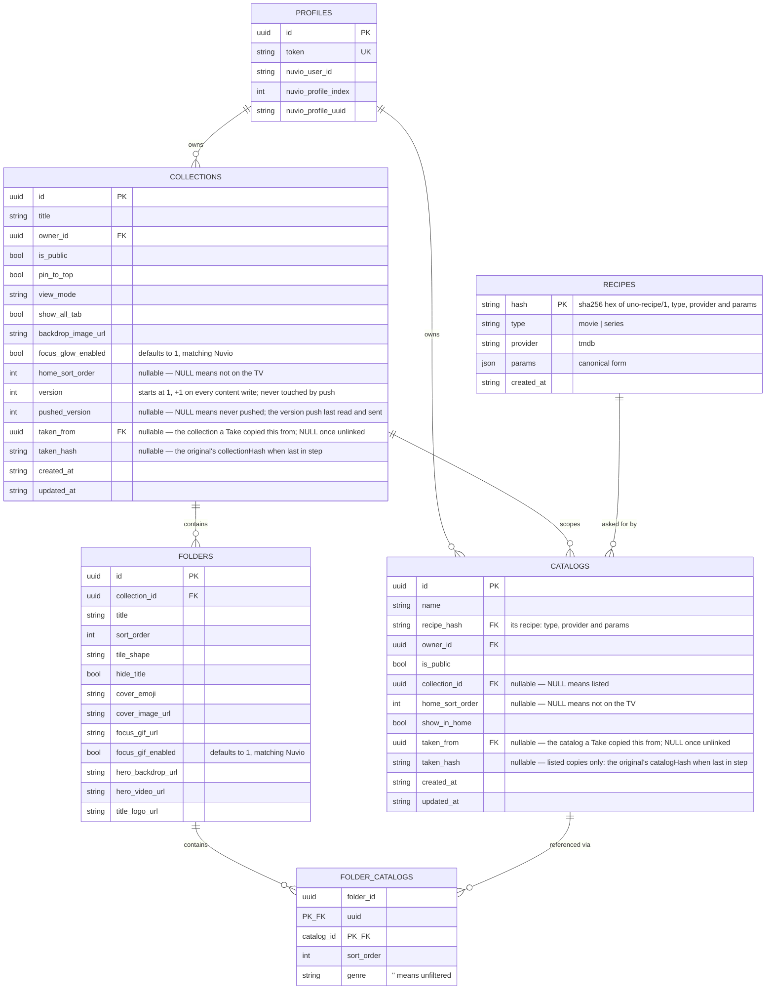

# Data model

SQLite. The migrations in `internal/vault/migrations/` build the schema, one frozen file per
version. `internal/vault/testdata/schema_latest.sql` is the resulting schema as SQLite stores it,
and a test holds it to a database migrated from empty. Row structs and wire DTOs are in
`internal/vault/models.go`, all with explicit `snake_case` JSON tags. `internal/vault/db.go`
opens the database in WAL mode with a 5s `busy_timeout` and foreign keys on, after migrating it.

**Migrations.** `PRAGMA user_version` is the schema version. On every start, `InitDB` first backs
the database up, then applies each pending migration in its own transaction on a connection with
foreign keys off. Each transaction also sets `user_version` and commits only if
`PRAGMA foreign_key_check` is clean. The runner, the backup and the `migrate --dry-run`
rehearsal are described in `docs/configuration.md` → *Database lifecycle*.

- **A migration is frozen once it ships.** A schema change is a new file, never an edit to an
  old one. It imports only the standard library, never live Uno code, so what it does can't
  drift when that code changes (`TestMigrationsImportOnlyTheStandardLibrary`). A check that needs
  live code belongs in the dry run and the tests.
- **A migration makes no network calls, and keeps every id and version.** Catalog, collection
  and folder ids, profile tokens, and every `version` and `pushed_version` are what Nuvio holds
  (see *Push wire shape*). A migration that changed them would force a re-push.
- **Migration 1 (`0001_baseline.go`) is the schema from before versioning, with `IF NOT EXISTS`
  throughout.** A database created before migrations (version 0, tables present) and an empty
  one take the same path. It then compares every table's columns with the baseline by name, in
  any order, since a column added by hand-run `ALTER TABLE` sits last. It fails naming every
  difference, apart from the legacy `is_default` columns. Its test fixture,
  `internal/vault/testdata/schema_v1.sql`, is a database shaped like prod's before migrations,
  with seed rows written by live vault code.
- **Migration 2 (`0002_recipes.go`) moves each catalog's recipe into `recipes`** (see *Recipes*
  below).
  - It puts every catalog's params in canonical form with frozen copies of the params structs,
    and stores one `recipes` row per distinct recipe. `catalogs.recipe_hash` points at it.
  - It drops `type`, `provider`, `params` and `fingerprint` from `catalogs`, and adds the index
    and triggers that delete an unused recipe.
  - Params that don't decode, and any provider but `tmdb`, fail it, naming the catalog. Its
    notes count the recipes and rewritten params, and name every unknown params key it
    dropped.
  - It rewrites every linked copy's `taken_hash`, a link hash over fingerprints, as the same
    link hash over recipe hashes. A `taken_hash` that matched the copy now matches the copy's new
    hash, and one that matched the source matches the source's. One that matched neither is
    kept. So every link compares in Update and Community as it did, and the notes count each
    case.
  - `recipe_hash` is nullable in the schema, since `ADD COLUMN` can't add a `NOT NULL` column
    to a table with rows. The migration fails if any catalog is left without one, and every
    write sets it.
  - The dry run checks every catalog's params before migrating against its recipe after
    (`docs/configuration.md`, *Database lifecycle*).



## `profiles`

```sql
CREATE TABLE IF NOT EXISTS profiles (
    id                  TEXT    PRIMARY KEY,     -- UUID
    token               TEXT    NOT NULL UNIQUE, -- URL slug, e.g. /u/{token}/...
    nuvio_user_id       TEXT    NOT NULL,        -- Nuvio auth.users.id (the account)
    nuvio_profile_index INTEGER NOT NULL,        -- Nuvio profile slot, 1..6
    nuvio_profile_uuid  TEXT    NOT NULL,        -- Nuvio profile row's own id

    UNIQUE (nuvio_user_id, nuvio_profile_index),
    CHECK  (nuvio_profile_index BETWEEN 1 AND 6)
);
```

**The composite key is `(nuvio_user_id, nuvio_profile_index)`, not `nuvio_profile_uuid`,** and
the reason propagates through the whole API. The *index* is what every downstream Nuvio call is
scoped by (`p_profile_id` is the integer slot, never the UUID), and the index is the only
identifier available at lookup time — the resolve-or-create input is `(sub from the JWT,
profile_index from the picker)`. The UUID isn't known until *after* a `sync_pull_profiles` round
trip, so it cannot be the thing you query by. This is also why the bearer-auth CRUD routes
resolve profiles by `(sub, profileIndex)`, not by UUID.

`nuvio_profile_uuid` is stored as a tripwire rather than a key. `sync_push_profiles` is
full-replace over slots 1..6, so a user can delete slot 2 and create a *different* profile in
that slot. Uno's link is to a slot *number*, and storing Nuvio's own profile UUID alongside it is
the only way to detect that a slot's occupant changed. `ResolveOrCreateProfile` **silently
overwrites** the stored UUID on drift rather than prompting; nothing acts on the tripwire.

`profiles.token` has exactly one job: identifying a profile in the public addon URLs. It is not a
write credential.

## Key rules

- **A catalog has a scope: listed or scoped to one collection.** `catalogs.collection_id` is
  `NULL` for a listed catalog (in the library, usable on home and in any of the owner's folders)
  or a collection id for one scoped to exactly that collection (hidden from the library, usable
  only in that collection's folders, deleted with it). `CreateUserCatalog`/`UpdateUserCatalog`
  enforce that the target collection is owned by the same profile, that a scoped catalog is never
  public, and that a scoped catalog is never on the home screen — the schema's own
  `CHECK (collection_id IS NULL OR (is_public = 0 AND home_sort_order IS NULL))` exists as a
  backstop and would surface as a 500, so the Go layer rejects all three before that CHECK is ever
  hit. Demoting a listed catalog into a collection (`UpdateUserCatalog` with `collection_id` set)
  additionally requires it to be off the home screen (`requireNotOnHome`, checking
  `home_sort_order IS NULL` directly on the row) and every existing folder ref to it to already be
  inside the target collection; promoting a scoped catalog back to listed is always allowed, and
  happens through its collection's save (a `catalog_edits` entry with `move_to_library`, below).
  `GetUserCatalogs` (the library) returns listed catalogs
  only — a scoped one is reached through its owning collection's own response instead.
- **A scoped catalog is written only through its collection's save.** `UpdateUserCatalog` and
  `DeleteUserCatalog` refuse a row whose `collection_id` is set (`ErrInvalidInput`, a 400).
  `CollectionForm.CatalogEdits` (`vault.ScopedCatalogEdit`) carries the new name and recipe for
  catalogs already scoped to the collection being saved, and `applyCatalogEdits` writes them
  inside `UpdateUserCollection`'s transaction, after the collection row and before the folder
  rewrite and its orphan cleanup. Each edit's catalog must be owned by the caller and scoped to
  this same collection, with the stored type and provider. An edit whose name and recipe
  (`recipe_hash`) both match the row, with `move_to_library` unset, is skipped, so `updated_at`
  stays put. `move_to_library` also clears `collection_id`. `CreateUserCollection` refuses any edit,
  since a new collection has no scoped catalogs. So an edit made in the collection editor lands
  with the rest of the collection, and a discarded one never wrote anything.
- **A profile's data graph is closed: references never cross an owner boundary.** A folder may
  reference a catalog only if `internal/vault/access.go`'s `validateFolderRefs` accepts it: the
  catalog's `owner_id` must equal the collection's `owner_id`, and the catalog's `collection_id`
  must be `NULL` (listed) or equal to that same collection (scoped to it already). There is no
  "or public" branch anywhere in a write path — a community catalog can only enter another
  profile's graph through Take (a copy with a fresh id), never through a live reference.
  `CreateUserCollection` has no collection id yet, so its folders may reference listed catalogs
  only. `CollectionWithFolders.Catalogs` carries every catalog a collection's folders reference,
  listed or scoped, so the editor never needs the library to render a folder.
- **A scoped catalog with no remaining folder reference in its collection is deleted on that
  collection's next whole-tree Save.** `UpdateUserCollection` runs this cleanup in the same
  transaction as the folder rewrite, right after `rewriteFolderCatalogRefs` for every folder:
  `DELETE FROM catalogs WHERE collection_id = ? AND id NOT IN (` the catalog ids still referenced
  by that collection's folders `)`. This is also what catches a scoped catalog created via
  `POST .../catalogs` and abandoned before Save — it has no folder ref yet, so the next Save (or
  the collection's own deletion, by cascade) removes it.
- **`catalogs.recipe_hash` names the catalog's recipe.** Its type, provider and params live in
  `recipes`, one row per distinct recipe (see *Recipes* below). Every catalog read joins its
  recipe in, so each catalog still carries `type` and `params` on the wire, and `recipe_hash`
  never reaches it. `GetCommunityCatalogs` collapses rows that share one, and the import check
  offers the caller's listed catalogs with the same one. A copy shares its source's recipe, so
  an original and its copy always hash on the same terms.
- **A Take is a linked copy.** `taken_from` names the original, and `taken_hash` is the
  original's content hash from when the copy was last in step with it. Both are `json:"-"`, and
  neither is rendered as attribution. The wire carries `linked` instead: a collection is linked
  while `taken_from` is set, and a catalog while `taken_from` is set and it is listed.
  - **Where the link lives.** A listed catalog Take links the catalog. A collection Take links
    the collection: every catalog copied inside it also carries `taken_from`, which is how Update
    pairs it with its source, but no `taken_hash`.
  - **One link per source.** `catalogs_one_link` (unique on `(owner_id, taken_from)` for listed
    rows) and `collections_one_link` (unique on `(owner_id, taken_from)`) are the only check. A
    second Take hits one of them, and `takeConflict` turns the unique violation into
    `ErrConflict` (409).
  - **The hashes** (`internal/vault/bundle.go`). `catalogHash` is a sha256 of the name and
    recipe hash. `collectionHash` is a sha256 of the collection's bundle form (`extractBundle`,
    every referenced catalog in the collection's own list), with each catalog's params replaced
    by its recipe hash. Whatever the bundle form leaves out — ids, scope, `is_public`,
    `pin_to_top`, the home fields, `version`, timestamps — the hash leaves out too. A content
    field added to the bundle form is hashed with no other change, which also shifts every
    stored `taken_hash` once: Community then offers each linked copy an Update that changes
    nothing but `taken_hash`, and any save of a copy before that Update — even one that only
    toggles `is_public` — unlinks it. `TestLinkHashesArePinned` (`bundle_test.go`) holds all
    three hashes to literal values, so such a change fails a test rather than landing silently.
    Migration 2 holds frozen copies of both, over fingerprints and over recipe hashes, and
    rewrites every `taken_hash` with them (its bullet at the top of this file).
  - **Community flags.** `taken` means the caller holds a linked copy. `update_available` means
    that copy's `taken_hash` differs from the original's hash now. Among community catalogs that
    share a recipe, the row shown is the one the caller is linked to, otherwise the oldest.
  - **A save that changes content unlinks.** `UpdateUserCatalog` clears both columns when the
    saved name and recipe no longer hash to `taken_hash`, or the catalog moves into a
    collection. `UpdateUserCollection` clears them when the saved tree no longer hashes to
    `taken_hash`, or any catalog edit moves a catalog to the library. A moved catalog's own
    `taken_from` is cleared too, so it never reads as a Take of its own. Toggling `is_public` or `pin_to_top` and
    the selection writes of push never unlink.
  - **Update** (`internal/vault/link.go`) compares the original's hash now, the copy's hash now,
    and `taken_hash`. A copy equal to its original only has `taken_hash` rewritten. A copy that
    no longer matches `taken_hash` was changed some way a save didn't unlink, so Update unlinks
    it, commits that, and returns `ErrConflict` rather than overwrite it. Anything else is
    rewritten through the same update core a save uses: the original's content, with the copy's
    `is_public`, `pin_to_top`, home placement and `pushed_version` kept, folders matched by position and
    catalogs by `taken_from`, and `version` bumped by one. An original made private is not found
    (404), and a deleted one unlinks its copies (`taken_from` is `ON DELETE SET NULL`).
  - **Community Duplicate** is a Take without the link: no `taken_from` anywhere in the copy, the
    original's title kept, and any number of them beside a Take.
- **`catalogs.id` is permanent once created** — never rename or recycle it. It is baked into
  `addon.ManifestID` and therefore into Nuvio's `catalogSources[].catalogId`.
- **`recipes.params` is opaque `TEXT` at the schema level.** For `provider = 'tmdb'` there is an
  app-level shape in `internal/provider` (`TMDBMovieParams` / `TMDBTVParams` on
  `TMDBCommonParams` + `BaseParams`), with `Validate()` covering cross-field rules, dispatched by
  `validateCatalogParams` from the create/update handlers. It crosses the wire as a JSON-encoded
  **string**, not a nested object, in its canonical form.
- **A catalog's `type` is immutable once the row exists.** It is the type of the catalog's
  recipe, and every write that repoints a catalog at another recipe keeps it. `UpdateUserCatalog`
  reads the stored type in its own opening `SELECT` and rejects the write with
  `ErrInvalidInput` if the incoming form's `type` differs; a collection's catalog edit and a
  linked copy's Update refuse a different type the same way. A catalog's type is baked into the
  pushed collections blob (each folder source names its catalog's type), so changing it would
  alter what Nuvio should have without bumping any collection's `version`. The catalog editor
  already locks the field once a row exists; this is the write path enforcing the same rule
  server-side. Duplicate is the supported way to get a different-typed copy.
- **Two distinct removal mechanisms — don't conflate them.**
  - **Hard delete** (`DeleteUserCatalog` / `DeleteUserCollection`): owner-scoped single `DELETE`,
    all downstream cleanup via `ON DELETE CASCADE`, and a recipe the delete leaves unused goes
    with it (*Recipes*, below). A public row leaves Community, but every copy
    another profile already took survives: those copies are independent rows whose `taken_from`
    is `ON DELETE SET NULL`, so the delete only unlinks them.
  - **Unselect**: reachable only through push, which folds the whole pending selection straight
    into `catalogs.home_sort_order`/`show_in_home` and `collections.home_sort_order`
    (`saveCatalogSelectionTx`/`saveCollectionSelectionTx`, `internal/vault`). Every owned row's
    `home_sort_order` is cleared first, then each incoming id is set in turn with its array index;
    an id that isn't owned (or, for a catalog, isn't listed — `AND collection_id IS NULL`) affects
    0 rows and is `ErrInvalidInput` naming the id. There is no separate join table and no separate
    access-check query — the `UPDATE`'s own `WHERE` clause is the validation.
- **`catalogs.show_in_home` drives the manifest's per-catalog genre extra, but the addon server
  reads it through `vault.GetPublishedCatalogs`, not the raw column.** `GetPublishedCatalogs` is
  the union of every owned catalog with `home_sort_order`
  non-`NULL` (its own `show_in_home`), plus every catalog referenced by a folder of a collection
  that is itself on the home screen (`collections.home_sort_order` non-`NULL`), with a forced
  `ShowInHome = false` — a catalog reachable only through a folder never gets an automatic home
  row. Deduped by id: a catalog on both the home screen and in an on-TV folder appears once,
  keeping its own `show_in_home`. `buildManifest` (`internal/addon/addon.go`) emits the result as
  an explicit per-catalog `showInHome`, and a `ShowInHome = false` result also gets a required
  `genre` extra whose first option is `"All"`. Nuvio TV reads the field, while Nuvio mobile,
  Nuvio desktop and Stremio read the required extra. `docs/architecture.md`'s addon-server
  section covers both.
  `GetCurrentCatalogSelection` (the narrower `home_sort_order IS NOT NULL` query)
  remains the pre-push validation/selection-editor view; only the addon server needs the wider
  published set.
- **`collections.version` bumps on every content write (`UpdateUserCollection`,
  `UpdateTakenCollection`), starting at 1 on insert (`CreateUserCollection`, `TakeCollection`,
  `DuplicateCollection`, `DuplicateCommunityCollection`) — push never touches it.**
  `collections.pushed_version` is stamped by `SaveSelectionsForPush` with the version
  `pushCollections` read for that collection *before* calling Nuvio, for every collection in the
  pushed selection, and only there. `NULL` means never pushed. The frontend flags a pending change
  when `version !== pushed_version` (`web/src/features/home/changes.ts`) — an integer compare, not
  a clock, so a Save landing between push's read and its local write (even inside the same second)
  is never mistaken for pushed.
- **No cascade on `owner_id`** (`catalogs`/`collections`). Irrelevant until profile deletion
  exists; revisit then.
- **`folder_catalogs.genre` narrows one folder reference, not the catalog.** It is a genre
  *name* from the catalog's manifest `genre` extra (`provider.GenreExtraOptions`), `''` for
  unfiltered. Push sends it as the folder source's `genre`, and Nuvio sends that back as the
  `genre` extra when it loads the folder's row, so the same catalog can show Westerns in one
  folder and war films in another, or both in one folder, with no second catalog. It is stored as a name rather than a
  TMDB id because the name is what goes over the wire both ways. It is not validated against the
  recipe on save: a later recipe edit can leave a stored genre outside the options (now required
  or excluded), and the addon path then serves that row unfiltered, the same as any unknown
  extra. The collection editor flags that case rather than clearing it. Take and Duplicate carry
  it onto the copy (`extractBundle` keeps each ref's genre). On the wire each folder carries an ordered
  `refs: [{catalog_id, genre}]` (`vault.FolderRef`), not a list of catalog ids, because one
  catalog can be two refs. A genre picked in Nuvio's own editor doesn't survive a push, because
  push rebuilds every Uno-managed collection from Uno's data.
- **`folder_catalogs` is `PRIMARY KEY (folder_id, catalog_id, genre)`.** One catalog can appear
  in a folder more than once under different genres, and push sends each as its own source with
  the same `catalogId`. Confirmed on Nuvio desktop and mobile with a hand-edited collection: both
  sources show, each filtered. The same catalog under the *same* genre twice is pointless, so
  `CollectionForm.Validate` rejects it as a 400 (comparing trimmed genres, as they're stored)
  before it can reach the primary key as a 500. An inline `new` entry in a save payload carries
  a client `key` (the editor's draft id), and every entry sharing a key resolves to the one
  catalog that save creates, so Validate treats a repeated `(key, genre)` the same way and
  rejects entries that share a key but not a spec. The same catalog in two *different* folders is
  allowed and supported. `GetPublishedCatalogs` still lists a catalog once however many refs
  point at it.
- **A builder write or an import stores its input normalized, then validates it**
  (`CollectionForm.normalized` and `CatalogForm.normalized`, `internal/vault/validation.go`). Every
  text field the editors trim is trimmed: titles, catalog names (the names of new and edited
  scoped catalogs included), the cover emoji and the media URLs. An empty `view_mode` or
  `tile_shape` is stored as `TABBED_GRID` or `POSTER`, which is what every Nuvio client shows
  for one (see "Push wire shape" below). So an untouched editor save writes back exactly what is
  stored, and never unlinks a linked copy. A Take, Duplicate or Update writes the values it read
  without normalizing them, so a copy hashes like its original. Rows written before
  normalization can still hold `''` or padding; Preview and the editor read an empty value the
  way Nuvio does.
- **`folders.tile_shape` defaults to `'LANDSCAPE'` at the schema level**, but every write sends
  the column, so the default is unreachable in practice. Nuvio's `SQUARE` default applies only
  when the key is absent, which a Uno push never produces.
- **`catalogs.created_at`/`updated_at` and `collections.created_at`/`updated_at` are `TEXT`
  RFC3339 UTC**, generated in Go with `time.Now().UTC().Format(time.RFC3339)` and parsed back to
  `time.Time` in `internal/vault/scan.go`; `encoding/json` serialises the Go field as RFC3339 on
  the wire. Every insert sets both to the same instant; every update rewrites only `updated_at`.
- **Legacy `is_default` columns.** `catalogs.is_default` and `collections.is_default`
  (`INTEGER NOT NULL DEFAULT 0`) are not in the baseline schema and are named nowhere in Go.
  Prod's database, created before they were removed, still carries them. Migration 1 accepts them
  with that exact definition and notes them. Every insert omits the column, so the default
  satisfies `NOT NULL`. Databases created since don't have them. Dropping them takes a
  migration.
- **Nuvio appearance fields.** `collections.focus_glow_enabled` (the TV's focus glow on the
  collection's home-screen folder cards), `folders.focus_gif_url`/`focus_gif_enabled` (an
  animated GIF played over a folder tile while it's focused), and
  `folders.hero_backdrop_url`/`hero_video_url`/`title_logo_url` (hero media that Nuvio's own
  editor labels "(Modern Home)") are stored, edited in the collection editor, copied by
  Take/Duplicate, and pushed. Uno's Preview renders none of them. The two flags default to `1`
  because Nuvio reads an absent flag as on. Every URL among them, plus
  `collections.backdrop_image_url`, must be an absolute `http`/`https` URL under 2048 characters
  — `CollectionForm.Validate` enforces it on save, and on Take/Duplicate against the form built
  from the source. Uno never renders these, but Nuvio's clients do, and a Take carries them into
  a profile that didn't author them, so a `javascript:` or `data:` value must not reach the push.
- **`collections.backdrop_image_url` is stored, editable in the collection editor, pushed to
  Nuvio, and never rendered by Uno.** It is a collection-level field, and a collection renders on
  home as a row of folder tiles rather than as its own page, so no current surface wants it.

## Vault invariants

- Every CRUD/selection method takes a pre-resolved `profileID uuid.UUID`, never a token — profile
  resolution happens exactly once per request, in the API layer's `requireProfile` middleware.
  `ResolveProfileID` (token → profile ID) exists exclusively for the addon server.
- `ResolveOrCreateProfile` is the **only** path that creates a profile row. It handles the
  SELECT-then-INSERT race by catching `SQLITE_CONSTRAINT_UNIQUE` (`isUniqueConstraintErr`) and
  falling back to a fresh SELECT rather than surfacing a 500.
- **Folders and their catalog refs are not independently addressable.** All access goes through
  the parent collection's whole-tree upsert. There are no standalone
  `listFolders`/`addFolder`/`reorder` operations, and adding them would be a fresh decision
  rather than resumption of a deferred plan. This shape is what forces the collection editor's
  one dirty state and one Save button.
- **Every stored string and list has a size ceiling, and all of them live in
  `internal/vault/validation.go`.** `maxNameLen` (200) bounds a catalog's `name` and a
  collection's and a folder's `title`; `maxParamsLen` (8192) a catalog's `params` JSON;
  `maxCoverEmojiLen` (32) a folder's `cover_emoji`; `maxGenreLen` (64) a folder ref's genre;
  `maxMediaURLLen` (2048) every media URL; `maxNewKeyLen` (128) an inline-`new` entry's client
  key; and `maxFoldersPerCollection`/`maxRefsPerFolder` (100 each) how many folders a collection
  holds and how many catalog refs a folder holds. These are bounds against absurdity, not product
  limits — each one sits well past anything the builder can produce — and they exist because
  `api.maxRequestBodyBytes` (1 MiB) is no substitute: 1 MiB is thousands of folders, and every one
  of these strings is stored, served from the public addon route, and pushed into Nuvio's
  collections blob as a full replace. `CatalogForm.Validate` and `CollectionForm.Validate` enforce
  them on save (an import, whose body limit is 4 MiB, is held to the same rules), a folder's inline `new` entries and the save's `catalog_edits` included, since
  either becomes a catalog row write in the same transaction.
- **Empty lists serialize as `[]`, never `null`.** The row parsers in `internal/vault/scan.go`
  initialize their slices, and `jsonwire.OrEmpty[T]` (`internal/jsonwire`) covers the
  map-lookup, decoded-response and client-input spots that produce nested
  `Folders`/`CatalogIDs` slices. The push-internal batch
  loaders still `return nil, nil` on empty input, deliberately — nothing serializes their output.
  The frontend's `?? []` coercion (`getList`, and the `| null` on nested array types in
  `web/src/api/types.ts`) is retained as defensive handling. Any new list endpoint must
  initialize or `jsonwire.OrEmpty` its slice: four client-side comments (`web/src/api/http.ts`,
  `web/src/features/library/useLibrary.ts`, `web/src/features/home/preview.ts`,
  `web/src/features/collections/collectionForm.ts`) assert the no-`null` rule unconditionally,
  and one nil slice on the wire makes all four wrong.

## Recipes

**A recipe is what a catalog asks its provider for: its type, provider and params.** `recipes`
holds each distinct recipe once, addressed by a hash of its content, and every catalog that
asks for it points there through `catalogs.recipe_hash` (`internal/vault/recipes.go`).

- **The canonical form** is per provider and type. `provider.CanonicalParams` decodes params as
  that recipe's params struct and encodes it again, then sorts the keys:
  - keys the type doesn't know are dropped;
  - zero values are dropped too, since zero means unset for every field;
  - the result is compact, with numbers written the way Go writes them.

  Two encodings of one recipe give the same bytes, so the SPA's key order or a `0` it sends for
  an empty field never makes a second recipe. `recipes.params` is always canonical, and the wire
  carries it back as each catalog's `params`. The editor's dirty check compares re-serialized
  form state, not the params string, so that needs nothing on the SPA side.
- **Checked first, then made canonical.** `api.checkRecipe`, which every client-supplied recipe
  goes through (a catalog save, a collection save's new entries and catalog edits, and each
  catalog of an import), validates the params as sent and only then canonicalizes them. The
  canonical form drops unknown keys, so this order is what keeps a key the check rejects, such as
  `with_networks` on a movie recipe, a 400 rather than silently dropped. The vault stores the
  params it is given.
- **The hash.** `vault.RecipeHash` is sha256 hex over `uno-recipe/1`, the type, the provider and
  the canonical params, separated by newlines. The vault computes it from the bytes it stores and
  never takes one from a caller, so a hash never names content other than its own.
  - `TestRecipeHashIsPinned` holds it to a literal, and migration 2 holds a frozen copy of it
    and of the canonical form.
  - Changing either changes every stored `recipe_hash`, and every `taken_hash` built over them.
    So it needs a migration that rewrites both.
- **Stored with the write that uses it.** `ensureRecipe` inserts a recipe unless it is stored
  already, in the same transaction as the catalog write that points at it:
  - `insertCatalog`, which a catalog save, a Take and a collection save's new entries all go
    through;
  - `UpdateUserCatalog`;
  - a collection save's catalog edit.

  A linked copy's Update points the copy at the recipe its original already holds.
- **Deleted once unused.** Two triggers delete a recipe as soon as no catalog references it, in
  the transaction of the change that left it unused. `recipes_drop_unused_on_delete` covers a
  deleted catalog, cascades included: a collection's delete, and the orphan cleanup of a
  collection save. `recipes_drop_unused_on_repoint` covers a catalog repointed at another
  recipe. The `catalogs_by_recipe` index keeps their check cheap.
- **Copies share.** A Take, a Duplicate and a linked copy's Update point the copy at its
  source's recipe. `changesNothing`, the Community collapse and the import check's matches all
  compare `recipe_hash`.

## Recipe params (TMDB)

The provider is read-only and sessionless: a live TMDB HTTP client plus typed "recipe" structs
describing what a TMDB-backed catalog may ask for.

- **Type hierarchy.** `BaseParams` (provider-agnostic behavior — `randomized`) →
  `TMDBCommonParams` (every discover filter both types share: genres, language, vote and runtime
  ranges, watch providers, production companies and keywords, **and certification**) → `TMDBMovieParams` / `TMDBTVParams`
  (type-specific only: the date window, plus movie's `with_collection` and series'
  `with_networks`). Movie has
  `primary_release_date_*` and `released_within_days`; series has `first_air_date_*` and
  `aired_within_days` — a different axis, since a 2015 show still matches "aired in the last 30
  days". `with_collection` is one TMDB collection id (e.g. `10`, Star Wars), movie only.
  `with_networks` is a comma (AND) or pipe (OR) separated list of TMDB network ids (e.g.
  `213|49`, Netflix or HBO), series only: `/discover/movie` has no network filter. It has no
  `without_networks` partner, because `/discover/tv` accepts that param and ignores it (the same
  total with or without it).
- **A collection catalog is a TMDB collection source, not a discover filter.** A collection
  recipe is a movie recipe with `with_collection` set: its titles are one predefined TMDB
  collection's films. `/discover/movie` accepts `with_collection` and ignores it — the same total
  with or without it — so such a recipe never reaches discover. `collectionItems`
  (`internal/provider/collections.go`), shared by `FetchCatalogPage` and `PreviewCatalog`, reads the films from `/collection/{id}`'s
  `parts` (memoized for 24 hours, since a collection gains films), sorts them by `release_date`
  ascending (undated last, ties by id), filters them locally by `genre_ids` for a client genre
  pick, and shuffles them instead when `randomized`. The whole collection is page 1; a later page
  is empty, and a preview's `total_results` is the filtered count. The addon path still resolves
  each film's IMDB id through `resolveMetas`. `Validate()` makes the recipe exclusive:
  `randomized` is the only field allowed beside `with_collection`, so no saved filter sits
  unapplied. The check walks every field of the params struct by reflection (`firstSetField`)
  and names the first one set, so a field added later is covered without editing it.
- **Validation split, part one: the rules that need no network.** `Validate()` on each leaf type
  checks the `sort_by` enum (per type — movie and tv have different sort vocabularies),
  fixed-vs-rolling date exclusivity, that the rolling window isn't negative, (movie) that
  `with_collection` is a single id rather than a `,`/`|` list with no other filter beside it, and
  (series) that `with_networks` holds at most 20 ids, then delegates
  to `TMDBCommonParams`'s shared check for the two required-together pairs (certification needs
  a country, watch providers need a region), the numeric bounds (`vote_average_*` within
  0–10, and no negative `vote_count_*` or `with_runtime_*`), and the id-list cap:
  `with_companies`, `with_keywords`, `without_companies` and `without_keywords` each hold at
  most 20 ids (`maxEntityIDs`, counted with
  `parseIDList`), so an over-cap recipe is rejected before any TMDB lookup. Zero means "unset" for every numeric
  field (`setIntIf`/`setFloatIf` in `query.go`), so these bound what is sent rather than
  requiring a value. A negative rolling window is rejected rather than ignored — `DiscoverQuery`'s
  `> 0` guard would otherwise drop it silently and save a filter that never applies.
- **Validation split, part two: the vocabulary TMDB owns.** Genre ids, `with_original_language`,
  `watch_region`, `with_watch_providers` and the certification country and scale can only be
  checked against TMDB's own published lists, so they can't live on the params structs —
  `TMDBClient.ValidateParams` (`internal/provider/validate.go`) does it, and
  `api.validateCatalogParams` runs it after `Validate()`. Each list is fetched only when the
  field needing it is set, and every one of them is memoized on the client, so a warm process
  validates a recipe without touching the network at all. A rejected value wraps
  `provider.ErrInvalidParams` (a 400); TMDB being unreachable wraps `errUpstreamValidation`,
  which `writeVaultError` answers with a 502 — a recipe that could not be checked has not been
  found at fault, so it is never reported as the caller's.
- **Companies and keywords are checked per id.** `with_companies` and `with_keywords` are
  comma (AND) or pipe (OR) separated TMDB id lists, like `with_genres`, but TMDB publishes no
  whole list of either — only `/company/{id}`, `/keyword/{id}` and `/search/*`. So
  `checkEntityIDs` shares `checkIDList`'s id-list parse (`parseIDList`) and then looks each id up
  through `TMDBClient.Company`/`Keyword` instead of testing set membership. Each looked-up id is
  memoized in a per-id `memo` with no expiry, bounded at `maxEntityCacheEntries` (see
  `docs/architecture.md`), so a warm process still validates without the network; a TMDB 404
  (`provider.ErrNotFound`) is a rejected value and becomes `ErrInvalidParams`, and is never
  cached, while any other lookup failure stays a 502. A cold cache costs one TMDB call per
  distinct id, which the 20-id cap in `Validate()` bounds at 20 per field.
- **`without_companies` and `without_keywords` are the same id lists, left out.** They are
  checked the same way, through the same lookups, and passed to both discover endpoints under
  the same names. TMDB drops a title carrying any listed id whether the list is comma- or
  pipe-joined, so the builder always stores them comma-joined, as it does `without_genres`.
  Nothing rejects an id that sits in both the `with_` and `without_` list, just as nothing does
  for genres. The builder's pickers keep the two apart instead.
- **`with_collection` goes through the same per-id check, movie only.** `ValidateParams` decodes
  it alongside `TMDBCommonParams` for either catalog type and looks the one id up through
  `TMDBClient.Collection` (`/collection/{id}`). A series recipe carrying it is rejected with
  `ErrInvalidParams`: `DecodeParams` is a plain `json.Unmarshal`, which ignores keys the type
  doesn't declare, so without this the field would be saved on a series catalog and never
  applied.
- **`with_networks` goes through the same per-id check, series only.** `ValidateParams` decodes
  it alongside `with_collection` and looks each id up through `TMDBClient.Network`
  (`/network/{id}`, memoized like the other per-id lookups). A movie recipe carrying it is
  rejected with `ErrInvalidParams`, for the same `json.Unmarshal` reason. Validation never reads
  the network export that network search uses (`docs/architecture.md`), so saving a recipe does
  not depend on TMDB's file host.
- **Take re-validates what it copies.** `TakeCatalog` and `TakeCollection` both run the same
  params check against the source rows before copying them (the recipe is another profile's
  input, validated when they wrote it, not when it is taken), via a validator passed in by
  `api` — `internal/vault` is the leaf package and cannot reach `internal/provider`. Update and
  Community Duplicate read the original the same way and run the same check. All of them
  require the validator: nil is a programming error, not "skip the check". A take crosses the
  owner boundary either way, and a listed catalog reachable directly is equally reachable
  through a public collection that references it, so both doors check the same row. One
  rejected recipe fails the whole collection take — a half-copied collection is not a
  collection. Every copy is also held to the save path's own rules, because being stored is not
  evidence a row was ever checked: rows written before a given check existed reach here too.
  `TakeCatalog` runs `CatalogForm.Validate` over the source row. A collection copy extracts the
  source tree into its bundle form (`extractBundle`, `internal/vault/bundle.go`), builds the
  `CollectionForm` that writes the copy from it (`collectionFormFromBundle`), and runs
  `CollectionForm.Validate` on that form: the collection's and every folder's enum values and
  media URLs, their titles, a folder's cover emoji, each folder's ref count and ref genres, and
  every catalog the copy writes as a new row. A stored row that never passed one of those
  checks — an unrecognized `view_mode`, a title past `maxNameLen` — is therefore not copyable
  at all, by Take or by Duplicate, and fails with `ErrInvalidInput` → 400. Because a copied
  catalog gets the full catalog rules rather than length bounds alone, a copied catalog with a
  blank name, or a `type` or `provider` Uno doesn't accept, is refused too — by `TakeCatalog`,
  `TakeCollection` and `DuplicateCollection` alike.
  `DuplicateCollection` passes no params validator: it copies rows the caller already owns, so a
  recipe TMDB has since outgrown must not block you from duplicating your own collection. It is
  still subject to `CollectionForm.Validate` — a stale enum, an overlong title, or a scoped
  catalog with a blank name or an unknown type or provider is stale whoever owns it — including
  `maxNameLen` on the `" (copy)"`-suffixed title it writes, so a collection whose title already
  fills the bound cannot be duplicated rather than being copied into a row the collection
  editor's own save would then refuse. The listed catalogs a Duplicate references are not
  checked: they stay `catalog_id` refs to rows the caller already owns, and nothing is written
  from them.
- **A collection copy reads and checks before it opens a transaction, then writes through the
  create core.** `copyCollection` reads the whole source tree — cosmetics, folders, refs, and
  the catalog rows those refs name — through the pool, and extracts and validates it as above.
  Only then does the write transaction open, and `createCollectionTx`, the same core
  `CreateUserCollection` runs, writes the copy, holding SQLite's write lock for inserts alone.
  Each scoped catalog copy is one of the form's `new` entries, carrying the source's recipe
  and, for a Take, `taken_from` naming the catalog it was copied from. A Take then
  sets the new collection's `taken_hash` from the copy as written, before committing. The params
  check reaches TMDB, and stalling every other writer for the length of a cold-cache network
  call is the cost this ordering avoids; it is the same read-then-validate-then-insert order
  `TakeCatalog` uses. A copy is a snapshot either way, so a source edit landing between the
  read and the write only means copying the slightly older tree.
- **Certification applies to both types.** `certification`, `certification.gte`,
  `certification.lte`, and `certification_country` sit on `TMDBCommonParams` and map in
  `commonQuery` (`internal/provider/query.go`), so `/discover/tv` gets them too. The **value
  vocabulary differs per type** (US movie is `G`/`PG`/`PG-13`/`R`/`NC-17`; US TV is
  `TV-Y`…`TV-MA`), which is why the picker's options come from `GET /api/certifications/{type}`
  rather than a shared hardcoded list.
- **Underscore-to-dot translation lives in one place.** Storage tags are underscore-only
  (`vote_average_gte`) while TMDB's real range params use a dot (`vote_average.gte`);
  `commonQuery` and each recipe type's `DiscoverQuery` translate field-by-field, and both
  `FetchCatalogPage` and `PreviewCatalog` go through them.
- **Vocabulary.** Uno and Stremio say `movie`/`series`; TMDB says `movie`/`tv`. Every route the
  UI calls is on Uno's vocabulary, `GET /api/genres/{type}` included, and the translation is
  entirely server-side via `tmdbMediaType` — the same map `resolveMetas` uses. The one
  place `movie`/`tv` legitimately survives on the client is the genre-lookup keying in
  `web/src/api/types.ts`, because **the two genre id spaces are genuinely separate** (`878`
  Science Fiction is movie-only; tv has `10765` Sci-Fi & Fantasy). That's a real TMDB fact, not a
  wire leak, and nothing persists it.
- **The manifest's genre extra is derived, never stored.** Nothing in `params` configures it.
  Every catalog offers TMDB's genre list for its type, minus the genres that can't narrow its
  recipe (`provider.GenreExtraOptions`; the rule is in `docs/architecture.md`'s addon-server
  section). A client's pick is ANDed onto an AND (comma) `with_genres`, and replaces an OR
  (pipe) one.
- **`randomized` is "shuffle by page":** `FetchCatalogPage` picks a random TMDB page in
  `[1, 20]` (`maxRandomPage`) instead of the requested page. Deep discover pages thin out fast,
  so the range is capped rather than sampled from `total_pages`. A recipe with fewer pages than
  that answers an overshooting pick with an empty page, so an empty randomized page is refetched
  as page 1 — one discover call for a pick that lands, two for one that overshoots. Label it
  honestly in UI ("shuffle"), not "true random". Preview always asks page 1 and returns the flag
  instead. A collection recipe (`with_collection`) has no pages to pick from: `randomized` shuffles
  its film list instead of sorting it by release date.
- **A second provider touches only the code that runs a recipe.**
  - **Storage is provider-neutral.** `recipes` keys a recipe by its type, provider and params
    together, so another provider's recipes never collide with TMDB's. Catalogs, links,
    bundles, Community and push carry the provider string without reading it.
  - **What runs a recipe is TMDB's alone.** There is no `Provider` interface, deliberately —
    deferred until a second provider is real enough to show what it should abstract over.
  - **A new provider needs:**
    - its name in `validProviders` (`vault.CatalogForm.Validate()`,
      `internal/vault/validation.go`) *and* past the provider check at the top of
      `validateCatalogParams` (`internal/api/provider.go`). Miss either and its rows are
      silently rejected everywhere. The `api` check is the one that actually parses `params`,
      so it must reject early rather than rely on the vault check alone;
    - its own params type and canonical form, reached by provider in `provider.decodeRecipe`,
      which `CanonicalParams` and `SameRecipe` go through. `DecodeParams` maps a catalog type to
      TMDB's params struct only;
    - its own way to fetch a page, preview a recipe and offer genre options. The addon's
      `CatalogHandler` and `buildManifest` and the preview routes call the TMDB client
      directly;
    - its own editor in the SPA, whose catalog editor and `TMDBParams` type are TMDB's.
  - `recipes.provider` is free text at the schema level (`TEXT`, no `CHECK`); the constraint is
    app-level only. Migration 2 refuses any provider but `tmdb`, the only one there was when it
    ran.

## Bundle format

**A bundle is catalogs and collections with every row id replaced by a key.** It is the file
export writes and import reads, and the in-memory shape every collection copy and the link hash
go through. The Go types in `internal/vault/bundle.go` (`Bundle`, `BundleCatalog`,
`BundleCollection`, `BundleFolder`, `BundleRef`) are its only definition. Keys are snake_case.
Version 1:

```json
{ "format": "uno", "version": 1,
  "catalogs": [ { "key": "c1", "name": "80s Horror", "type": "movie", "provider": "tmdb", "params": { } } ],
  "collections": [ {
    "title": "Halloween", "view_mode": "TABBED_GRID", "show_all_tab": true,
    "backdrop_image_url": "", "focus_glow_enabled": true,
    "catalogs": [ { "key": "c2", "name": "Slashers", "type": "movie", "provider": "tmdb", "params": { } } ],
    "folders": [ { "title": "Classics", "tile_shape": "POSTER", "hide_title": false, "cover_emoji": "",
                   "cover_image_url": "", "focus_gif_url": "", "focus_gif_enabled": true,
                   "hero_backdrop_url": "", "hero_video_url": "", "title_logo_url": "",
                   "refs": [ { "catalog": "c1", "genre": "" }, { "catalog": "c2", "genre": "Horror" } ] } ] } ] }
```

- **Two kinds of catalog list.** The top-level `catalogs` are listed catalogs. A collection's own
  `catalogs` are scoped to it; one that no ref uses is ignored on import.
- **Never in the bundle:** row ids, `owner_id`, `is_public`, `pin_to_top`, `collection_id`, timestamps,
  `home_sort_order`, `show_in_home`, `taken_from`, `taken_hash`, `recipe_hash`, `version` and
  `pushed_version`.
- **Export writes every field.** Booleans are plain bools, and an empty list is `[]`. `params` is
  the stored recipe as a JSON object.
- **Export placement** (`ExportBundle`): the selected listed catalogs come first, in library
  order, then each listed catalog a selected collection references, once across all of them.
  Keys are `c1`, `c2`, … in the order catalogs are emitted, so a collection's scoped catalogs take
  keys between the top-level ones. A scoped catalog can't be selected by itself; it travels
  inside its collection.
- **File-level rules** (`Bundle.Validate`): format `"uno"` and version 1; each key non-empty, at
  most 64 bytes, and unique across the whole bundle; `params` a JSON object; a ref names a
  top-level key or one of its own collection's keys, never another collection's; at most 200
  catalogs (top-level and in collections together) and 50 collections. Every problem is listed in
  one 400. Decoding compacts `params`, and `checkRecipe` puts them in canonical form, so an
  imported recipe is stored the way a saved one is.
  Everything else is bounded by the form validators the rows are written through:
  `CatalogForm`'s rules for each new listed catalog, `CollectionForm.Validate` for each
  collection, and `checkRecipe` for every recipe (see `docs/architecture.md`).

**Import creates copies** (`ImportBundle`):

- Every row id is minted by Uno; the file only ever supplies keys. Importing one file twice gives
  two independent sets.
- Imported rows are private and off Home, with `taken_from` NULL, `version` 1 and
  `pushed_version` NULL. Titles are kept as they are, with no "(copy)" suffix. Imports never link.
- **Optional reuse.** `reuse` maps a bundle catalog key, top-level or a collection's own, to one
  of the importer's own *listed* catalogs; its refs then point at that row and no new row is
  written for it. The import check offers the listed catalogs whose recipe matches. A reuse
  target owned by someone else, or scoped to one of the importer's collections, fails the import.
  Reuse can map two bundle catalogs onto one row, so within a folder a repeated (catalog, trimmed
  genre) ref is dropped, keeping the first.
- **All or nothing.** Every check that needs no database runs before the transaction. Inside it,
  the new listed catalogs are inserted first, in bundle order, then each collection through
  `createCollectionTx`. Any failure rolls everything back.

## Push wire shape (Nuvio collections)

**The wire shape is camelCase, and it is not Uno's own.** Real `collections_json` uses
`backdropImageUrl`, `pinToTop`, `focusGlowEnabled`, `viewMode`, `showAllTab`, `coverImageUrl`,
`coverEmoji`, `focusGifUrl`, `focusGifEnabled`, `heroBackdropUrl`, `heroVideoUrl`,
`titleLogoUrl`, `tileShape`, `hideTitle`, plus `addonId`/`type`/`catalogId` inside each source — a different
convention from every other Nuvio surface (RPC params and REST table rows are snake_case) *and*
from Uno's own Builder API. Push therefore has dedicated types in `internal/nuvio/types.go`
(`PushCollection`, `PushFolder`, `CatalogSource`) built by `buildPushCollection`; **never
`json.Marshal` a `vault.CollectionWithFolders` into this payload.** A dangling catalog ref (an id
missing from the resolved map) is skipped rather than failing the whole push.

**Nuvio fills absent keys with its own defaults**, and they don't all match Uno's (from
NuvioTV's `CollectionsDataStore` and `domain/model/Collection.kt`): `focusGlowEnabled`,
`focusGifEnabled` and `showAllTab` default to `true`, and `tileShape` defaults to `SQUARE`.
So every boolean and `tileShape` goes out on every push, never `omitempty`: an omitted `false`
would read as `true` on the TV. The appearance URLs, `coverImageUrl`, `coverEmoji` and
`backdropImageUrl` are `omitempty`, since an absent URL and an empty one mean the same thing
there. A present but empty or unrecognised `tileShape` is `POSTER` (`PosterShape.fromString`),
and a present but empty or unrecognised `viewMode` is `TABBED_GRID` (`FolderViewMode.fromString`
in NuvioTV `1a132cb`; NuvioMobile `90b58e2` and NuvioDesktop `c5826cb` read it the same way).

**Field name:** the code sends `catalogSources`, as the public doc documents. **Confirmed against
a real Nuvio profile:** a collection Uno has pushed round-trips its folder sources
under that same key, `catalogSources` — pulling it back after a push shows `catalogSources`
populated and `sources` empty. A Nuvio-native collection (built in Nuvio's own UI, never pushed
by Uno) may still use `sources` — the two sample files below, which predate any Uno push, use it
— so push's own merge (`pushCollections`, `internal/api/push.go`) still parses **both** keys when
deciding whether a pulled collection is Uno-managed (`isUnoManaged`); the Uno-pushed case is
confirmed to use `catalogSources` only.

**The real `sources[]` entry is wider than what Uno emits.** The entries in
`docs/api/samples/collections-basic.json` carry five keys — `addonId`, `catalogId`, `type`,
`genre`, `provider`. The entries in `docs/api/samples/collections-extended.json` carry thirteen: those five
plus `filters`, `mediaType`, `sortBy`, `sortHow`, `title`, `tmdbId`, `tmdbSourceType`,
`traktListId`. So a Nuvio folder can source content from TMDB directly and from Trakt lists, not
only from an installed addon's catalog, and can sort and filter per reference. Uno emits only the
addon-catalog form (`buildPushCollection` → `nuvio.CatalogSource`: `addonId`, `type`,
`catalogId`, plus `genre` when the reference has one), which is correct for what Uno owns; collections Uno doesn't own pass through push as raw `json.RawMessage`, which is what keeps
their wider entries intact, and that protection holds only while Uno never imports one into its
own database.
