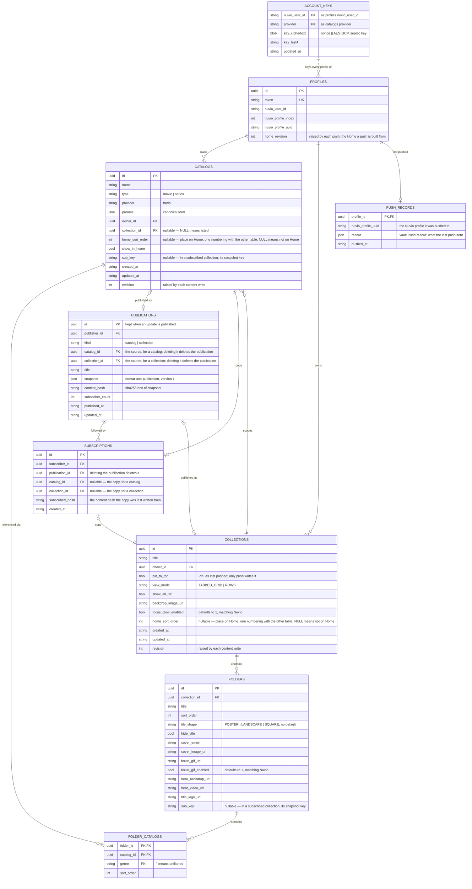

# Data model

Uno stores everything in one SQLite file (`VAULT_DB`). The schema is [`internal/vault/schema.sql`](../internal/vault/schema.sql), embedded in the binary. Uno creates it the first time it runs on an empty database.

## Concepts

- **Profile**: one Nuvio profile slot (1 to 6) of one Nuvio account. Created when you first pick it. Its random token is its addon URL.
- **Catalog**: a named TMDB recipe for movies or series. A *listed* catalog is in your library. A *scoped* catalog belongs to one collection.
- **Collection**: a set of **folders**, each with artwork and an ordered list of catalogs. A folder can narrow a catalog to one genre.
- **Home**: the ordered catalogs and collections on your home screen. Only a push changes it.
- **Publication**: a snapshot of a catalog or collection shared in Community. A **subscription** links someone's copy to it.
- **Push record**: what the profile's last push put in Nuvio. The addon serves from it.

## Tables



| Table | Holds |
|---|---|
| `profiles` | One row per Nuvio account and slot, with its addon token. |
| `catalogs` | Recipes. `collection_id` is set for a scoped catalog. |
| `collections` | Collections and their settings. |
| `folders` | A collection's folders and their artwork. |
| `folder_catalogs` | Which catalogs each folder shows, in order, with an optional genre. |
| `publications` | Published snapshots, as JSON. |
| `subscriptions` | Which copy came from which publication. |
| `account_keys` | Per-account TMDB keys, encrypted. |
| `push_records` | Each profile's last push, as JSON. |

Catalogs, collections and Home carry a `revision`. A save built from an outdated revision is refused, so two tabs can't overwrite each other.

## Limits

| Limit | Value |
|---|---|
| Catalogs in a profile's library | 200. Catalogs made inside a collection don't count. |
| Collections in a profile | 50 |
| Folders in a collection | 10 |
| Catalogs in a folder | 20. A catalog split by genre counts once per genre. |
| Catalogs one push gives Nuvio | 1,000, counting those inside collections. |
| Titles in a catalog row | 500. Nuvio sees the row end there. |

A save, import, Add or Duplicate that would go past one of the first four is refused, and so is a push past 1,000 catalogs. A profile already past a limit, from before it existed, still loads and pushes.

## Recipes

A catalog's `params` is a JSON object of TMDB discover filters, stored as a string, for example:

```json
{"sort_by":"popularity.desc","vote_count_gte":200,"with_genres":"878"}
```

Uno checks the params on every save and stores them in a canonical form. The fields are the structs in `internal/provider/models.go`.

## Bundles

Export and import use a JSON file (`"format": "uno"`, `"version": 1`) with catalogs and collections. In the file, row ids are replaced by keys. The types are in `internal/vault/bundle.go`.
